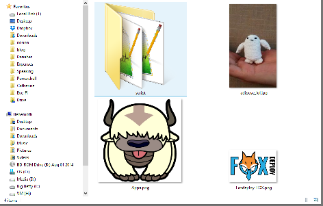
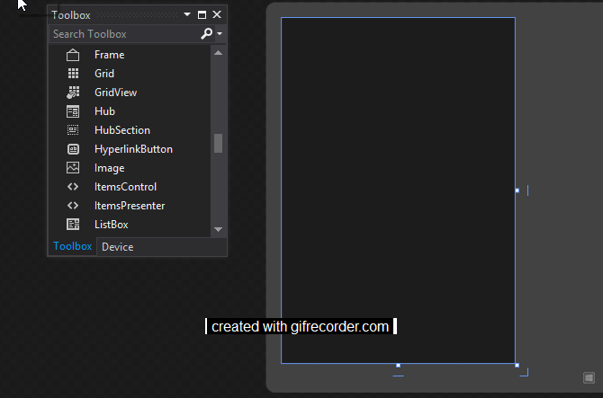
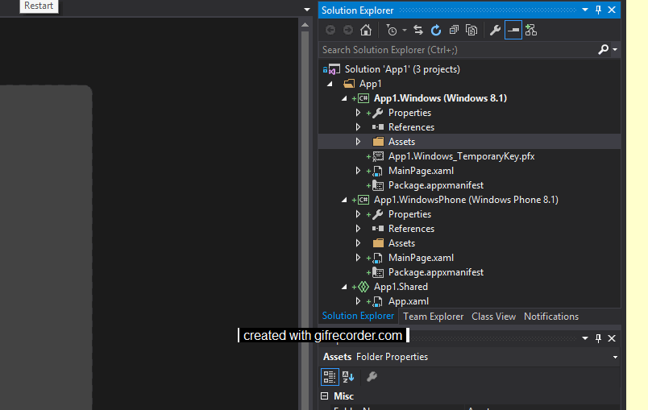
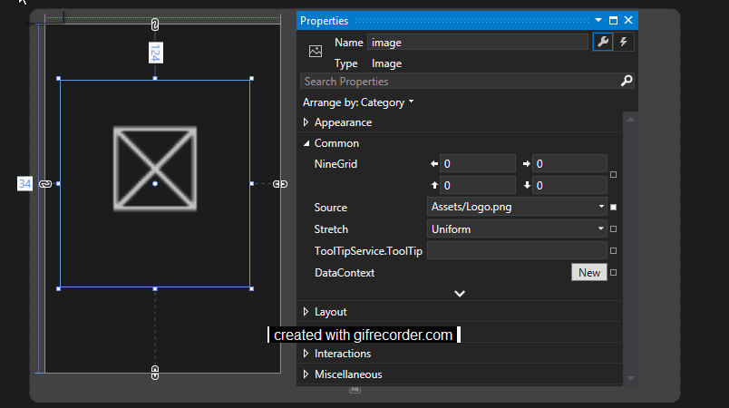
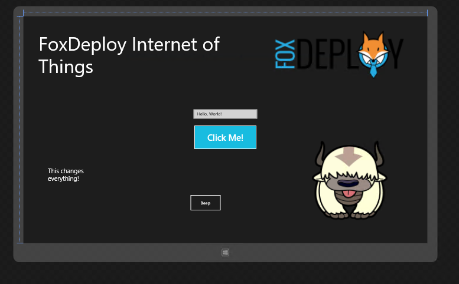

This is part of the **Learning Raspberry Pi Series** here on FoxDeploy.com. 

Click the banner for more Raspberry Pi and Windows!

* * *

One of the first things you'll want to do when you make a GUI to push out to your Raspberry Pi 2 with Windows 10 is to make a fancy smancy GUI. To do that, you'll need an image!

Assuming [you've followed the guide here to](http://ms-iot.github.io/content/win10/samples/HelloWorld.htm) make your first HelloWorld app, you might want to add an image. This will be your first image embedded in a functional app, so you'd better make it a good one!

For me, the pursuit of a fine image is half of the fun. Most of the fun! I like to Google around for the best image, that perfect piece of clipart which accurately describes my project, inspires my end user and aligns our paradigms…and then discard it and pick a picture of a Fox or a Sky Bison (my wife and I are really enjoying Avatar the Last Airbender now!)

Now that I've got a folder of some high quality jpegs ready

Using the toolbox image control, you can draw the outline for an image to put it wherever you'd like and then you'll get a…uh…

 Wait, it's an X, what gives?

Previously, we were using PowerShell implementing .net classes to draw WPF forms, meaning we could put together a GUI in real time using bits and pieces from all over our system, including files stored in relative paths.

Since we're not dealing with the same sorts of apps we worked with before, we can't just point to outside files anymore. We're talking about compiled code now; we've gotta up our game, and that means including assets.

### Give me the short answer

Fine, I'll save you a ton of words here. If you want to include an image in your program, you'll have to embed it as an asset. These things get embedded in your .exe/code when you compile and are the one true way to deliver resources within your code. It is possible to download your image when the tool runs...which is something I'll cover later.

To embed an image, follow these instructions/gifs

Open Solution Explorer and click on the Assets Folder. Now, right click->Add->Add Existing Item.

 Pick your file.

Now click your image placeholder again and check out the dropdown box.

Success! Our image was included!

You're now on your way to building beautiful and functional Windows 10 Raspberry Pi apps, like this one:

Uh…that doesn't look very functional Stephen…