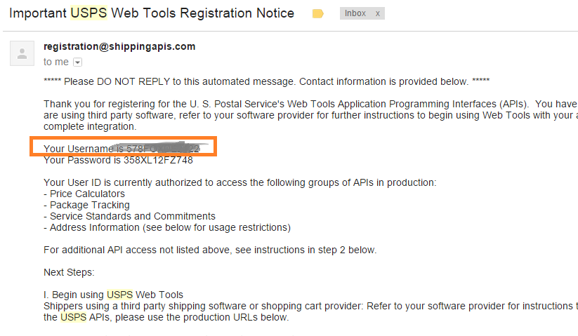
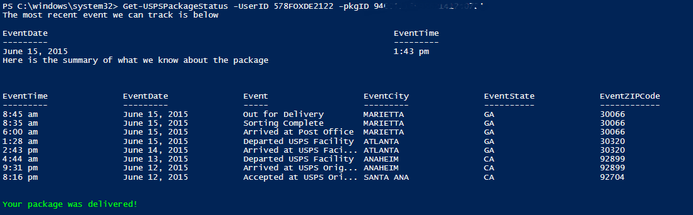

Hey guys!

Been a while since I wrote up a fun little PowerShell REST API tool, so here we go! I taught a four day PowerShell boot camp for a Fortune 50 company, and during the event, one of my students called out the need to track his package delivery online.

The discussion quickly turned high-dork, as we dug in to see if there was a convenient way to get this information.

It turns out that the United States Postal Service has a REST API we can use to check for the status of package delivery.

You'll need to sign up here for REST Api access first : https://www.usps.com/business/web-tools-apis/welcome.htm

To make a request, you need to query the following URL:

```
http://production.shippingapis.com/ShippingAPI.dll?API=TrackV2&XML=$xml 
```

You'll notice the $XML, this is a special XML payload that needs to contain data in a certain format, here's the template for a package delivery status page:

```
<?xml version="1.0" encoding="UTF-8" ?> 
  <TrackFieldRequest SERID="$userID">
    <TrackID ID="$pkgID"> 
    </TrackID> 
  </TrackFieldRequest> 
```

$pkgID will be a long package tracking number you'll get in your e-mail when something is mailed to you, it's about 22 characters long.

When you've signed up, you'll get an e-mail like this one, this is your userId



From here on, it is pretty straightforward, all we have to do is use Invoke-WebRequest to query the URL and then check for some errors (I've planned for you to forget to provide your UserID, or to not provide a PKgID. If you leave these out...I'm not sure what you expect this to do :) ). If no errors are there, your package information will be contained within $Response.Content.TrackResponse.TrackInfo.TrackDetail.

Here's an image of what it looks like!



Here's the code!

```powershell    
<#
.Synopsis
   Use this tool to query the US Postal Service to find out where your packages are!
.DESCRIPTION
   Use this tool to query the US Postal Service to find out where your packages are!
.EXAMPLE
    Get-USPSPackageStatus -UserID 578FOXDEPLOY -pkgID 94HAMHAMHAMHAM95621412407
 
EventTime EventDate     Event                                 EventCity EventState EventZIPCode EventCountry FirmName Name AuthorizedAgent
--------- ---------     -----                                 --------- ---------- ------------ ------------ -------- ---- ---------------
8:45 am   June 15, 2015 Out for Delivery                      MARIETTA  GA         30066                                   false          
8:35 am   June 15, 2015 Sorting Complete                      MARIETTA  GA         30066                                   false          
6:00 am   June 15, 2015 Arrived at Post Office                MARIETTA  GA         30066                                   false          
1:28 am   June 15, 2015 Departed USPS Facility                ATLANTA   GA         30320                                   false          
2:43 pm   June 14, 2015 Arrived at USPS Facility              ATLANTA   GA         30320                                   false          
4:44 am   June 13, 2015 Departed USPS Facility                ANAHEIM   CA         92899                                   false          
9:31 pm   June 12, 2015 Arrived at USPS Origin Facility       ANAHEIM   CA         92899                                   false          
8:16 pm   June 12, 2015 Accepted at USPS Origin Sort Facility SANTA ANA CA         92704                                   false          
 
 
.EXAMPLE
   Get-USPSPackageStatus -UserID 578FOXDE2122 -pkgID 94HAMHAMHAMHAM9562141240
The most recent event we can track is below
 
EventDate                                                                     EventTime                                                                     Event                                                                        
---------                                                                     ---------                                                                     -----                                                                        
June 15, 2015                                                                 1:43 pm                                                                       Delivered, In/At Mailbox                                                     
Here is the summary of what we know about the package
 
 
 
EventTime               EventDate               Event                   EventCity               EventState             EventZIPCode           EventCountry           FirmName               Name                   AuthorizedAgent       
---------               ---------               -----                   ---------               ----------             ------------           ------------           --------               ----                   ---------------       
8:45 am                 June 15, 2015           Out for Delivery        MARIETTA                GA                     30066                                                                                       false                 
8:35 am                 June 15, 2015           Sorting Complete        MARIETTA                GA                     30066                                                                                       false                 
6:00 am                 June 15, 2015           Arrived at Post Office  MARIETTA                GA                     30066                                                                                       false                 
1:28 am                 June 15, 2015           Departed USPS Facility  ATLANTA                 GA                     30320                                                                                       false                 
2:43 pm                 June 14, 2015           Arrived at USPS Faci... ATLANTA                 GA                     30320                                                                                       false                 
4:44 am                 June 13, 2015           Departed USPS Facility  ANAHEIM                 CA                     92899                                                                                       false                 
9:31 pm                 June 12, 2015           Arrived at USPS Orig... ANAHEIM                 CA                     92899                                                                                       false                 
8:16 pm                 June 12, 2015           Accepted at USPS Ori... SANTA ANA               CA                     92704                                                                                       false                 
 
 
Your package was delivered!
#>
function Get-USPSPackageStatus {
param($UserID="Something",
$pkgID='9400111899562141240724',[switch]$Passthru)
 
$xml = @"
<?xml version="1.0" encoding="UTF-8" ?>
<TrackFieldRequest USERID="$userID">
    <TrackID ID="$pkgID">
   </TrackID>
</TrackFieldRequest>
"@
 
$url = @"
http://production.shippingapis.com/ShippingAPI.dll?API=TrackV2&XML=$xml
"@
 
#Get the response and save in a variable $Response
$response = Invoke-WebRequest $url
     
    #Check for an error
 
        if ((([xml]$response.Content | select -ExpandProperty Error -ErrorAction SilentlyContinue) -ne $null) -or ([xml]$response.Content | select -ExpandProperty TrackResponse | select -Expand TrackInfo  | select -ExpandProperty Error -ErrorAction SilentlyContinue) -ne $null){
     
            if (([xml]$response.Content | select -expand Error -ErrorAction SilentlyContinue).Number -eq "80040B1A")  {
                Write-Warning "We hit an error: Check your user credentials, specifically the value for `$userID :$UserID"
                BREAK
                }
 
            if (([xml]$response.Content | select -ExpandProperty TrackResponse | select -Expand TrackInfo  | select -ExpandProperty Error -ErrorAction SilentlyContinue) -ne $null){'ham'
                Write-Warning "We hit an error: Check the package ID you specified, `$pkgID :$pkgID"
                BREAK
            }
                 
        }
 
    #Show the most recent event
 
    $status = [xml]$Response.Content  | select -expand TrackResponse | select -ExpandProperty TrackInfo | select -expand TrackSummary | select EventDate,EventTime,Event
     
    Write-output "The most recent event we can track is below"
     
        if ($Passthru){$status}
            else{
                $status | select EventDate,EventTime,Event | Format-Table -AutoSize
            }
 
    Write-output "Here is the summary of what we know about the package"
    #take the response which is XML and Cast it to make PowerShell parse it better
    $details = [xml]$Response.Content  | select -expand TrackResponse | select -ExpandProperty TrackInfo | select -expand TrackDetail 
 
        if ($Passthru){$details}
            else{
                $details | Format-Table -AutoSize
            }
 
    if ($status.Event -like "Delivered*"){
        Write-Host -ForegroundColor Green "Your package was delivered!"
    }
 
} 
```
