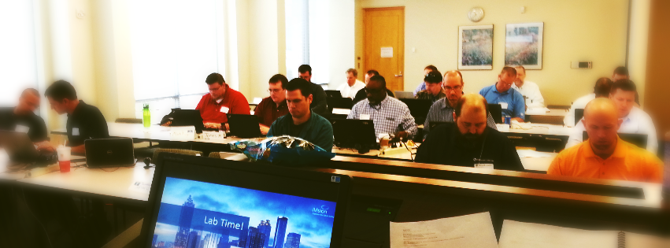

If you've been following my blog, chances are that you enjoy PowerShell, and hopefully like my take on presenting information and the like! I'm happy to announce that we've got open registration now for two exciting upcoming PowerShell training events!

Here's the ad for the classes!
****
### The South-Eastern PowerShell Bootcamp Tour

- [**Registration Now Open! Alpharetta, GA**](http://t.co/mgGnkVTTR6) [July 22- July 24](http://t.co/mgGnkVTTR6)
- [**Registration Now Open!  Birmingham, AL**](http://bit.ly/PSBamaBootCamp) [August 10 - August 12](http://bit.ly/PSBamaBootCamp)

Come with no command line, DOS, VBScripting or other experience and leave writing powerful one-liners and scripts.  

You'll receive poignant tips from the field in a custom course designed and taught by [Microsoft MVP, Stephen Owen](https://mvp.microsoft.com/en-us/mvp/Stephen%20Owen-5001199). 

Bring your laptop and appetite, as Breakfast and Lunch are included!

#### Agenda

- **Intro to PowerShell** - learn about what it is, who made it, why it's different, and why some are saying 'Learn PowerShell or get used to saying '...would you like fries with that?'
- **Diving into the Shell** - starting with command line basics, we'll build up through demo after demo and hands-on lab work to see just a few of the unique and productivity enhancing tools that PowerShell provides.
- **Enter the Pipeline** - picking up speed, we'll cover pipelining fundamentals, and by the end of this module, you'll be able to perform very complex operations with only a handful of characters.
- **We'll Do it Remote** - we'll explore the incredibly powerful built-in remote capabilities PowerShell offers, to let you scale from one-on-one to one-to-many and one-to-environment with your commands.  We'll cover all the safety basics too!
- **Data Processing** - able to natively process numerous datatypes, we'll explore in-depth the data capabilities PowerShell provides, and end with a powerful section on report building sure to impress your colleagues and peers!
- **Advanced Scripting Techniques** - We've done one-liners, now it's time to scale and we'll cover all of the tools you'll need to quickly get started with enterprise ready scripting, including best practices for roll-back, code review and logging.
- **Spelunking with WMI** - inevitably you'll run into a situation for which a pre-made PowerShell cmdlet doesn't exist yet, and at that point, it's time to make our own!  We'll go on a guided tour through the WMI Management Repository, and learn the few commands needed to extract anything from Windows with one or two lines of code.
- **Functions and Toolmaking** - we'll finish strong by expanding our scripts into reusable code and functions you can distribute to your peers.  By popular demand, the toolmaking module is being expanded into multiple units, now also covering the fundamentals of Easy Graphical User Interface tool creation using Visual Studio.  You don't need to be a developer, as we'll cover everything you need to know to start making GUIs in minutes.  You should leave this module with branded tools you can take back and put into use at the office!

* * *

### Course Prerequisites

Time: Come ready to learn, as this is an all-day course.  Attendees will have access to the internet, but it is recommended that they have the full three days allocated to learn.  Because this is a boot camp style course, we will be moving swiftly as a group.

Laptop : Bring a capable laptop, PowerShell v4 capable.  You'll need a minimum of Windows 7 and DotNet FrameWork 4.5.

Experience: So long as you have a basic understanding of Windows concepts like the Control Panel and Registry, we'll build from the ground level up.  We'll talk about a number of common services like Exchange and Active Directory, and the basics of their management.

**This is intended as a Level 100 course, meaning you do not need to be an expert to attend.** 

* * *

###  Registration

The first four stops of our Bootcamp tour are now completed, but registration is now open for our Summer stops, in Atlanta and Birmingham!

- Raleigh-Durham - SOLD OUT
- Charlotte - SOLD OUT
- SPECIAL FOUR DAY - Corporate event for Fortune 50 company - SOLD OUT
- [**Registration Now Open!** PowerShell Bootcamp | Alpharetta, GA ](http://t.co/mgGnkVTTR6) [July 22 @ 8:30 am - July 24 @ 5:00 pm](http://t.co/mgGnkVTTR6)
- [**Registration Now Open!** PowerShell Bootcamp | Birmingham, AL](http://bit.ly/PSBamaBootCamp) [August 10 @ 8:30 am - August 12 @ 5:00 pm](http://bit.ly/PSBamaBootCamp)
