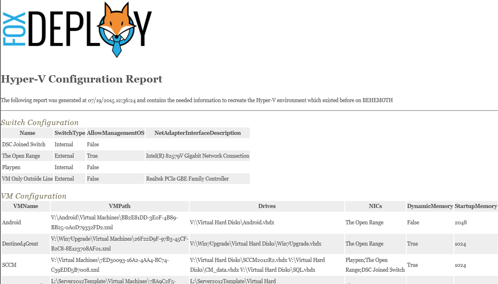

In preparing my home lab to upgrade to Windows 10 (I'll be leaving server 2012 R2 w/ Desktop experience behind, after years as my daily driver).

I realized that I'd essentially need to rebuild my Hyper-V setup (which really isn't so bad, just reimporting my VM .xml files and then setting the VHDs the right way again) when I got to Windows 10, so I wanted a quick reference of which VM files were where and how my switches were laid out.

This is what I came up with!

 

It gives us first the configuration of all of our switches, whether they're bound to a physical adapter and whether the management OS shares the NIC, if so. It then breaks down by VM, where the .xml file lives for it, which drives it has mounted, which NICs, whether Dynamic RAM is turned on and finally the startup memory.

Pretty much everything you'll need to know when rebuilding VMs and you still have access to the source files!

This depends on the ZenGarden Css Theme from Css Garden.

```powershell    
$Switches = Get-VMSwitch | Select Name,SwitchType,AllowManagementOS,NetAdapterInterfaceDescription
 
 
$VMs = get-vm | % {
       $VMXML = gci $_.Path -Recurse -Include *xml | ? baseName -like "$($_.VMId)*"
       $VMDisk = Get-VMHardDiskDrive -VMName $_.Name | Select -expand Path 
       $VMNics = Get-VMNetworkAdapter -VMName $_.Name | select -expand SwitchName
       [pscustomobject]@{VMName=$_.Name;
            VMPath=$VMXML;
            Drives = $VMDisk -join "`n"
            NICs = $VMNics -join ";"
            DynamicMemory = $_.DynamicMemoryEnabled;
            StartupMemory = $_.MemoryStartup/1mb
            }
        
       } | ConvertTo-Html -Fragment
 
$base = $switches
 
 
$companyLogo = '
<div align=left></div>
 
'
$header = @"
  
 $companyLogo
 
<h1>Hyper-V Configuration Report</h1>
 
 
 
The following report was generated at $(Get-Date) and contains the needed information to recreate the Hyper-V environment which existed before on $($Env:Computername)
 
 
 
 
 
<hr>
 
 
<h3>Switch Configuration</h3>
 
"@
 
$post = @"
 
<h3>VM Configuration</h3>
 
$VMs
 
 
<h3>These VMs were found on the L: and V: drives</h3>
 
"@
 
$HTMLbase = $base | ConvertTo-Html -Head $header -CssUri "C:\Users\Stephen\Dropbox\Speaking\Demos\style.css" `
                            -Title ("VM Configuration Report for $((Get-Date -UFormat "%Y-%m-%d"))") `
                            -PostContent $post
                                             
                                             
$HTMLbase | out-file l:\VMBackup_$((Get-Date -UFormat "%Y-%m-%d"))_Log.html 
```
