[](/series/LearningGUIs)

**This post is part of the Learning GUI Toolmaking Series, here on FoxDeploy. Click the banner to return to the series jump page!**

* * *

### Where we left off

Previously in [Part III of our GUI series](https://foxdeploy.com/2015/05/14/part-iii-using-advanced-gui-elements-in-powershell/), we left off with a review of some advanced GUI options, things like radio buttons, text replacement and things like that. In this section, we'll grow our tool from [Part I, our lowly Ping tool](https://foxdeploy.com/2015/04/10/part-i-creating-powershell-guis-in-minutes-using-visual-studio-a-new-hope/), and expand it to become a fully-fledged remote PC management tool. We'll do this to learn our way through some new GUI concepts we haven't run into before. I'll take you through making most of this tool, and leave you at a place where you should be able to take it the rest of the way.

### What we'll cover

If you walk through this guide, I guarantee that we'll cover each of these items below. If there is something you'd like to see covered in a future post, **[send me an e-mail!](mailto:stephen@foxdeploy.com)** Each of the items covered in this post came from requests from my readers.

Seriously.

I am gathering input for post five right now, so let me know what'd you'd like to do with PowerShell, and we can make it happen.

## Making a Tabbed Interface

We're going to talk about the right way to use this element, to make it obvious to users (something called 'Discoverability') that more tools and options exist, if they'd only click this tab and explore around a bit! 

In tab one, we'll drop in the whole of our pinging tool from Part I of this walkthrough, while we'll hide extra functionality in tabs two, three and four. For extra niftiness, we'll have the others tabs be disabled (unclickable) until the user first verifies that a PC is online in tab one.

## Handling UI Events

This is the part that has me the most excited, mostly because I just learned about how to do it, and it solves so many issues. Want to have your GUI run a chunk of code when the user edits a textBox. Or handle the event which is triggered if the user moves the mouse over a button? We can even wait till the user is finished entering text, and then run a short chunk of code to validate an entry. These are all real world scenarios for a User Interface Developer, and we can easily deal with them in PowerShell.

Let's get started.

## Tabs, not just for playing 'The house of the rising sun'

Now, I said we'll be bringing back our pinger…and we kind of will. But we're not ready to open up that code, just yet.

See, the thing is that while it IS possible to add tabs to an existing project or UI, it's much easier to start off with a new project, get the tabs, status bar, dock panels, etc setup the way you want them to look, and then copy and paste in other GUI elements from Visual Studio, or some XAML code.

Let's start the right way with a tabbed UI. We'll be making a new project for this walkthrough, and at this point, it should feel familiar. Launch Visual Studio, click New, New Project, WPF.

Pick a good starting size for your form (I'll do 345x450), then add a Tab control from the toolbox.

I like to draw a somewhat wide tab, like this.

[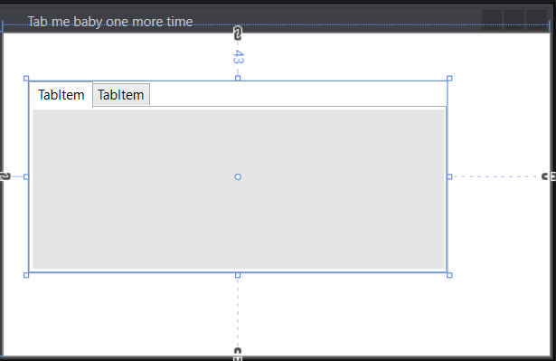

Then, right-click the top of the tab...uh, holder, right next to your last tab and choose Layout-Fill All. I do this because it's actually surprisingly hard to drag your tab to fill the window, so this is the easy shortcut.

[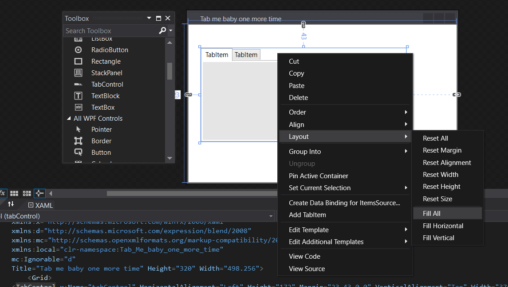 

This will expand the tabs to fill the whole UI.

Now that we have our tabs taking up the whole window, we can add more by right-clicking the background and choosing 'Add Tab Item'. We can also rename the tabs by clicking one and using their properties, or going down to the XAML and changing the name property there.

For our purposes, we'll name the Tabs 'Computer Name', 'System Info', 'Services' and 'Processes'. Now, for the process of adding content to tabs.

## This is a bit tricky

When it comes to adding guts to our tabs, I don't like to build the new guts for each tab within the tab window itself.

No, instead, I like to make a new window (right click the project in Solution Explorer, Choose Add, then New Window, and pick Window WPF) for each of my tabs. Then I can decorate them there, get them sized up, and then copy-paste the XAML or the UI elements into the Tab where they'll reside when I'm done.

This way, I make a good `ComputerConnection.XAML` window once, then I can copy it and paste it as many times as needed, and reuse it later on down the line. If the code's already embedded into a tabcontrol, pulling it out to reuse later can be tricky.


Making a new window for each tab is much easier for development

Now with a new window created, I pick the tools I need, build it here, and then when it's finished, I copy and paste it into the tabbed UI. I found it quite difficult to do this by manually dragging and dropping tools from the toolbox into the tab itself. If you've got a gamer mouse or much better dexterity, or are just plain cooler than me (you probably are, I write a blog about a scripting language, that doesn't scream 'Taking the cheerleader to prom' to me) then go ahead and build your whole tool, bypassing the method I provide here.

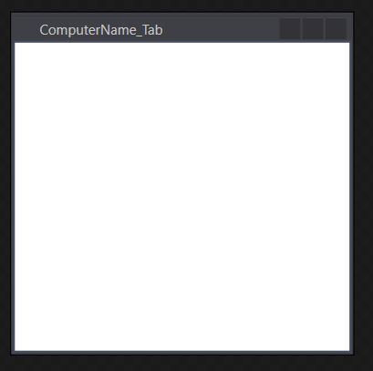 

This is what a blank window looks like. Time to put some clothes on this naked baby!

So I've got my new window which I've named and titled ComputerName_Tab. I'm going to drop in an image, a textblock, a button, and a textbox, and change the background color to something dark and moody looking.

## Important tip

This is a time to make sure we're using good naming conventions for our UI elements. When we paste our XAML over to PowerShell snippet, we'll have a lot of $WPFButtons to keep track of, if we're not careful. From now on, when we add elements, **lets take the time to give them a logical name**, like 'VerifyOnline_Button' and 'ComputerName_textbox', etc.

[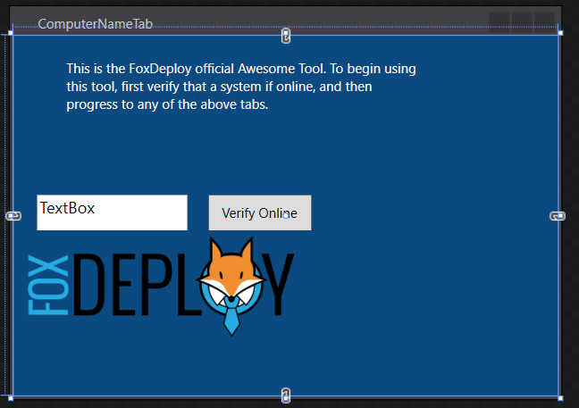

Here's my XAML if you want to be lazy. Just copy and paste this after the window declaration in Visual Studio.

```
<Grid Background="#FF0B4A80">
    <TextBlock TextWrapping="WrapWithOverflow" VerticalAlignment="Top" Height="89" Width="314" Background="#00000000" Foreground="#FFFFF7F7" Margin="22,21,101,0" >
    This is the FoxDeploy official Awesome Tool.  To begin using this tool, first verify that a system if online, and then progress to any of the above tabs.
</TextBlock>
    <TextBox x:Name="ComputerName" TextWrapping="Wrap" HorizontalAlignment="Left" Height="32" Margin="21,142,0,0" Text="TextBox" VerticalAlignment="Top" Width="135" FontSize="14.667"/>
    <Button x:Name="Verify_Button" Content="Verify Online" HorizontalAlignment="Left" Margin="174,142,0,0" VerticalAlignment="Top" Width="93" Height="32"/>
    <Image x:Name="image1" Stretch="UniformToFill" HorizontalAlignment="Left" Height="98" Margin="10,174,0,0" VerticalAlignment="Top" Width="245" Source="C:\Users\Stephen\Dropbox\Speaking\Demos\module 13\Foxdeploy_DEPLOY_large.png"/>
  </Grid>
```

Now, that I've got this configured the way that I like it, I'm going to copy this whole body of code, and paste it into the master .xaml file, the one with the tabs we made earlier.


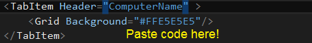 

In case it's not clear, you want to paste your code in between the TabItem tags

When you click away after pasting, the window will update in Visual Studio and you should see your same UI compressed into the tab. You may need to resize some things to make them fit, but this is looking good so far!

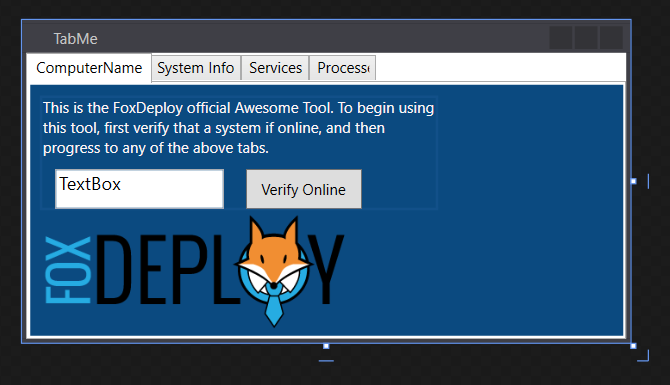 

It's the same UI, now within the tabbed screen!

Now, let's flesh out the rest of the tabs. For System Info, I'm going to copy and paste the formatting we already did for [Part II of this blog series](http://foxdeploy.com/2015/04/16/part-ii-deploying-powershell-guis-in-minutes-using-visual-studio/), excerpted here, after renaming some elements and removing cruft. Don't worry about looking up the post unless you want to, what I've got here will work just fine if you're following along.

```xml
<Grid Background="#FF0B4A80">
  <Button x:Name="Load_diskinfo_button" Content="get-DiskInfo" HorizontalAlignment="Left" Height="24" Margin="10,10,0,0" VerticalAlignment="Top" Width="77"/>
  <ListView x:Name="disk_listView" HorizontalAlignment="Left" Height="115" Margin="10,40,0,0" VerticalAlignment="Top" Width="325" RenderTransformOrigin="0.498,0.169">
      <ListView.View>
          <GridView>
              <GridViewColumn Header="Drive Letter" DisplayMemberBinding ="{Binding 'Drive Letter'}" Width="80"/>
              <GridViewColumn Header="Drive Label" DisplayMemberBinding ="{Binding 'Drive Label'}" Width="80"/>
              <GridViewColumn Header="Size(MB)" DisplayMemberBinding ="{Binding Size(MB)}" Width="80"/>
              <GridViewColumn Header="FreeSpace%" DisplayMemberBinding ="{Binding FreeSpace%}" Width="80"/>
          </GridView>
      </ListView.View>
  </ListView>
</Grid>
```

Alright, pasting that in to our UI, we should see the following.

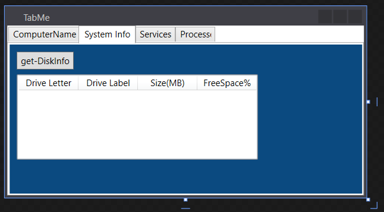

This is a great time to take this code and try and run it in PowerShell. If it works...you're in business, and the next step is to hook up some of the UI elements with some Add_ methods.

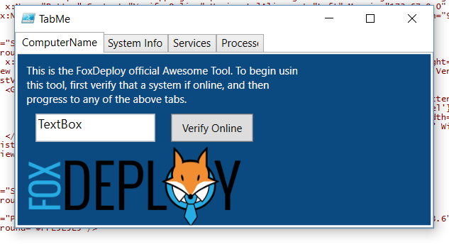 

Copied and paste and it worked in PowerShell!

At this point, we'll move on to the coolest part, which is how to handle events.

## Events and how to handle them

This was something that confused me for a LONG time., in fact it's been the dreaded question of my bootcamps as well. This is how I used to handle questions like these.

> **Student:** 'Stephen, how do I do something when the textbox loses focus, or when the text changes, or when blahBlah happens?'. 

>**Me:** ... 

>**Me:** ... 

>**Me:** \* runs to bathroom and hides till day is over\*

Here's how it works.

Every GUI element in a form has a collection of Events that get triggered on certain conditions. They have names which are pretty easy to understand too, things like MouseEnter, MouseLeave(this event name has always sounded kind of disappointed to me), texthasChanged, etc.

When we're loading this our form code into memory, the c# compiler is transforming our XAML into intermediate language code, another phrase for code on it's way to becoming machine executable code. When that happens, we get a whole lot of what developers call 'syntax sugar'--which sounds awfully diabetic--but means that the tools help us do work and give us shortcuts.

One of those shortcuts is that the compiler snorts through our GUI like a pig looking for truffles, finds all of the events associated with the objects on our form, and sets up handlers for each of the events, in the form of methods that begin with Add_.  We can use these to setup a handler, so that when an event is triggered, something cool happens.

There are a metric pant load of events, for every element. You can see them by piping one of your objects into Get-Member like so:

```powershell   
$WPFComputerName | Get-member Add\* -MemberType Method -force
```

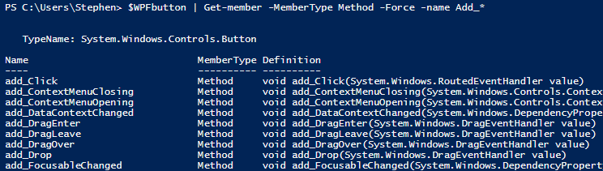

All we have to do is add some code after the event we want to handle, and that's it. Sugar baby, SUGAR!

So, let's say you want to run a chunk of code when the user moves over to another element in your form (which is called LosingFocus, which happens to me constantly during the day...hey I wonder what's on reddit...). For example, let's echo out the value of a box when a user moves away from the box.

```powershell   
$WPFComputerNameBox.Add_LostFocus({Write-Host $WPFComputerName.Text})
```

I'll stage this in the context of a little mini GUI, here's the XAML, and then below, the PowerShell code.

```xml
<Grid Background="Azure">
    <Button x:Name="button" Content="Click Me" HorizontalAlignment="Left" Height="32" Margin="62,186,0,0" VerticalAlignment="Top" Width="106"/>
    <TextBox x:Name="textBox" HorizontalAlignment="Left" Height="30" Margin="62,92,0,0" TextWrapping="Wrap" Text="Type stuff here" VerticalAlignment="Top" Width="106"/>
    </Grid>
</Window>
```

Method Code

```powershell  
$WPFbutton.add_MouseEnter({Write-host 'Yay, the mouse is over me!'}) 
$WPFbutton.Add_MouseLeave({Write-host 'he didnt click me...:('})
$WPFTextBox.Add_TextChanged({Write-host "the user typed something, something like this $($WPFtextBox.Text)"})
```

As I interact with my form, you can see the background updating in real time.

https://www.youtube.com/watch?v=5cepMPD7j-s

## Giving the Form some Smarts

With that done, I'm now going to go back and set the tabs for tabs 2, 3 and 4 as disabled, so that the user will have to interact with tab 1 before proceeding. Do this by adding IsEnabled="False" to each TabItem header, like this:

```
<TabItem Header="System Info" IsEnabled="False">
```


We're going to plug some logic in at the bottom of our XAML/WPF Snippet. When the user launches this form, we want the $WPFComputerName.Text to default to the user's computer name. When the user clicks the $WPFVerify button, we're going to ping the system, if it replies, we'll activate the rest of the tabs.

When I said earlier that every object in our GUI has a slew of events, that includes the form (background) of our app itself.  We'll use the Form's own Add_Loaded({}) event handler to tell our form to run a snip of code when it finishes loading, which is a useful way to set a default value for a box, for instance.

Below that, we'll give our Verify button some code to run when it throws a click event (when the user clicks the button), via the .Add_Click({}) event handler method.  The code will try to ping the computer in the ComputerName box; if it replies, it will then enable each of the tabs for the user to click them by stepping through each item in the TabControl, and setting the 'IsEnabled' property of each to $True, to turn the lights on.

```powershell    
$Form.Add_Loaded(
    {$WPFComputerName.Text = $env:COMPUTERNAME}
)
$WPFVerify.Add_Click(
    {if (Test-Connection $WPFComputerName.Text -Count 1 -Quiet){
        write-host "$($WPFComputerName.Text ) responded, unlocking" $WPFtabControl.Items[1..3] | % {
            $_.IsEnabled = $true} 
        } 
        else{
            write-host "$($WPFComputerName.Text ) did not respond, staying locked" $WPFtabControl.Items[1..3] | % {
                $_.IsEnabled = $false} 
        } 
    }) 
```

Now when the form loads, the user has to interact with tab 1 before they can go on to the rest of the UI.

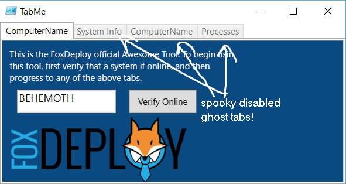 User can't click these till they ping a system first

For our System / Disk Info panel, I'm liberally applying the principle of code reuse to recycle the code from Part II of this series.  There we covered how to instruct PowerShell to assign certain properties to certain columns in a GridView table, using Binding.  This code will grab the hard drive info, and display it in a table on tab II.

```POWERSHELL
$WPFLoad_diskinfo_button.Add_Click({ Function Get-DiskInfo { param($computername =$env:COMPUTERNAME)

Get-WMIObject Win32_logicaldisk -ComputerName $computername | Select-Object @{Name='ComputerName';Ex={$computername}},\` @{Name=‘Drive Letter‘;Expression={$_.DeviceID}},\` @{Name=‘Drive Label’;Expression={$_.VolumeName}},\` @{Name=‘Size(MB)’;Expression={\[int\]($_.Size / 1MB)}},\` @{Name=‘FreeSpace%’;Expression={\[math\]::Round($_.FreeSpace / $_.Size,2)\*100}} }

Get-DiskInfo -computername $WPFComputerName.Text | % {$WPFdisk_listView.AddChild($_)}

})
```

With all of these changes in place, when the user provides a valid computer name, the other tabs will all unlock, then they can click the Get-DiskInfo button and...get some disk info.

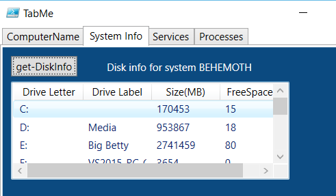

## Wrapping up

Your next steps to flushing out the rest of the UI is to figure out how to apply the same principles from Tab II to the tabs for Services and Processes.  I've got you started here with the GUI for the Services Tab, it's up to you to handle the GUI for the processes tab, and the logic for both.   If you pay close attention to one of the column headings in the Services Tab, you'll find you have to think outside of the box to come up with the value I'm asking for there.

Should you come up with something you're particularly proud of, please sanitize your code (remove company info) and share it in the comments.  I'd recommend making a Gist or putting your code on GitHub or PasteBin, rather than dumping in 30KB of PowerShell and XAML below :)   I'm always surprised by the creativity my readers display, particularly when proving me wrong :p

[Part V - Building Responsive Apps using Runspaces and adding Progress Bars](https://foxdeploy.com/2016/05/17/part-v-powershell-guis-responsive-apps-with-progress-bars/)

## Complete XAML

```xml
<Window x:Class="Tab_Me_baby_one_more_time.TabMe"
    xmlns="http://schemas.microsoft.com/winfx/2006/xaml/presentation"
    xmlns:x="http://schemas.microsoft.com/winfx/2006/xaml"
    xmlns:d="http://schemas.microsoft.com/expression/blend/2008"
    xmlns:mc="http://schemas.openxmlformats.org/markup-compatibility/2006"
    xmlns:local="clr-namespace:Tab_Me_baby_one_more_time" mc:Ignorable="d" Title="TabMe" Height="258.4" Width="486.4">
    <Grid>
    <TabControl x:Name="tabControl">
        <TabItem Header="ComputerName">
            <Grid Background="#FF0B4A80">
                <TextBlock TextWrapping="WrapWithOverflow" VerticalAlignment="Top" Height="89" Width="314" Background="#00000000" Foreground="#FFFFF7F7" Margin="10,10,150.4,0" > This is the FoxDeploy official Awesome Tool. To begin using this tool, first verify that a system if online, and then progress to any of the above tabs. </TextBlock>
                <TextBox x:Name="ComputerName" TextWrapping="Wrap" HorizontalAlignment="Left" Height="32" Margin="20,67,0,0" Text="TextBox" VerticalAlignment="Top" Width="135" FontSize="14.667"/>
                <Button x:Name="Verify" Content="Verify Online" HorizontalAlignment="Left" Margin="173,67,0,0" VerticalAlignment="Top" Width="93" Height="32"/>
                <Image x:Name="image1" Stretch="UniformToFill" HorizontalAlignment="Left" Height="98" Margin="9,99,0,0" VerticalAlignment="Top" Width="245" Source="C:\\Users\\Stephen\\Dropbox\\Speaking\\Demos\\module 13\\Foxdeploy_DEPLOY_large.png"/>
            </Grid>
        </TabItem>
        <TabItem Header="System Info" IsEnabled="False">
            <Grid Background="#FF0B4A80">
                <Button x:Name="Load_diskinfo_button" Content="get-DiskInfo" HorizontalAlignment="Left" Height="24" Margin="10,10,0,0" VerticalAlignment="Top" Width="77"/>
                <ListView x:Name="disk_listView" HorizontalAlignment="Left" Height="115" Margin="10,40,0,0" VerticalAlignment="Top" Width="325" RenderTransformOrigin="0.498,0.169">
        <ListView.View>
            <GridView>
                <GridViewColumn Header="Drive Letter" DisplayMemberBinding ="{Binding 'Drive Letter'}" Width="80"/>
                <GridViewColumn Header="Drive Label" DisplayMemberBinding ="{Binding 'Drive Label'}" Width="80"/>
                <GridViewColumn Header="Size(MB)" DisplayMemberBinding ="{Binding Size(MB)}" Width="80"/>
                <GridViewColumn Header="FreeSpace%" DisplayMemberBinding ="{Binding FreeSpace%}" Width="80"/>
            </GridView>
        </ListView.View>
                </ListView>
                <Label x:Name="DiskLabel" Content="Disk info for system: " HorizontalAlignment="Left" Height="24" Margin="117,10,0,0" VerticalAlignment="Top" Width="197" Foreground="#FFFAFAFA"/>
            </Grid>
        </TabItem>
        <TabItem Header="Services" IsEnabled="False">
            <Grid Background="#FF0B4A80">
                <Button x:Name="Load_services" Content="Load Services" HorizontalAlignment="Left" Height="24" Margin="10,10,0,0" VerticalAlignment="Top" Width="77"/>
                <ListView x:Name="service_listView" HorizontalAlignment="Left" Height="115" Margin="10,40,0,0" VerticalAlignment="Top" Width="355">
                    <ListView.View>
                        <GridView>
              <GridViewColumn Header="Name" DisplayMemberBinding ="{Binding ServiceName}" Width="80"/>
              <GridViewColumn Header="DisplayName" DisplayMemberBinding ="{Binding 'DisplayName'}" Width="100"/>
              <GridViewColumn Header="Status" DisplayMemberBinding ="{Binding 'Status'}" Width="80"/>
              <GridViewColumn Header="AutoStart" DisplayMemberBinding ="{Binding 'AutoStart'}" Width="80"/>
                        </GridView>
                    </ListView.View>
                </ListView>
                <Button x:Name="Stop_service" Content="Stop Service" HorizontalAlignment="Left" Height="24" Margin="129,10,0,0" VerticalAlignment="Top" Width="77"/>
                <Button x:Name="Start_service" Content="Start Service" HorizontalAlignment="Left" Height="24" Margin="258,10,0,0" VerticalAlignment="Top" Width="77"/>
            </Grid>
        </TabItem>
        <TabItem Header="Processes" IsEnabled="False">
            <Grid Background="#FF0B4A80">
                <TextBlock Name="processes_text" TextWrapping="WrapWithOverflow" VerticalAlignment="Top" Height="89" Width="314" Background="#00000000" Foreground="#FFFFF7F7" Margin="10,10,150.4,0" > Do something cool :) </TextBlock>
            </Grid>
        </TabItem>
    </TabControl>
    </Grid>
</Window>
```

My syntax highlighter was causing issues with the PowerShell code I posted. Instead, [you'll find the completed script here on the Github page](https://github.com/1RedOne/FoxDeploy-GUI-Series-Post4-Resources/) for this post.

For additional reading on Events, I'd recommend checking out [Keith Hill's Blog Post here](https://rkeithhill.wordpress.com/2015/08/29/an-explanation-of-the-net-add_eventname-remove_eventname-methods/), [and June Blender's excellent post here](https://www.sapien.com/blog/2015/08/31/the-methods-that-register-events/). Both helped me to finally understand how it is that this works, and I truly appreciate it.

If you have any features you'd like to see me include next time, drop a comment here, hit me up on Twitter, or send me an e-mail at myFirstName At Foxdeploy.com. (You do have to replace MyFirstName with Stephen, by the way!)

If you have a particular scenario and it's interesting enough, I might write a whole post on it. So if you want to recreate the ConfigMgr 2012 UI in PowerShell XAML, let me know :)

Who knows where we'll go from here...

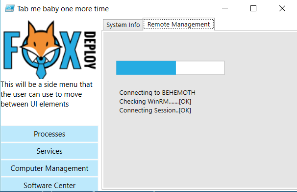 

GUI Progress bars? Must have!
