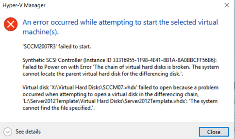
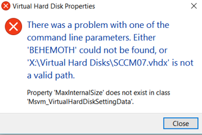

I'm running Windows 10 w/ Hyper-V on my home lab pc, and found a strange Hyper-V error this week.

One of the core things you shouldn't do with differencing disks is to ever, ever move or edit the parent disk, or else you can break the child disk.  I added some more storage and moved my VHDs around to an all SSD Raid, then found that I'd broken the chain of VHDs for one of my VMs.

When trying to start the VM, this is the error you'll see.

 The chain of virtual hard disks is broken. The system cannot locate the parent virtual hard disk for the differencing disk.

Normally, one runs 'Inspect Disk' from Hyper-V to locate the parent disk of a child VHD, which will fix the chain of differencing and allow your VMs to access the disks again.  However on Windows 10, clicking ‘Inspect Disk’ will result in Hyper-V throwing a fatal error.

 

There was a problem with one of the command line parameters. Either 'BEHEMOTH' could not be found, or 'X:\\Virtual Machines\\Virtual Hard Disks\\VM01.vhdx' is not a valid path.  
Property 'MaxInternalSize' does not exist in class 'Msvm\_VirtualHardDiskSettingData'.

The path is valid and exists. I’ve found a workaround, that of using PowerShell and the Hyper-V module to run Set-VHD, like so:
```
set-vhd -Path 'X:\\Virtual Machines\\Virtual Hard Disks\\VM01.vhdx' \` -ParentPath "X:\\Server2012Template\\Virtual Hard Disks\\Server2012Template.vhdx"
```

