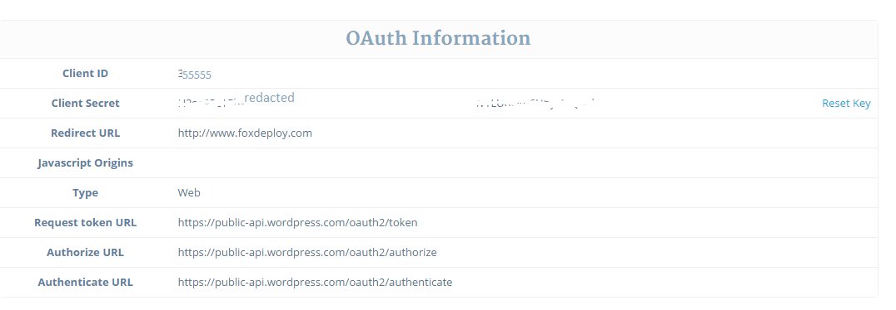
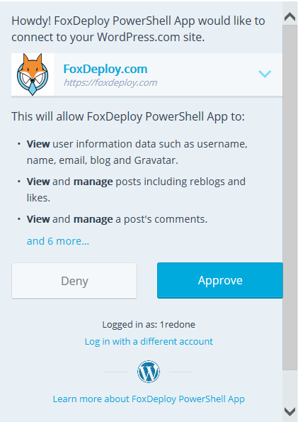
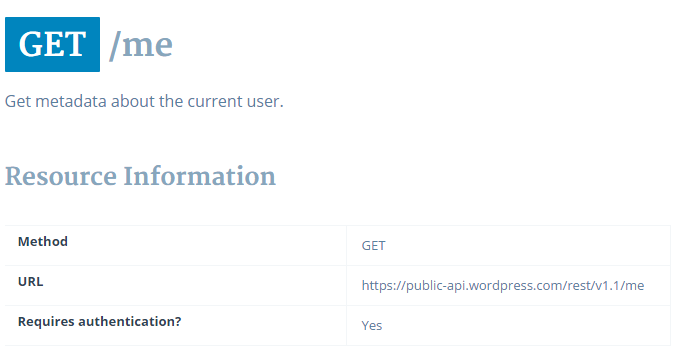
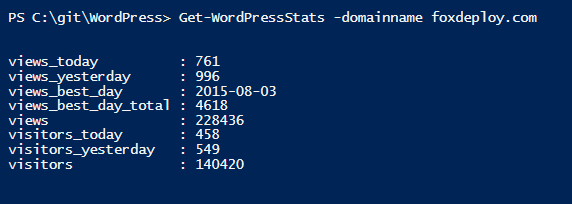

Like most of my posts here, I'm going to try to make something sound easy, when in reality I've spent months crying into my coffee trying to understand it. In truth, I've been trying to get oAuth to work for more than a year now.

It all started with a simple goal, I just wanted to check my blog stats easily using WordPress's REST API, and I wanted to do it from PowerShell, should be simple, right? **WRONG**

My initial issue was that I didn't want to understand oAuth, I just wanted to copy and paste some stuff and hope that it worked. I can tell you now that I've worked it out, it really isn't that difficult, but knowing what's happening will make it all much easier.

## What is oAuth?

oAuth was made to solve a problem, that of sharing information between two different web services. We need oAuth because a user may want to right click a file from Dropbox.com and post it on Facebook with one click, for instance. Or have their Twitter send a Tweet when they update their Blog on WordPress. oAuth is a crucial verification step when tying two services together, and it's worth the time to spend learning how it works. Furthermore, most of the coolest REST APIs out there require you to authenticate using oAuth in order to even use them.

Now, let's see what the steps are to get your application (or script) linked to a service that uses oAuth.

#### The Core Steps of oAuth

oAuth isn't too complicated. Here's what a normal oAuth exchange looks like. This happens the first time a user links two services (or instead links PowerShell or Python to a web service) and generally is a one time thing.

## Prompt the User for permission

We'll prompt the user with a login window, they'll sign in and if they agree with the permissions we're asking for, **we receive an Access Code**

## Exchange the Access Code for an Authorization Token

We'll submit that code in exchange for an authorization token. This is a one-time thing, as most auth tokens last quite a long time.

## Use the Authorization Token for future requests

Now that we've got an Authorization Token, we can use this over and over to make action on behalf of our user.

The last piece of info to know is that there are special URLs to use for each stage of the authorization process. For the rest of this post, assume I'm talking about Wordpress.com, which requires you to use oAuth for authentication before you can start using their API.

All of the code I'm referring to here can be [found in the PSWordPress repo on GitHub](https://github.com/1RedOne/PSWordPress). In my implementation of oAuth for WordPress, all of the following steps (except signing up for the API) are performed within the Connect-WordPress Account cmdlet, if you'd like to follow along.

### How to begin - Register for the API

Any service which uses oAuth as the gateway to a REST API is going to have some mechanism in place for you to register for the API. If you want to use the WordPress.com API, for instance, [you'll register for it here](https://developer.wordpress.com/).  Just to be clear, you're not signing up for oAuth, rather oAuth is simply the mechanism that let's your users trust your app or service with a bit of access to their account from something else, say, Twitter or FaceBook.

Signing up for an API will normally involve you picking out a name for your project, providing a thumbnail image, and providing the URL of your application. Because the primary use case of oAuth is to allow services to talk to each other, even though we'll be using PowerShell, we still must provide a URL. I'm using the URL of my blog, FoxDeploy.com, but you could pick literally any URL in the world.

The key things you need to copy when you sign up are in this list below.  You'll need to use them when you send the user off to the approval page, and then you'll also need it when you exchange the access code for an authorization token:

- ClientID, a numerical ID WordPress assigned us.
- ClientSecret, a randomly generated strong password assigned to us. Generally, keep this secret. It's not such a big deal for WordPress but some APIs will require payment, so this could be as costly as giving out a credit card number.
- A list of URLs we need to query for different things

[](../assets/images/2015/11/images/oauth-info.png)

Copy all of this stuff down somewhere safe (don't put it in a GitHub project, for instance!)

## Get an Access Token

The first real step in implementing oAuth, once you've got your Client details and the URLs, is to display a logon box to a user.

This step is mostly prompting a user to provide you their credentials to a given service. We can grab the URL that we saw when we signed up for the API, and send the user there, providing a few values to represent your application/project, and then the user will login. When the user signs in, they'll be redirected to the URL we specify, and the access token will be embedded at the end of the address they go to; we need to simply substring out the Access token and we're set.

Taking a look at [the oAuth page](https://developer.wordpress.com/docs/oauth2/) for WordPress, we see where we need to provide our values to make the login box appear.

[](/assets/images/2015/11/images/accesstoken.png)

If you were to plop in values for clientID, and blogID, you'd see a standard oAuth sign in window, like this:

[](../assets/images/2015/11/images/oauth-window-perms.png)

**To display a login box from PowerShell**, you should use the cmdlet I've got here, [Show-oAuthWindow](https://raw.githubusercontent.com/1RedOne/PSWordPress/master/Private/Show-oAuthWindow.ps1). In this next section, we'll dig into what this is actually doing, so that you can swap parts in and out as needed to fit whatever you're working on.

## Showing a login window from PowerShell

[Show-oAuthWindow](https://raw.githubusercontent.com/1RedOne/PSWordPress/master/Private/Show-oAuthWindow.ps1) is where the magic happens. I found [this example](http://blogs.technet.com/b/heyscriptingguy/archive/2013/07/01/use-powershell-3-0-to-get-more-out-of-windows-live.aspx) on the Hey! Scripting Guy Blog, written by Microsoft PowerShell PFE (Wow, talk about my dream job!) [Chris Wu](https://twitter.com/ps4it). It's really beautifully simple.

An assembly is loaded into PowerShell, to allow us to display some .net forms objects. Then the window size is specified, and we provide the URL for the browser window to go to (the ‘Authorize’ URL from my project screenshot above). We watch the process and instruct the window to close when the user is redirected to an address with Error= or code= in the URL.

```powershell
Function Show-OAuthWindow { Add-Type -AssemblyName System.Windows.Forms $form = New-Object -TypeName System.Windows.Forms.Form -Property @{Width=440;Height=640} $web = New-Object -TypeName System.Windows.Forms.WebBrowser -Property @{Width=420;Height=600;Url=($url -f ($Scope -join "%20")) } $DocComp = { $Global:uri = $web.Url.AbsoluteUri if ($Global:Uri -match "error=\[^&\]\*|code=\[^&\]\*") {$form.Close() } }

Show-OAuthWindow -URL "https://public-api.wordpress.com/oauth2/authorize?client\_id=$clientID&redirect\_uri=$blogURL&scope=global&response\_type=code"


```

If you were to run this code, you'd see a login box like this one:


The user clicks Approve, and then our Access Code comes back in the form of some characters appended to the URL

Assuming the user interacts with this successfully, they will be redirected to the $redirectURL, and our Access Code will be within the URL, looking something like the following: `[https://foxdeploy.com/?code=cw9hk1xG9k](https://developer.wordpress.com/?code=cw9hk1xG9k)`.  We'll store the address in $uri, make it a global variable and then close the window, and we're left with a $URI value that includes our access code.  We merely need to regex out the Access Code.

```
$regex = '(?<=code=)(.\*)(?=&)' $authCode = ($uri | Select-string -pattern $regex).Matches\[0\].Value $global:accessCode = $accessCode Write-output "Received an accessCode, $accessCode"

```

At this point, we have the Access Code, and it's time to cash it in for an Authorization Code.

## Trade the Access Token to get an Auth Token

Now that we have the time sensitive Access Token, it's time to cash that in for a mostly-permanent authToken. Looking back at the WordPress API Docs again, they say the following (referring to our accessCode):

 They showed us how to do it in curl. Scroll down to see how to do it in PowerShell

They URL listed there is actually the Token URL we saw earlier when we sign up, and tell us to do a cUrl to that URL and add our (the ClientSecret), the project ID (Client ID) and your redirect URL, along with the Access Token we just got . Take all of these, present them as the body for one last Post and we'll get back our Auth Token. Once we've done this, we don't need to repeat the steps again until our Authorization Token expires.

If you're looking at my Connect-WordPressAccount cmdlet, we're now up to line 46. The code calls [Get-WordPressAuthToken (gitHub link)](https://raw.githubusercontent.com/1RedOne/PSWordPress/master/Private/Get-WordPressAuthToken.ps1), and passes in params it already had, like $clientSecret, $clientID and $blogURL. It also passes in $authCode, which we received in the last step.  I've excerpted this bit below:

```
#Continuing in Connect-WordPress Account Get-WordPressAuthToken -ClientID $ClientID -clientSecret $clientSecret -blogURL $blogURL -authCode $authCode -Debug

#store the token $password = ConvertTo-SecureString $accessToken -AsPlainText -Force $password | ConvertFrom-SecureString | Export-Clixml $configDir -Force
```

Now, to look within Get-WordPressAuthToken, here is how to post an access code and get back a token with PowerShell, instead of the cURL example in their screen shot.

```powershell
Function Get-WordPressAuthToken{ \[CmdletBinding()\] param($ClientID,$blogURL,$clientSecret,$authCode)

try { $result = Invoke-RestMethod https://public-api.wordpress.com/oauth2/token \` -Method Post -ContentType "application/x-www-form-urlencoded" \` -Body @{client\_id=$clientId; client\_secret=$clientSecret; redirect\_uri=$blogURL; grant\_type="authorization\_code"; code=$authCode} -ErrorAction STOP }


```

We call the oAuth2/token endpoint, and just provide a list of parameters, including the Access Token we received when the user authorized our app. If this request worked, we'll see something like the following.

```
{ "access\_token": "YOUR\_API\_TOKEN", 
  "blog\_id": "blog ID", 
  "blog\_url": "blog url", 
  "token\_type": "bearer" 
}
```

We simply need to take the Access Token and save it for future use. We're done with authorizing now!

## Storing the Token Safely

The user has now trusted us to partially act on their behalf for WordPress/whatever service.

This token we have is the functional equivalent to them just handing us their computer logged in, with Chrome open and signed in as them on this service. Anything you can do as a person using the service, someone with your Auth Token could do as well. This means you need to find a safe place to store it.

I opted to use the secure string cmdlets to store them safely within the user's appdata folder, so if you're looking at my own example, I use the system security API to safely store this info.  It can only be read (by default) by that user, or administrators of that PC, so it is fairly safe.  When the user loads any cmdlet from my PowerShell module, the variable is reloaded into $accessToken so that all of the PowerShell cmdlets that need the token 'just work'.

```
#store the token $password = ConvertTo-SecureString $accessToken -AsPlainText -Force $password | ConvertFrom-SecureString | Export-Clixml $configDir -Force


```

## Using THE token to actually query the API

The final thing to do is to try this token out against one of the many, many endpoints available. The awesome thing about Rest APIs is that they almost always have some totally kick-butt documentation, including pages and pages of addresses we can query for nifty info. Here's a snippet of just a few, listed on developer.wordpress.com/docs/api. I'll pick one out, like /me

 append any of these to /rest/v1.1 and you're in business

[](../assets/images/2015/11/images/oauth-me.png)

According to this, I just need to query the URL listed and provide my Authorization Token as a header.

In PowerShell, this looks something like this:

```powershell   
Invoke-RestMethod https://public-api.wordpress.com/rest/v1.1/me -Method Get -Headers @{"Authorization" = "Bearer $accessToken"}
```

 Getting data back from a REST API, awesome!

That's really all there is to it!  The data will come back already serialized, in most cases, and you're in business.

## Let's make some cmdlets!

At this point, all you need to do to make a slue of cmdlets is to look at the endpoints, find nifty ones, and then just setup functions that ask for the right info. This is the fruit of my labors, right here.

```powershell  

Function Get-WordPressStats { \[Cmdletbinding()\] param( \[Parameter(Mandatory=$true,ValueFromPipelineByPropertyName=$true, Position=0)\] \[Alias("domainName")\] $ID, $accessToken=$Global:accessToken)

Invoke-RestMethod https://public-api.wordpress.com/rest/v1.1/sites/$ID/stats -Method Get \` -Headers @{"Authorization" = "Bearer $accessToken"} | Select-object -ExpandProperty Stats |Select-Object Views\*,Visit\*
}
```

## [](../assets/images/2015/11/images/get-wordpressstats.png)

## Let's REST

I hope you liked this post. I'm very happy to have finally worked out an approach that makes sense to me for oAuth. If you've got some specific requests or some REST APIs that are giving you fits, let me know and I'll do my best to help you figure it out!

### Sources

[For helping me to understand how to present parameters for oAuth](http://www.clermontwebsites.com/restservices/powershell.aspx)

[Wordpress Reference for API, with actually really good documentation](https://developer.wordpress.com/docs/api/1.1/get/sites/%24site/users/)
