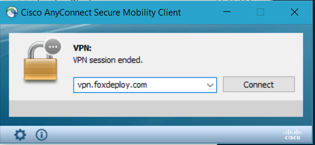
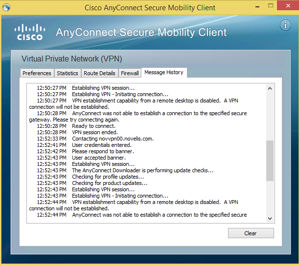

This was kicking my butt today, but turns out that it had an easy work around.

I learned a long-time ago that if you're running Hyper-V on your Device, you should not install a VPN client on the host, but rather should be doing this within child VMs.  The reason for this is that sometimes the drivers associated with a VPN adapter don't play nicely with a hypervisor, and can often result in a blue screen error when they attempt to make changes to the virtual adapters displayed to the parent partition.

So, I made a Windows 10 VM to run my VPN client...however, I was getting errors of 'Session Ended', along with tons of murky stuff in my Event Viewer, related to missing devices, etc.  It looked pretty scary.

As it turns out this is a simple resolution.

**Symptom**

A VPN connection is immediately dropped when connecting on a Windows 8 or higher VM

**Validation** 

Launch AnyConnect and click the cog icon, then click the Mesage History tab.

Look for an error of "VPN establishment capability from a remote desktop is disabled.  A VPN connection will not be established".

**Cause**

When connecting to Windows 8.1 and newer child OSes in Hyper-V, Virtual Machine Connection will actually attempt to connect via RDP, rather than through the secured backchannel that VMC normally offers.  This will appear as an RDP session on the remote machine, and AnyConnect is often configured to prohibit this behavior.

**Resolution**

While connecting to the VPN, use basic connection instead of 'Enhanced Session'  You can use this button here to toggle between the two, and it's okay to jump back into enhanced session after the VPN connection in completed.