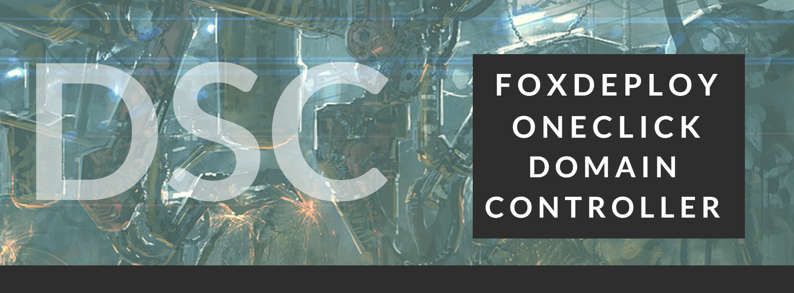

[](/series/LearningDSC)

**This post is part of the Learning PowerShell DSC Series, here on FoxDeploy. Click the banner to return to the series jump page!**

* * *

I've been pointing people to my series on DSC for a while now, and noticed that my instructions were not 100% accurate, plus I was sending people all over the web to download the needed files to build a Domain Controller using DSC. So, in this post, I'll provide much simpler instructions to deploying a one-click domain controller.

> I've also provided some custom versions of the DSC Resources used in this post, which include some code fixes not yet available on the PowerShell Gallery today.
> 
> To avoid heart-ache, I would strongly encourage you to use the copies I'm providing with this post.

 



- First and foremost, [download a .zip of the full repo here](https://github.com/1RedOne/DSC_OneClick-DomainController)
- Now, make sure you have a Windows Server machine ready, running WMF 5.0. If you need it, [download it here](https://www.microsoft.com/en-us/download/details.aspx?id=50395)
- VM Configuration: The VM should have two network adapters.
- The first one should be internal (that is to say facing the VMs where you'd like this DC to be accessible) and once the script completes, you'll have working DHCP and DNS on this vSwitch.
- The second vNic should be external, if desired. DNS and DHCP will not be provided on this connection.
- Create a new Administrator on this machine. The Admin which you use to run this process becomes the first Domain Administrator in your new Domain.
- Next, extract this to your new Domain Controller to be, under C:\\temp.
- Copy all of the xModuleName folders into `$env:ProgramFiles\WindowsPowerShell\Modules` on your VM
- From an Administrative PowerShell prompt, run the below command to unblock all files downloaded.

```powershell
dir -recurse -path $env:ProgramFiles\\WindowsPowerShell\\Modules | Unblock-File 
```

Now, simply launch OneClickDSC.ps1 in PowerShell, and click the Play button (or hit F5), to launch the GUI.

You only have to provide two values.  On the left, if you choose to, you can rename your computer.  If you choose to do so, you'll have to reboot before you can complete DSC Application.  _But DSC will continue after the reboot, so there's really no worry._

On the right side of the screen, simply type in the domain name for your new Domain.  You'll then be prompted for credentials.


This prompt is a little bit nonstandard. See, DSC will run a check for DSC consistency regularly, and it will do so using the values you type in on the credentials prompt as the DSC Admin account.

What's going to happen is that our current account will be elevated to domain admin and when DSC runs this check again for consistency, it will use the credentials we specify here.

**Important warning!!!! Make sure to specify your username as NewDomainName\\CurrentUserName.** 

So, if you're making Domain Ham, and your name is Bacon, then login as Ham\\Bacon.


# That's it

First step for application, is to change the computer's name. This requires a reboot. So...reboot.


On restart, we can run the following commands to watch the rest of the DSC Application

```powershell #Pause the last application Stop-DSCConfiguration -Force #Resume so we can watch it Start-DscConfiguration -ComputerName localhost -Wait -Force -Verbose -UseExisting 
```

Now, if you diverged from using my copy of the DSC resources, you may run into an error, specifically w/ the computername module, around specifying a name for a Computer, without specifying a domain name. This is an open issue in GitHub right now, so hopefully the problem will be resolved soon, but for now, the copy you'll get w/ this blog post has the proposed fix to the issue.

And...we're done when we see this screen!


So, I hope this clears up the questions people were asking about how to use this 'OneClick Domain Controller'.

My next plan is to add SQL support and the prerequisites for SCCM. And then we'll work up to a one-click ConfigMgr install!
