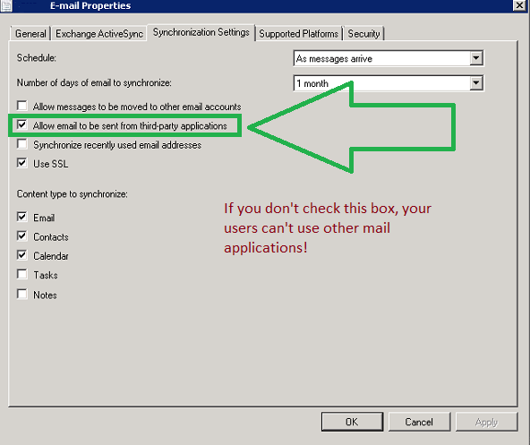

On a recent InTune deployment, we had a requirement to force encryption and security on mobile devices and also provision mail profiles as well.

During the pilot, we heard informal reports that a user thought they couldn't send a photo using their company e-mail after migration, but we found this hard to reproduce.

However, during the production roll-out, we discovered that users were unable to add attachments using their InTune configured mail account.

Note that this was an ConfigMgr w/ InTune deployment, and the affected devices were mostly iOS and Android devices.

## How do I fix this?

You control this setting from ConfigMgr, so launch the console.

Browse to Assets\\Compliance Settings\\Company Resource Access\\E-mail Profiles

Open Mail Profile

Check the Synchronization Settings tab and ensure the 'Allow email to be sent from third-party applications' checkbox is checked. 

 

## Will mobile devices reflect this change?

YES!  The next time your devices check in for policy, they will note the change and the InTune MDM agent will allow your users to add attachments and send e-mail from other applications again.

## How do I force update of my iOS and Android Devices?

If you're reading this, chances are that you forgot to make this change, and are wondering precisely how screwed you might be.

# **You're OK!**

Mobile Devices refresh their policy in accordance with the Default Device Policy setting in SCCM itself, and respect no other client setting.  You can alter this setting under **Administration\\Client Settings\\Default Settings.**

The value you want is under **Client Policy\\Client policy polling interval (minutes)**

The default Setting is 60 minutes, meaning that the device will phone home every hour.  You could ratchet this setting down to 5 minutes, but your devices in the field will still only check-in once an hour or so.

Once they note the change **devices will automatically remediate themselves.** So you're OK!

**How do I force a single device to update policy?**

You can force a single Device by launching the Company Portal application.  In the app, click on 'devices' and then click Sync.  Assuming good data coverage, this process takes roughly five minutes.

## References

http://www.theexperienceblog.com/2014/03/18/bug-deploying-email-profiles-to-ios-using-intuneconfigmgr/

http://blogs.technet.com/b/tune\_in\_to\_windows\_intune/archive/2014/12/12/force-a-refresh-of-microsoft-intune-policies-on-ios.aspx

http://blogs.msdn.com/b/beanexpert/archive/2015/07/07/microsoft-intune-standalone-device-policy-refresh-interval.aspx