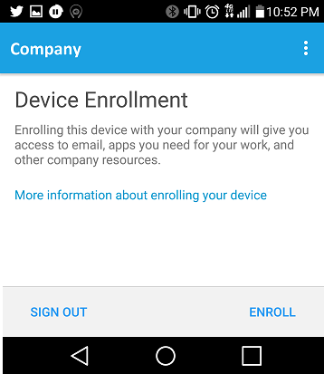

We had a big issue at a client recently, which was quite a bear to solve.  They used ADFS with On-premise SSO (meaning that they didn't use DirSync to push passwords into Azure AD/Office 365), so when clients come to authenticate over the web via the Company Portal App, they were referred to our on-prem ADFS for authentication.

This worked fine for our iOS and Windows Devices, no issues at all!  But then when we tried to use Android devices, they would be presented with the following error message:

### The Symptom

 Could not sign in. You will need to sign in again. If you see this message again, please contact your IT Admin.

Don't you love those messages that tell you to contact yourself?

From the InTune app, you can obtain logs by clicking on the '...' hamburger menu.  Opening the log, we see the following errors.

```
Authentication failed. Current state: FailedToAcquireTokens Failed to acquire Graph token from AAD. SignInService.access$900(SignInService.java:44) SignInService$AadFailureAction.exec(SignInService.java:464) SignInService$AadFailureAction.exec(SignInService.java:444) GraphAccess$GraphTokenFailureDelegate.exec(GraphAccess.java:190) GraphAccess$GraphTokenFailureDelegate.exec(GraphAccess.java:174) AdalContext$AdalAuthenticationRetryCallback.onError(AdalContext.java:228) com.microsoft.aad.adal.AuthenticationContext.waitingRequestOnError(AuthenticationContext.java:899) com.microsoft.aad.adal.AuthenticationContext.onActivityResult(AuthenticationContext.java:758) com.microsoft.windowsintune.companyportal.authentication.aad.AdalContext.onActivityResult(AdalContext.java:150) com.microsoft.windowsintune.companyportal.views.AadAuthenticationActivity.onActivityResult(AadAuthenticationActivity.java:57)

Code:-11 primary error: 3 certificate: Issued to: CN=adfs.company.com,OU=E-Commerce,O=Company,L=Somewhere,ST=Georgia,C=US; Issued by: CN=Symantec Class 3 Secure Server CA - G4,OU=Symantec Trust Network,O=Symantec Corporation,C=US on URL: https://adfs.company.com/adfs/ls/?wfresh=\[...\]


```

## The Reason

The error occurs when the Company Portal app checks our certificates on ADFS to see if we are trustworthy.

The issue is that Android handles cert chaining in a way somewhat differently from iOS and Windows Phone. In short, Android needs all of our certs to be present on our ADFS Servers, where iOS would intelligently lookup the Cert Signer for us.

## The Fix

Import the certs up the chain into the intermediate store on the ADFS Proxies themselves.

So, launch the MMC and add the Certificates Snapin for the Local Computer on your ADFS Server.  Find the cert your ADFS Service is using (likely issued to adfs.yourcompany.com), and view it's parent certificate.

Move a copy of the 'parent' cert, (in my case, Symantec) into the Computer\\Intermediate Certification Authorities\\Certificates store. **This part is CRUCIAL!**

Next, move copies of your ADFS, ADFS Decrypting, and ADFS Signing Certs into the Personal Store **for the ADFS Service.**

Finally, restart the ADFS servers, because restarting the service alone is not enough.

With all of this finished, I'm finally able to enroll Android devices into InTune.

[](../assets/images/2015/12/images/screenshot_2015-12-08-22-52-11.png)