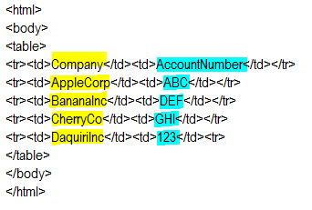
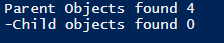
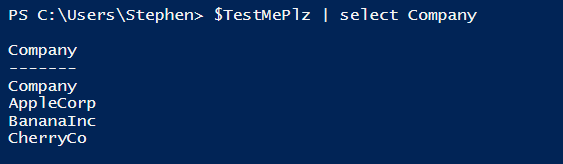
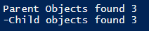
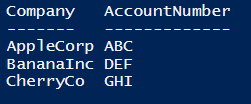
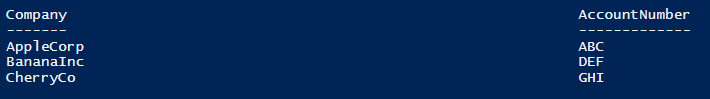
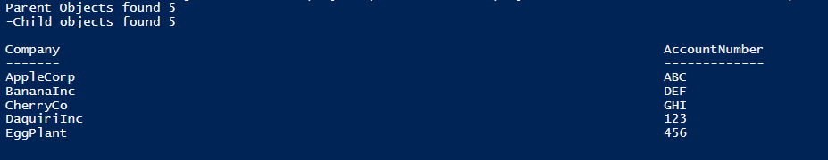
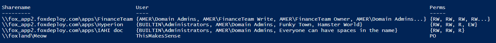

[In our previous post](http://foxdeploy.com/2015/01/05/walkthrough-parsing-log-or-console-output-with-powershell/) we used the tried and true old school method to convert data from the console or logs into a PowerShell object.  It works but it isn't very much fun and by and large you have to write a lot of code to do it.

I've dug under the covers, thanks to these excellent resources (at the bottom of this post!) and have now come up with a method to parse files using PowerShell Version 5's awesomely powerful new ConvertFrom-String cmdlet.  This tool is based on FlashExtract, which is a Microsoft Labs creation that originally showed up in Excel under the FlashFill and FlashConvert tools, which let you highlight some sample data and watch as a machine learning creates regex string extraction tools for you.  Automatically.

I'm not sure if is cool or if it is scary.  It's definitely cool at least!

This new approach drops down from more than 60 lines of code to only 13 to parse the data.  But the craziest thing about is how the code looks and works.

### Machine learning will take our jobs

Will it? Maybe…probably. Previously you needed Exchange Admins to monitor all of an org's exchange servers, and infrastructure admins to watch over the datacenter, plus guys to swap tapes, make custom internal apps and things like that. Now you can do all of that through AWS or Azure, so presumably at least one guy is looking for a job now. Probably the one who tended the printers and tape drives. Most of the apps we'd make internally have now found a 'good-enough' alternative online with SaaS. My personal plan is to try to be the guy who automates the last mile and glues all of the systems together, so hopefully I'll have a job as long as possible.  
/rant

Our old approach worked, but was pretty hard. Let's make things so, so much easier using PowerShell version 5.0's awesome new ConvertFrom-String cmdlet. Along with this, we'll use a new example to make things extra obvious.

### Our new approach

As I mentioned before, our new tool of choice **ConvertFrom-String** is built on a product from Microsoft Labs called FlashExtract. You can see it in GUI form in action [on this video here](http://research.microsoft.com/en-us/um/people/sumitg/pubs/FlashM-TextFile.avi). ConvertFrom-String on its own does a great job of trying to map columns from an input log or string, but if you have an entry that spans many lines, you'll want to create a template file that you provide to CFS using the -TemplateContent or -TemplateFile param. You make one of these files by taking a snippet of your usual input data, then mark it up using special characters to highlight which fields we care about and want to extract. Then, we provide this template to ConvertFrom-String and experiment with it to see how many example rows we need to provide in order to let ConvertFrom-String learn about our input file.

**Syntax** {VariableName\*:Values} - Each of these is a parent object, things that come behind it are properties {?VariableName:Values} - this Might be {!VariableName:Values} - This is NOT what I want

Notice that we DON'T use a normal PowerShell variable heading. I know, that's confusing, let me show you an example.

Here is our super basic HTML input file.

\[code language="html"\] <html> <body> <table> <tr><td>Company</td><td>AccountNumber</td></tr> <tr><td>AppleCorp</td><td>ABC</td></tr> <tr><td>BananaInc</td><td>DEF</td></tr> <tr><td>CherryCo</td><td>GHI</td></tr> <tr><td>DaquiriInc</td><td>123</td><tr> <tr><td>EggPlant</td><td>456</td><tr> </table> </body> </html>

\[/code\]

Our next step here is to take a row or two that we care about, and mark out our variables.

Taking a glance at the file, it is pretty obvious that our Company records are in the left column, while the AccountNumber is in the right. We have to teach this to the computer though.

### Making a template

Now, we use the tags above to mark out our Company name like this {Company:} and the AccountNumber like so {AccountNumber:}. We'll take a snippet of our input doc then 'highlight' a few of the entries we care about using the tags. We'll store this in a here-string called $template (but you could save it as a template file as well and use the -TemplateFile param instead)

\[code language="PowerShell"\] $template = @' <html> <body> <table> <tr><td>{Company\*:AppleCorp}</td><td>{AccountCode:ABC}</td></tr> </table> '@ \[/code\]

See what we're doing? We're marking out with one sample row the data we care about, the Company with an asterisk, to signal to FlashExtract to return multiple instances of these. If we left off the \*, we'd get back the first match, which would literally be the word Company from the header of the table. Adding a star gives us back multiple matches.

Let's see what happens when we run this through ConvertFrom-String. A note: I like to use this syntax to get an output of how many objects were detected, and then leave me with a string I can play with.

\[code language="powershell" light="true"\] ConvertFrom-String -InputObject $import -TemplateContent $template -OutVariable TestMePlz | Out-Null "Parent Objects found $($testmePlz.Count)" "-Child objects found $($testmePlz.Company.Items.Count)" $TestMePlz | select Company \[/code\]

We see that it captured the name of each company ($testmeplz.Company) but it didn't grab the AccountNumber! Not bad for very little work! If we now add a bit more detail to our template file, we can hopefully narrow things down and grab the rest of the output. Let's try adding an extra row to our template to give it another example and try and teach the system.

While we're at it, we don't want ConvertFrom-String to return the Header row of our table (we don't want the values of Company=Company and AccountNumber=AccountNumber) so we'll add an exclamation point to the value. We're doing both with these two lines highlighted below.

\[code language="powershell" light="true" highlight="5,7"\] $template = @' <html> <body> <table> <tr><td>{!Company\*:Company}</td><td>AccountNumber</td></tr> <tr><td>{Company\*:AppleCorp}</td><td>{AccountNumber\*:ABC}</td></tr> <tr><td>{Company\*:BananaInc}</td><td>{AccountNumber\*:DEF}</td></tr> </table> '@

ConvertFrom-String -InputObject $import -TemplateContent $template -OutVariable TestMePlz | Out-Null "Parent Objects found $($testmePlz.Count)" "-Child objects found $($testmePlz.Company.Items.Count)" $TestMePlz | select Company \[/code\]

 

Better, now we're getting back at least the first three companies AND we have the accountnumber too! We also don't have an that pesky incorrect result of 'Company/Accountnumber' crapping things up anymore either.

**Calculated Properties will save us all!** In case you haven't noticed thus far, I'm mapping a custom object using calculated properties to get some more meaningful results. I'm doing this because currently in WMF 5.0 preview, there is a LOT of debug info returned when you run ConvertFrom-String, including the column 'ExtentText' which is great for troubleshooting but not needed for most use cases. I suspect (but have no secret knowledge) this will change as time passes, because CFS also doesn't do a great job of mapping objects back for you, which I suspect will also be remedied in a future version. In any case, FlashExtract/ConvertFrom-String will do it's best to assign leaf/branches as makes sense for your input file. As you can see below, we get back a Company.Value property, while the AccountNumber becomes a sub-property @ Company.AccountNumber.Value.

\[code language="powershell" light="true"\] $TestMePlz | Select-Object @{Name=‘Company‘;Expression={$\_.Company.Value}},@{Name=‘AccountNumber’;Expression={$\_.Company.AccountNumber.Value}} \[/code\]

We're running into an issue here…we're only getting back 3 of our five inputs! Is there any difference between these last two (Daquiri and Eggplant) compared to the others? We could look at the debug output for more info.

\[code language="java"\] DEBUG: Property: Company Program: ESSL((EndsWith(Dynamic Token(</td><td>)(</td><td>), ALL CAPS(\\p{Lu}(\\p{Lu})+), Dynamic Token(</td></tr>)(</td></tr>))): 0, 1, ...: Dynamic Token(<tr><td>)(<tr><td>)...Alphabet(\[\\p{Lu}\\p{Ll}\\-.\]+), Dynamic Token(</td><td>)(</td><td>), ALL CAPS(\\p{Lu}(\\p{Lu })+), 1 + Camel Case(\\p{Lu}(\\p{Ll})+)...Dynamic Token(</td><td>)(</td><td>), ALL CAPS(\\p{Lu}(\\p{Lu})+), Dynamic Token(</td></tr>)(</ td></tr>), 1) ------------------------------------------------- Property: AccountNumber Program: ESSL((EndsWith(Dynamic Token(</td><td>)(</td><td>), ALL CAPS(\\p{Lu}(\\p{Lu})+), Dynamic Token(</td></tr>)(</td></tr>))): 0, 1, ...: Camel Case(\\p{Lu}(\\p{Ll})+), Dynamic Token(</td><td>)(</td><td>)...ALL CAPS(\\p{Lu}(\\p{Lu})+), Dynamic Token(</td></tr>)(</td ></tr>), 1 + Camel Case(\\p{Lu}(\\p{Ll})+), Dynamic Token(</td><td>)(</td><td>), ALL CAPS(\\p{Lu}(\\p{Lu})+)...Dynamic Token(</td></tr>) (</td></tr>), 1) -------------------------------------------------

\[/code\] Uh…if you can read that you're a better man than me.

One thing jumps out though, the accountNumber for the other two entries are numeric, not alphabetical. We basically told FlashExtract that 'gosh, we must only want letters for the Account field'. Let's add one more entry to our template and see what happens. Here's our complete code for this example, including the debug output and the item mapping:

\[code language="powershell" light="true"\]$template = @' <html> <body> <table> <tr><td>{!Company\*:Company}</td><td>AccountNumber</td></tr> <tr><td>{Company\*:AppleCorp}</td><td>{AccountNumber\*:ABC}</td></tr> <tr><td>{Company\*:BananaInc}</td><td>{AccountNumber\*:DEF}</td></tr> <tr><td>{Company\*:DaquiriInc}</td><td>{AccountNumber\*:123}</td><tr> </table> '@

ConvertFrom-String -InputObject $import -TemplateContent $template -OutVariable TestMePlz | Out-Null "Parent Objects found $($testmePlz.Count)" "-Child objects found $($testmePlz.Company.Items.Count)"

$TestMePlz | Select-Object @{Name=‘Company‘;Expression={$\_.Company.Value}},@{Name=‘AccountNumber’;Expression={$\_.Company.AccountNumber.Value}}\[/code\]

So, it's a tricky concept, but look at how much less code this used than the previous functional approach. Imagine if you had a very complex list of addresses, license keys and things like that to parse, and I think you can see why this is a worthwhile endeavor.

Now when you get a task to import data, it can be as easy as sitting down with a highlighter, marking out the columns and rows, then just adding a few {VariableName} tags to your document. In my mind this is one of those killer-app features that PowerShell offers which really has no comparison in other scripting languages.

### Revisiting our previous example

To refresh our memory, we had an input file like this: \[code\] \\\\fox\_app2.foxdeploy.com\\apps\\FinanceTeam RW AMER\\Domain Admins RW AMER\\FinanceTeam Write RW AMER\\FinanceTeam Owner RW AMER\\Domain Admins RW AMER\\FinanceTeam Write\_permissions RW AMER\\FinanceTeam Write\_limited \\\\fox\_app2.foxdeploy.com\\apps\\Hyperion RW BUILTIN\\Administrators RW AMER\\Domain Admins R Funky Town EW Hamster World \\\\fox\_app2.foxdeploy.com\\apps\\IAHI doc RW BUILTIN\\Administrators RW AMER\\Domain Admins R Everyone can have spaces in the name \\\\foxland\\Meow PO ThisMakesSense \[/code\]

Using the new tricks we've learned with ConvertFrom-String, we can reduce our code to input from 60 lines, down to this!

\[code language="powershell"\] $Template = @' {ShareName\*:\\\\fox\_app2.foxdeploy.com\\apps\\FinanceTeam} {perm\*:\*} {user:\*} {ShareName\*:\\\\fox\_app2.foxdeploy.com\\apps\\\*} {perm\*:RW} {user:BUILTIN\\Administrators} {perm\*:RW} {user:AMER\\Domain Admins} {perm\*:\*} {user:Everyone} {ShareName\*:\\\\\*} '@

$testme = ConvertFrom-String -InputObject $filecontents -TemplateContent $Template -OutVariable TestMe "Parent Objects found $($testme.Count)" "-Child objects found $($testme.ShareName.Items.Count)"

$testme | Select-Object @{Name=‘Sharename‘;Expression={$\_.ShareName.Value}},@{Name=‘User’;Expression={$\_.ShareName.Items.User}},@{Name=‘Perms’;Expression={$\_.ShareName.Items.Perm}} \[/code\]

](images/cfs_output03.png) This is getting to be so easy!\[/caption\]

Fully resolving all of our objects, with less than a quarter of the code. **AWESOME!**

**References**

Ted Hart - PowerShell Team Blog - _ConvertFrom-String: Example-based text parsing_ http://blogs.msdn.com/b/powershell/archive/2014/10/31/convertfrom-string-example-based-text-parsing.aspx

Francois-Xavier Cat - LazyWinAdmin.com _PowerShell - ConvertFrom-String and the TemplateFile parameter_ http://www.lazywinadmin.com/2014/09/powershell-convertfrom-string-and.html

Tobias Weltner - PowerShell Summit Europe 2014 - _Sophisticated Techniques of Plain Text Parsing_ [YouTube - Sophisticated Techniques of Plain Text Parsing](http://www.youtube.com/watch?v=Hkzd8spCfCU&index=5&list=PLfeA8kIs7Coehjg9cB6foPjBojLHYQGb_)
