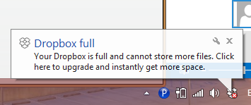
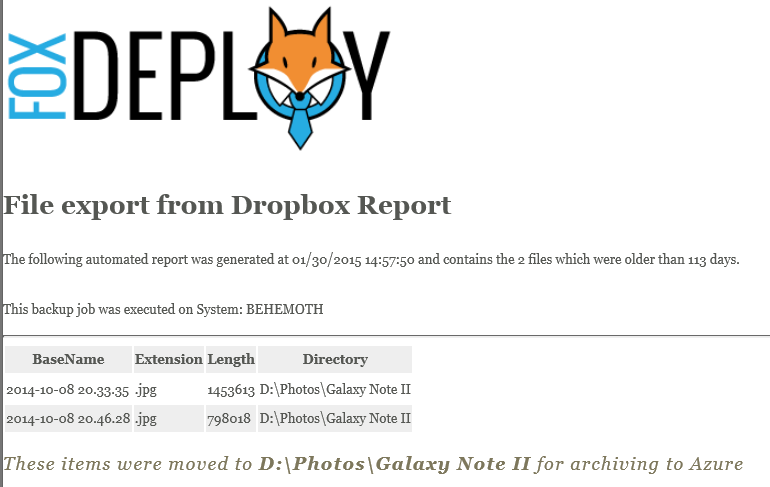

I love dropbox, we all love Dropbox, it even comes preinstalled on our phones!

Sadly, it can be irritating when you get notices like this on the desktop

[](images/dropbox-nag-screen.png)

I noticed one day that my DropBox camera roll folder was using up the vast majority of my free space, something like 60 or more percent! Since I've got a 9 month old, its no wonder. I am constantly recording pictures and videos of her, so it's a matter of course.

If we could move all files older than three or four months out of the Dropbox 'Camera Uploads' folder, we could really free up some space! Additionally, I wanted to backup my files from DropBox onto another Storage Provider (OneDrive) as well as move a copy onto my backup drive. To solve all of these needs, I wrote a PowerShell script which can run as a scheduled task to handle moving the items out of the Camera Uploads folder. This can be run on any system that you've got the DropBox desktop client installed.  

I even included a snazzy looking summary report which is displayed after the job finishes.

Simply download the .ps1 file, then modify the few highlighted lines below.

```powershell ####User Params Here # / This should be the path to your Dropbox camera Uploads folder $cameraFolder = "C:UsersStephenDropboxCamera Uploads"

\# / If you want to create a copy somewhere else, provide it here $SkyDriveFolder = "C:UsersStephenSkyDrivePicturesCamera Roll"

\# / Finally, files are MOVED from your Dropbox folder to this path $BackupFolder = "D:PhotosGalaxy Note II"

\# / Specify the maximum age of files in days here. Anything older than this is moved out of the $cameraFolder path $MoveFilesOlderThanAge = "-113"

\# / Specify the path to an optional logo for your status report $logoPath = "C:UsersStephenDropboxSpeakingDemoslogo.png"

\# / Specify the path to a CSS file $cssPath = "C:UsersStephenDropboxSpeakingDemosstyle.css" ####End user params \[/code\]

Save the code below as a Move-DropBoxFiles.ps1. Next, to setup a scheduled task using the below code. (Borrowed liberally from the King of Code himself, Ed Wilson, [in this blog post on Scheduled Jobs](http://blogs.technet.com/b/heyscriptingguy/archive/2012/09/18/create-a-powershell-scheduled-job.aspx).

\[code language="powershell" light="true"\] $dailyTrigger = New-JobTrigger -Daily -At "2:00 PM"

$option = New-ScheduledJobOption -StartIfOnBattery –StartIfIdle

Register-ScheduledJob -Name UpdateHelp -ScriptBlock \`

{c:pathtoMove-DropboxFiles.ps1} -Trigger $dailyTrigger -ScheduledJobOption $option \[/code\]

Now, when this runs every day at 2:00 PM, you should see a PowerShell window popup momentarily, and then the files will be copied and moved according to the criteria you select. When the job is finished, you'll see this nice looking HTML Status Page pop-up.

](images/dropbox-backup.png) Automatic file move from DropBox report\[/caption\]

**Enjoy!**

### Full source here:

\[code language="powershell" collapse="true"\]

####User Params Here # / This should be the path to your Dropbox camera Uploads folder $cameraFolder = "C:UsersStephenDropboxCamera Uploads"

\# / If you want to create a copy somewhere else, provide it here $SkyDriveFolder = "C:UsersStephenSkyDrivePicturesCamera Roll"

\# / Finally, files are MOVED from your Dropbox folder to this path $BackupFolder = "D:PhotosGalaxy Note II"

\# / Specify the maximum age of files in days here. Anything older than this is moved out of the $cameraFolder path $MoveFilesOlderThanAge = "-113"

\# / Specify the path to an optional logo for your status report $logoPath = "C:UsersStephenDropboxSpeakingDemoslogo.png"

\# / Specify the path to a CSS file $cssPath = "C:UsersStephenDropboxSpeakingDemosstyle.css" ####End user params

$backupFiles = new-object System.Collections.ArrayList $itemCount = Get-ChildItem $cameraFolder | Where-Object LastWriteTime -le ((get-date).AddDays($MoveFilesOlderThanAge)) | Measure-Object | select -ExpandProperty Count

Get-ChildItem $cameraFolder | Where-Object LastWriteTime -le ((get-date).AddDays($MoveFilesOlderThanAge)) | ForEach-Object { $i++ Write-Progress -PercentComplete (($i/$itemCount) \* 100) -Status "Moving $\_ ($i of $itemCount)" -Activity ("Backup up files older than " + ((get-date).AddDays($MoveFilesOlderThanAge))) Copy-Item -Destination $SkyDriveFolder -Path $\_.FullName -PassThru $backupFiles.Add((Move-Item -Destination $BackupFolder -Path $\_.FullName -PassThru | select BaseName,Extension,Length,Directory)) Start-Sleep -Milliseconds 25 }

$companyLogo = "<div align=left></div>" $header = @" $companyLogo <h1>File export from Dropbox Report</h1> <p>The following automated report was generated at $(Get-Date) and contains the $itemcount files which were older than $(\[math\]::Abs($MoveFilesOlderThanAge)) days. <Br><Br>This backup job was executed on System: $($Env:Computername)</p>

<hr> "@

$post = @" <h3>These items were moved to <b>$BackupFolder</b> for archiving to Azure</h3> "@

$HTMLbase = $backupFiles | ConvertTo-Html -Head $header -CssUri $CssPath \` -Title ("Dropbox Backup Report for $((Get-Date -UFormat "%Y-%m-%d"))") \` -PostContent $post

$HTMLbase | out-file $StatusReportPathDropboxBackup\_$((Get-Date -UFormat "%Y-%m-%d"))\_Log.html

& $StatusReportPathDropboxBackup\_$((Get-Date -UFormat "%Y-%m-%d"))\_Log.html

\[/code\]

### CSS Code here

This is based off of [Zen Garden](http://www.csszengarden.com/) v 1.02, by Dave Shea. I've since made some tweaks to it for styling.  
\[code language="css" collapse="true"\] /\* css Zen Garden default style v1.02 \*/ /\* css released under Creative Commons License - http://creativecommons.org/licenses/by-nc-sa/1.0/ \*/

/\* This file based on 'Tranquille' by Dave Shea \*/ /\* You may use this file as a foundation for any new work, but you may find it easier to start from scratch. \*/ /\* Not all elements are defined in this file, so you'll most likely want to refer to the xhtml as well. \*/

/\* Your images should be linked as if the CSS file sits in the same folder as the images. ie. no paths. \*/

/\* basic elements \*/ html { margin: 0; padding: 0; } body { font: 75% georgia, sans-serif; line-height: 1.88889; color: #555753; background: #fff url(blossoms.jpg) no-repeat bottom right; margin: 0; padding: 0; } p { margin-top: 0; text-align: justify; } h3 { font: italic normal 1.4em georgia, sans-serif; letter-spacing: 1px; margin-bottom: 0; color: #7D775C; } a:link { font-weight: bold; text-decoration: none; color: #B7A5DF; } a:visited { font-weight: bold; text-decoration: none; color: #D4CDDC; } a:hover, a:focus, a:active { text-decoration: underline; color: #9685BA; } abbr { border-bottom: none; }

/\* specific divs \*/ .page-wrapper { background: url(zen-bg.jpg) no-repeat top left; padding: 0 175px 0 110px; margin: 0; position: relative; }

.intro { min-width: 470px; width: 100%; } tr:nth-child(odd) { background-color:#eee; } tr:nth-child(even) { background-color:#fff; }

header h1 { background: transparent url(h1.gif) no-repeat top left; margin-top: 10px; display: block; width: 219px; height: 87px; float: left;

text-indent: 100%; white-space: nowrap; overflow: hidden; } header h2 { background: transparent url(h2.gif) no-repeat top left; margin-top: 58px; margin-bottom: 40px; width: 200px; height: 18px; float: right;

text-indent: 100%; white-space: nowrap; overflow: hidden; } header { padding-top: 20px; height: 87px; }

.summary { clear: both; margin: 20px 20px 20px 10px; width: 160px; float: left; } .summary p { font: italic 1.1em/2.2 georgia; text-align: center; }

.preamble { clear: right; padding: 0px 10px 0 10px; } .supporting { padding-left: 10px; margin-bottom: 40px; }

footer { text-align: center; } footer a:link, footer a:visited { margin-right: 20px; }

.sidebar { margin-left: 600px; position: absolute; top: 0; right: 0; } .sidebar .wrapper { font: 10px verdana, sans-serif; background: transparent url(paper-bg.jpg) top left repeat-y; padding: 10px; margin-top: 150px; width: 130px; } .sidebar h3.select { background: transparent url(h3.gif) no-repeat top left; margin: 10px 0 5px 0; width: 97px; height: 16px;

text-indent: 100%; white-space: nowrap; overflow: hidden; } .sidebar h3.archives { background: transparent url(h5.gif) no-repeat top left; margin: 25px 0 5px 0; width:57px; height: 14px;

text-indent: 100%; white-space: nowrap; overflow: hidden; } .sidebar h3.resources { background: transparent url(h6.gif) no-repeat top left; margin: 25px 0 5px 0; width:63px; height: 10px;

text-indent: 100%; white-space: nowrap; overflow: hidden; }

.sidebar ul { margin: 0; padding: 0; } .sidebar li { line-height: 1.3em; background: transparent url(cr1.gif) no-repeat top center; display: block; padding-top: 5px; margin-bottom: 5px; list-style-type: none; } .sidebar li a:link { color: #988F5E; } .sidebar li a:visited { color: #B3AE94; }

.extra1 { background: transparent url(cr2.gif) top left no-repeat; position: absolute; top: 40px; right: 0; width: 148px; height: 110px; } \[/code\]
