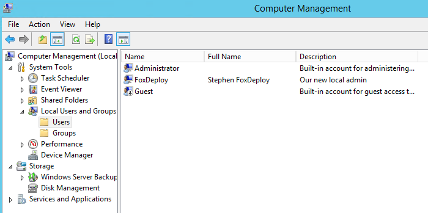

[](http://foxdeploy.com/learning-dsc-series/)

Being that I am a creature of pure distilled vanity, I often reread my articles and blog posts after the fact to make sure that I wrote well and don't have any typos. Well, when I reread my last post, I realized that I forgot to add the step of making a User Account with PowerShell DSC! Whoops!

As it turns out, actually creating a user with DSC had me ready to pull my hair off in frustration, so to save you intrepid Googlers from this pain, I've outlined what you SHOULDN'T do, and also have a working easy to understand demo in the bottom.

#### Add a User Resource to our DSC Config

So, building on our DSC Config from last week; when we want to add a new DSC Resource, the first start is to run Get-DSCResource and look at what Properties we can (and need to) focus on.

\[code\]Get-DscResource User | select -ExpandProperty Properties\[/code\]

 

Based on what we see above, we should be good to add the following under xComputer

```powershell   

User LocalAdmin { UserName = $UserName DependsOn = '\[xComputer\]NewNameAndWorkGroup' Description = 'Our new local admin' Disabled = $false Ensure = 'Present' FullName = 'Stephen FoxDeploy' Password = '$Password' PasswordChangeRequired = $false PasswordNeverExpires = $true

} \[/code\]

You can see that we added a few variables there, so let's go add them all to our Parameter block.

Change our params block in this script to the following

```powershell    param ( \[string\[\]\]$NodeName ='localhost', \[Parameter(Mandatory)\]\[string\]$MachineName, \[Parameter(Mandatory)\]\[string\]$WorkGroupName, \[Parameter()\]\[string\]$UserName, \[Parameter()\]\[string\]$Password ) \[/code\]

Now let's invoke it…

```powershell  TestLab -MachineName DSCDC01 -WorkGroupName TESTLAB -Password 'myRootPw' -UserName 'Stephen FoxDeploy'\[/code\]

ERROR :(

```powershell   Write-NodeMOFFile : Invalid MOF definition for node 'localhost': Exception calling 'ValidateInstanceText' with '1' argument(s): 'Convert property 'Password' value from type 'STRING' to type 'INSTANCE' failed At line:37, char:2 Buffer: onName = 'TestLab'; };^ \[/code\]

#### Fix: Convert property value from type string to type instance failed

What?!? Maybe my brain just doesn't work so good, but I had a really hard time understanding what this message meant: Convert Property Value from type String to type Instance. So I took a peek at TechNet.

[Checking TechNet](https://technet.microsoft.com/en-us/library/dn282118.aspx?f=255&MSPPError=-2147217396.), I see this example of how to use the DSC User Resource(I've actually bolded the part that was causing me grief, let's see if you can figure it out quicker than I could!):

> User UserExample { Ensure = "Present" # To ensure the user account does not exist, set Ensure to "Absent" UserName = "SomeName" **Password = $passwordCred # This needs to be a credential object** DependsOn = “\[Group\]GroupExample" # Configures GroupExample first }

Let's look at the error message again…

"Convert property 'Password' value from type 'STRING' to type 'INSTANCE' failed

And now side-by-side...

Password = $passwordCred # This needs to be a credential object Can't convert property 'Password' value from type 'STRING' to type 'INSTANCE' failed

Hmm…I converting from a string failed, and TechNet says it needs to be a Credential object instead…! Wait! PowerShell is telling me I can't give the PW as a string, it actually has to be a credential object! Not sure why it took me so long to understand this. Actually, if we take a look at the output from Get-DSCResource, it even says right there what type to provide the data in.


So, let's replace our -PassWord 'RootPW' with a parenthesis with Get-Credential and see what happens...

```powershell   TestLab -MachineName DSCDC01 -WorkGroupName TESTLAB -Password (Get-Credential -UserName 'FoxDeploy' -Message 'Enter New Password') -UserName 'FoxDeploy'\[/code\]

#### Fix: Storing passwords as plain text is not recommended

Running the cmd above gives us...some more blood in the water, but this is great because we've solved the first problem!

```powershell   ConvertTo-MOFInstance : System.InvalidOperationException error processing property 'Password' OF TYPE 'User': Converting and storing encrypted passwords as plain text is not recommended. For more information on securing credentials in MOF file, please refer to MSDN blog: http://go.microsoft.com/fwlink/?LinkId=393729 \[/code\]

Hey, at least we're getting somewhere! This is probably one of the most informative error messages I've ever had in PowerShell! It's saying hey, you can't do this, here is a link with more info. I like it! Much better than before.

I did some googling and [found this article on the topic](http://newdelhipowershellusergroup.blogspot.com/2014/05/using-windows-powershell-desired-state_20.html), it turns out we need to specify a -ConfigurationData parameter, which will allow us to tell PS to, just this once, ignore our bad behavior password.

Let's throw this bad boy on there…

```powershell  

$configData = @{ AllNodes = @( @{ NodeName = 'localhost'; PSDscAllowPlainTextPassword = $true } ) } \[/code\]

Now, to run it, one last time!


BLAM! Let's apply it!

RESULTS

\[code language="powershell" collapse="true"\] \[\[xComputer\]NewNameAndWorkgroup\] Checking if computer name is DSCDC01 \[\[xComputer\]NewNameAndWorkgroup\] Checking if workgroup name is TESTLAB \[\[xComputer\]NewNameAndWorkgroup\] in 0.2420 seconds. \[\[xComputer\]NewNameAndWorkgroup\] \[\[User\]LocalAdmin\] A user with the name FoxDeploy does not exist. \[\[User\]LocalAdmin\] in 2.4380 seconds. \[\[User\]LocalAdmin\] \[\[User\]LocalAdmin\] Configuration of user FoxDeploy started. \[\[User\]LocalAdmin\] Performing the operation 'Add' on target 'User: FoxDeploy'. \[\[User\]LocalAdmin\] User FoxDeploy created successfully. \[\[User\]LocalAdmin\] Configuration of user FoxDeploy completed successfully. \[\[User\]LocalAdmin\] in 2.5090 seconds. \[/code\]

Now, let's look to see if our User was created



Ok, that's damned sexy

#### Completed DSC File

This DSC config will rename our PC, join it to a workgroup, and then add a new local user to the machine. When you run this, you'll be prompted to provide the PW for the new local user. Make sure to change the -Username value to a name you'd like to use.

```powershell   configuration TestLab { param ( \[string\[\]\]$NodeName ='localhost', \[Parameter(Mandatory)\]\[string\]$MachineName, \[Parameter(Mandatory)\]\[string\]$WorkGroupName, \[Parameter()\]\[string\]$UserName, \[Parameter()\]$Password )

#Import the required DSC Resources Import-DscResource -Module xComputerManagement

Node $NodeName { xComputer NewNameAndWorkgroup { Name = $MachineName WorkGroupName = $WorkGroupName }

User LocalAdmin { UserName = $UserName Description = 'Our new local admin' Ensure = 'Present' FullName = 'Stephen FoxDeploy' Password = $Password PasswordChangeRequired = $false PasswordNeverExpires = $true DependsOn = '\[xComputer\]NewNameAndWorkGroup' }

} }

$configData = 'a'

$configData = @{ AllNodes = @( @{ NodeName = 'localhost'; PSDscAllowPlainTextPassword = $true } ) }

#See whats needs to be configured # Get-DscResource User | select -ExpandProperty Properties | select -expand name

TestLab -MachineName DSCDC01 -WorkGroupName TESTLAB -Password (Get-Credential -UserName 'FoxDeploy' -Message 'Enter New Password') -UserName 'FoxDeploy' -ConfigurationData $configData

Start-DscConfiguration -ComputerName localhost -Wait -Force -Verbose -path .TestLab \[/code\]

#### Wrapping Up

So, it seems that most things in DSC look deceptively easy when you see the finished result, but working up to that is quite difficult. Instead this was more of a deep dive into using the User Resource with DSC. Join us again next week when we add our user to the Administators built-in Group, then make our machine into a Domain Controller.

- [Step 1 Getting Started, renaming our machine and joining a workgroup](http://foxdeploy.com/2015/03/20/part-i-building-an-ad-domain-testlab-with-dsc/ "Part I : Building an AD Domain Testlab with DSC")
- This Post - [Step 1.5 Creating our first local user](http://foxdeploy.com/2015/03/26/part-i-5-creating-a-user-for-our-testlab-with-dsc/ "Part I.5: Creating a user for our Testlab with DSC")
- [Step 2 Making our user a local administrator](http://foxdeploy.com/2015/03/31/building-on-our-configuration-from-last-week-we-add-our-user-to-the-local-admin-group-using-dsc/)
- [Step 3 Making our system a Domain Controller](http://wp.me/p3Q7Nu-zr)
