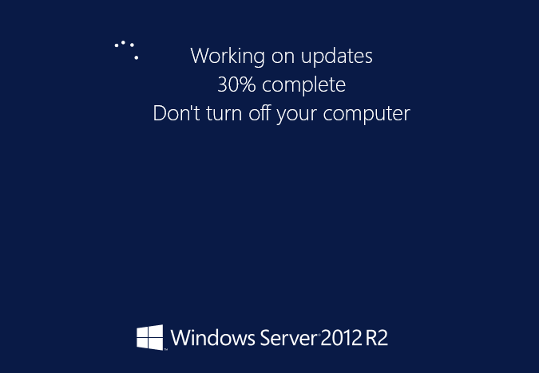

I often rebuild my testlab from the ground up, and have gotten to the point that setting up my Domain, DHCP, DNS and the like all is a very quick and easy task., But it wasn't always this way, in fact, I used to spend hours trying just to get DHCP and Domain Controller working.

This is post one of a projected three part series in which we'll use the magical power of infrastructure as code and embrace the DevOps lifestyle using PowerShell Desired State Configuration. In post one, we'll start easily and just change the name of our machine and the workgroup, then configure a local admin account in the same doc.

In part II - we'll configure some Windows Roles, and make this system into a Domain Controller. In part III - we'll pull out all of the stops and ensure that our DSC configuration handles DHCP and DNS as well, giving us a one-click DSC Testlab.

### System Prerequisites

Using Hyper-V or VMware, make a VM with Two NICs, one connected to an external, and one an internal virtual switch, for ease, make it a Server 2012 R2 VM.

Then we'll apply WMF 5.0 to our server, [found here](http://www.microsoft.com/en-us/download/details.aspx?id=45883).

Kick that bad boy off, and let 'er reboot. Uh..let him rebot. What I'm trying to say is, regardless of the sex of your system, reboot it.

We'll need to provide the DSC resources we need to install, so the next step is to download the xServer script module, [provided here](https://gallery.technet.microsoft.com/scriptcenter/xComputerManagement-Module-3ad911cc).

Now, download and extract this to the following path : $env:ProgramFilesWindowsPowerShellModules folder

### Making our first configuration

In the ISE, we can run the Get-DSCResource cmdlet to see if PowerShell detects our new xResource. If you don't see the following, stop now and make sure you downloaded the xComputerManagement resource before proceeding.

Now deeply under the covers, we can see that making a PowerShell configuration is really quite similar to creating a Function. All we've got to do is use the Configuration Keyword in a format that should look quite familiar.

\[code language="powershell"\] Configuration TestLab { Param($nodeName) Import-DscResource -Module xComputerManagement

Node $nodeName {

} }

\[/code\]

When we run this, we'll end up with a compiled Configuration in memory, just like we would when we run a Function. We can call it by typing TestLab and it will accept a parameter of -NodeName, which will be the computer to apply to configuration too.

We'll compile our Configuration, then execute it, which makes a .mof configuration. Finally, we run Start-DSCConfiguration -Path .Pathtoconfiguration.mof to apply the changes to our system.

### Adding Configuration Items to our Configuration

So far, we've got the skeleton of a config but it isn't making any changes to our system.

We'll now rely on one of the cool features of the ISE is Intellisense, I.e. super mega auto-complete. Right underneath `Node $nodename`, let's start by typing xComputer then hitting Control+Space to pop-up Intellisense and see which configuration options we can use from this resource.

We see that we can configure a lot of things:

- Credential : If you need special rights to implement this change
- DependsOn : We'll use this in Part II to order the application of our changes
- DomainName : if we want to add to a new Domain, we'd use this configuration
- UnjoinCredential : if we need special rights to pull our machine off of an existing domain
- WorkGroupName: to specify a new workgroup, you specify this setting

So, for part I of our DSC walk-through, we only want to change the MachineName and the WorkGroupName, lets drop these values in under $nodeName.  I want to name my new system DSCDC01, and my new WorkGroup to be called TestLab

\[code language="powershell"\] xComputer NewNameAndWorkgroup { Name = DSCDC01 WorkGroupName = TestLab } \[/code\]

### The Next step...wait, That's all!

Just to reiterate, this is our total script, making some small changes to add parameter support.

\[code language="powershell"\] configuration TestLab { param ( \[string\[\]\]$NodeName ='localhost', \[Parameter(Mandatory)\]\[string\]$MachineName, \[Parameter(Mandatory)\]\[string\]$WorkGroupName )

#Import the required DSC Resources Import-DscResource -Module xComputerManagement

Node $NodeName { xComputer NewNameAndWorkgroup { Name = $MachineName WorkGroupName = $WorkGroupName } } } \[/code\]

To implement this, all that we have to do is go to our new DSC client, and execute the code, just like we would with a Function. We then run it like we do a cmdlet and provide some params.

\[code language="powershell" light="true"\] TestLab -MachineName DSCDC01 -WorkGroupName TESTLAB -Verbose\[/code\]

That will create an output file in .mof format

\[code\]

Directory: C:TestlabDCTestlabDCxComputer

Mode LastWriteTime Length Name ---- ------------- ------ ---- -a---- 3/19/2015 2:23 PM 1670 localhost.mof \[/code\]

The final step here is to apply the configuration to our machine and see what happens.

\[code language="powershell" light="true"\] Start-DscConfiguration -ComputerName localhost -Path .xComputer \` -Wait -Force -Verbose\[/code\]

And watch the beautiful colors scroll by

Our log output says that a reboot is needed to kick things off, but we can take a look at System Management to see what the setting will be after a reboot.

### That's it!

Now, join us in our next post on this series to see how we add a few extra paragraphs to make this into a Domain Controller and get our TestLab really going.

- This post - [Step 1 Getting Started, renaming our machine and joining a workgroup](http://foxdeploy.com/2015/03/20/part-i-building-an-ad-domain-testlab-with-dsc/ "Part I : Building an AD Domain Testlab with DSC")
- [Step 1.5 Creating our first local user](http://foxdeploy.com/2015/03/26/part-i-5-creating-a-user-for-our-testlab-with-dsc/ "Part I.5: Creating a user for our Testlab with DSC")
- [Step 2 Making our user a local administrator](http://foxdeploy.com/2015/03/31/building-on-our-configuration-from-last-week-we-add-our-user-to-the-local-admin-group-using-dsc/)
- [Step 3 Making our system a Domain Controller](http://wp.me/p3Q7Nu-zr)
