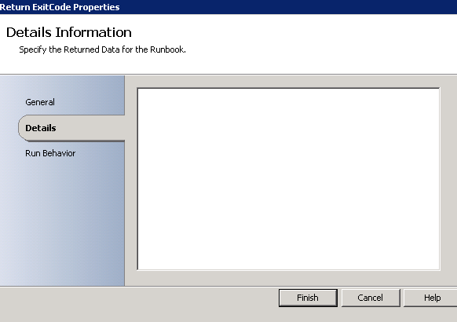
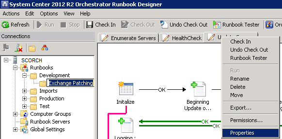
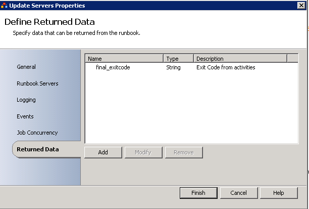

System Center Orchestrator--formerly Opalis Orchestrator-- and now lovingly called SCORCH by its fans is a powerful automation tool, but there are a lot of gotcha's that makes it difficult to begin rolling out in the environment.

For instance, it's desirable to Return Data back from a Runbook either to a parent runbook, or to Service Manager or another system to act on the results. As an example, imagine a runbook that can fork in many places and then return an exit code that we then send off to a parent runbook to register as an Operations Manager event, or to send in an e-mail. There's lot of options. Well, even with this common scenario, people still run into a brick wall when they experience the following

#### Symptom

When a runbook has valid data pushed to the SCORCH Databus, adding a **Return Data** step results in a blank window like the following.

 

#### Cause

Oddly enough, the settings for which data is returned from the runbook aren't configured from anywhere within the runbook, but rather within the runbook properties itself.

#### Resolution

This one is easy to fix, go up to the top of the Orchestrator window and right-click on the Runbook name itself, and choose properties.

Next we browse down to to Returned Data and prepare to roll our eyes.

This is actually the place where you enable values for the **Return Data** activity. I know, I think it's absolutly horrific from a usability and discoverability stand-point. One of the many things that make Orchestrator a challenge to use.

If we go back into the runbook itself now, we can Check the runbook back in and out and then our Return Data field will update. Enjoy!
