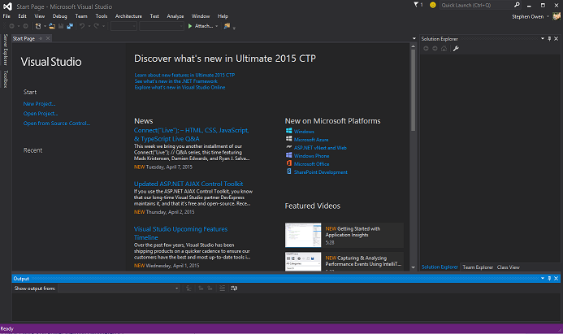
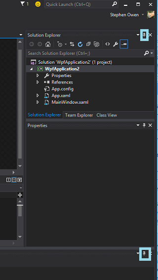
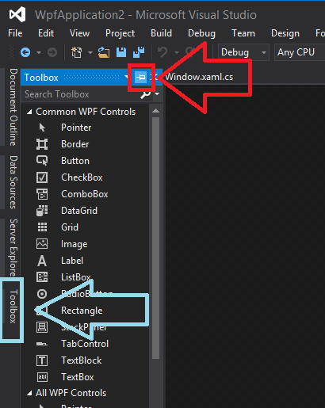
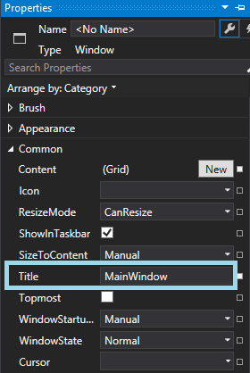
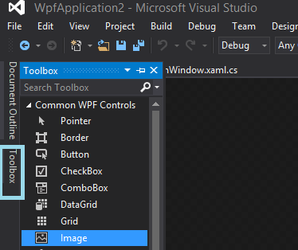
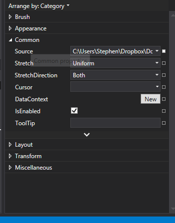
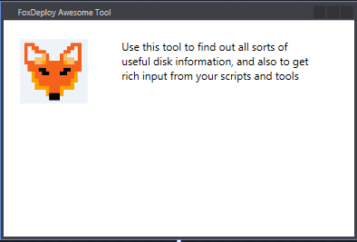
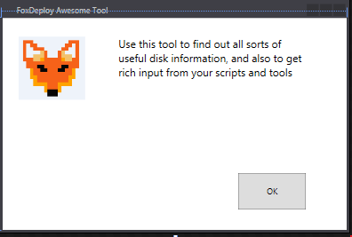
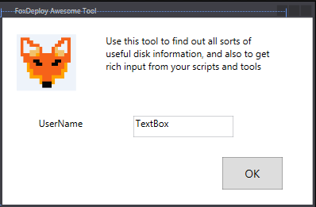

**This post is part of the Learning GUI Toolmaking Series, here on FoxDeploy. Click the banner to return to the series jump page!**

* * *

> "I'll never do it the old way again. EVER. " -me

If you've been following my blog for any time, you'll know that I love making tools using PowerShell.

I've written on the topic previously, and the approach I took then were based off of using the .net System.Windows.Forms class which really meant that you had to painfully, agonizingly create a GUI one element at a time.   I knew there were other methods, using something scary called XAML, and I'd even seen other's tutorials, but frankly thought it looked too hard.

So I stuck with the pulling teeth method for years.  Until one day, I had some spare time and thought I'd take a look at the other GUI design method again...

**I wish I had sooner, because it is so EASY!**

What You'll Need:

- Visual Studio.  I'm using Community Tech Preview 2015, but you can do this with Visual Studio Express too. [Get it here](https://www.visualstudio.com/vs/community/) 
- A bit of helper PowerShell code, inspired by the awesome Chris Conte in [this guest post on The Scripting Guy blog](http://blogs.technet.com/b/heyscriptingguy/archive/2014/08/01/i-39-ve-got-a-powershell-secret-adding-a-gui-to-scripts.aspx).  I'll provide the snippet we need, when we need it.

Getting Visual Studio is easy, just download either the CTP edition or the trial of Ultimate.  There are ways of getting it for free too, via DreamSpark, MSDN, MVP Access or you can always use Express.  Assuming you've been able to install Visual Studio...

#### How this is going to work

A bit of history first on how this differs from what we did before.

Released with .net 3.0 back in 2006, Windows Presentation Foundation sought to rearchitect the way Windows Developers wrote their programs.  Instead of WinForm and the incredibly verbose style of configuring each element line by line, Microsoft brought a more civilized, CSS inspired design pattern to the world of Windows UX Design.

C# could be used as the code-behind (the actual payload of making things work), while the UI could be designed and themed in XAML, Microsoft's new Extensible Application Markup Language format (inspired by XML), and the whole thing could easily be themed much like a website with CSS.

Since PowerShell is also based on .net, we can use Visual Studio to draw and design a GUI, then easily import it into PowerShell to use to make our own GUIS, but with our favorite scripting language used as the engine (instead of C#).  And the cool part is that anywhere that PowerShell runs and a GUI is available, our code will work there too!

(Sorry Server Core users of the World, Server Core _does not_ have the WPF assemblies needed to run GUIs)

Interested?  Let's begin!

#### Preparing Visual Studio

Start by launching Visual Studio

 it's so purple and creepy! Like a Gore Magala!\[/caption\]

Not a Monster Hunter fan? Ok…moving on

You'll want to click New Project on the left side of your screen

Next, follow the numbers in the image below as you will 1. type **WPF** in the search box 2. click **WPF Application** in the main window, and then 3. customize the project name (if you'd like) and click OK.

This is what you'll see, the fully blown Visual Studio UI.

 There is a lot of cruft we can disable though, so lets hide some elements.  For now, we don't need Solution Explorer, which holds all of the files related to our project (since we won't actually be publishing this project, just building its UI here) and we won't need Properties until we add some items.

 You can bring these items back by hitting F4, F6 or choosing them from the Alt-View menu up top\[/caption\]

Now, we will want to display and then pin the toolbox on the left side, to give us our goods we can drag and move around.

Alright, there we go, much less noise, and now we're able to get started.

#### Making a GUI in Visual Studio

The center area now holds our form.  You're looking at what the GUI will be for your script or tool. You can resize the window, or drag and drop items into our form.

##### **Two Tool making tips to remember**

Before we dig in deeper, you should remember these tennants:

- **Give it a name -** Every good tool needs a name, without a name, it's harder to understand what something is for non-enthusiasts and you might end up with something being called 'the Dan Script' or 'The Stephen Tool'
- **Wait till its ready -** Always add an image and put a small amount of polish on your tools before you release them, or you'll never get over that first bad impression

Let's name this bad boy: click the title bar of your GUI, then hit F4 to show Properties

 You could also just click the text and hit F2\[/caption\]

Let's start with our GUI by adding an image first, then some text. The elements we want to grab from the tool box are Image, and a TextBlock object.

In the Toolbox, click Image, then draw the area you want the image to take on your form.

Now's a good time to hit F4 to bring back some of the stuff we hid earlier, because we want to add some properties to this image (namely, the file source).

Go to explorer, find an image you like, and then copy its path and paste it here (pro-tip, don't use quotes).

 Put the file path in the Source field. Pro-tip: no quotes\[/caption\]

Now we'll do the same again for a TextBlock.

I created mine right next to my MS-DOS FoxDeploy icon, and just added a bit of flavor text.

If you're feeling really uninspired and just want to copy my text, then go ahead and enter the following:

"Use this tool to find out all sorts of useful disk information, and also to get rich input from your scripts and tools "

If you really want to, you change the Font as well, by clicking in the Properties box on the right, and look towards the bottom for the Text area

Provided you've accomplished the above, you should now be looking at a pretty sweet field like this guy.

### But it doesn't _do_ anything yet...

One thing every good tool should have is a button!  Let's add an OK button.  Go back to the toolbox, find the Button Control and drag and drop it.  I'll put mine in the lower right hand corner.

A button shouldn't say 'Button'.  When you've clicked on the button, you can Hit F2 to quickly type in some new text for the face of the button, or edit this value in the properties as well.

I wasn't satisfied with the miniscule font VS likes to use, so I decided to change it; you can change the size or font of pretty much anything by clicking it in the drafting pane, and then using the Properties window on the right (or Hit F4 to show it if properties is hiding) to change the Font Size.  I pumped the font up to 12 or 14.

I'd say if we add a text box (place where users can enter stuff) and a label (non-editable, it's where we add a description to a field, we'll have enough for now.  For both of these, go back to the toolbox and then grab one of each and draw them on your form.  I went agead and changed Label to say 'UserName', because I've started thinking about how to make this useful.

####  Coming Up...

In this guide, we installed Visual Studio and spent some time creating a WPF Powered GUI, which uses XAML as the language to describe the GUI.  All well and good, but how do we get this working in PowerShell??

Read on, intrepid reader, to find out.

[Series Home page ](http://foxdeploy.com/resources/learning-gui-toolmaking-series/) [Part II - Deploying PowerShell GUIs in Minutes using Visual Studio](http://foxdeploy.com/2015/04/16/part-ii-deploying-powershell-guis-in-minutes-using-visual-studio/)
