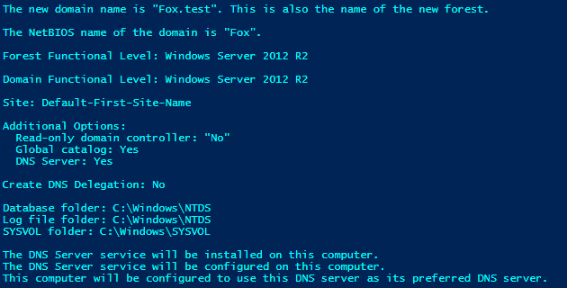
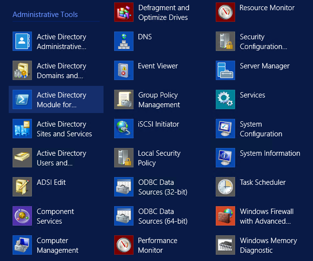

So, it seems that I bit off a huge chunk here in making this a good walk-through, so in this section, we'll be working again on our configuration from last week and, make this even better.

#### The Completed Script

> What? We're starting off with the full script?

Yep, I want you guys to have the working code from the beginning, and we'll work through what we have to add to make this configuration our one-stop-shop for building a testlab.

\[code language="powershell" collapse="true"\] $secpasswd = ConvertTo-SecureString 'IWouldLiketoRecoverPlease1!' -AsPlainText -Force $SafeModePW = New-Object System.Management.Automation.PSCredential ('guest', $secpasswd)

$secpasswd = ConvertTo-SecureString 'IveGot$kills!' -AsPlainText -Force $localuser = New-Object System.Management.Automation.PSCredential ('guest', $secpasswd)

configuration TestLab { param ( \[string\[\]\]$NodeName ='localhost', \[Parameter(Mandatory)\]\[string\]$MachineName, \[Parameter(Mandatory)\]\[string\]$DomainName, \[Parameter()\]$firstDomainAdmin, \[Parameter()\]\[string\]$UserName, \[Parameter()\]$SafeModePW, \[Parameter()\]$Password ) #Import the required DSC Resources Import-DscResource -Module xComputerManagement Import-DscResource -Module xActiveDirectory Node $NodeName { #ConfigurationBlock xComputer NewNameAndWorkgroup { Name = $MachineName WorkgroupName = 'TESTLAB' } User LocalAdmin { UserName = $UserName Description = 'Our new local admin' Ensure = 'Present' FullName = 'Stephen FoxDeploy' Password = $Password PasswordChangeRequired = $false PasswordNeverExpires = $true DependsOn = '\[xComputer\]NewNameAndWorkGroup' } Group AddToAdmin{ GroupName='Administrators' DependsOn= '\[User\]LocalAdmin' Ensure= 'Present' MembersToInclude=$UserName }

WindowsFeature ADDSInstall { DependsOn= '\[Group\]AddToAdmin' Ensure = 'Present' Name = 'AD-Domain-Services' IncludeAllSubFeature = $true } WindowsFeature RSATTools { DependsOn= '\[WindowsFeature\]ADDSInstall' Ensure = 'Present' Name = 'RSAT-AD-Tools' IncludeAllSubFeature = $true }

xADDomain SetupDomain { DomainAdministratorCredential= $firstDomainAdmin DomainName= $DomainName SafemodeAdministratorPassword= $SafeModePW DependsOn='\[WindowsFeature\]RSATTools' DomainNetbiosName = $DomainName.Split('.')\[0\] } #End Configuration Block } }

$configData = 'a'

$configData = @{ AllNodes = @( @{ NodeName = 'localhost'; PSDscAllowPlainTextPassword = $true } ) }

TestLab -MachineName DSCDC01 -DomainName Fox.test -Password $localuser \` -UserName 'FoxDeploy' -SafeModePW $SafeModePW \` -firstDomainAdmin (Get-Credential -UserName 'FoxDeploy' -Message 'Specify Credentials for first domain admin') -ConfigurationData $configData Start-DscConfiguration -ComputerName localhost -Wait -Force -Verbose -path .\\TestLab -Debug \[/code\]

#### What's changed?

_Warning: Laziness has occurred. I got sick of typing in Passwords over and over, so I'm using the ConvertTo-SecureString cmdlet to save on typing in the first four lines of the script. Update these values to whatever you'd like for your own testlab domain's Recovery Password and local admin account password._

In order to progress this DSC Configuration from making just a local user, making him an admin, and changing the name, we have to add some extra configuration resources to our config. From the top down, these are the one's we'll be making use of.

• WindowsFeature - Install the Windows Feature AD-Domain Services, then RSAT-AD-TOOLS • xADDomain - Creates a domain if one doesn't exist and makes this a Domain Controller

We'll also need to add some new parameters as well,

\[code language="powershell"\] \[Parameter(Mandatory)\]\[string\]$DomainName, \[Parameter()\]$firstDomainAdmin, \[Parameter()\]$SafeModePW, \[/code\]

These parameters are used to configure the following values:

• DomainName - for instance "foxdeploy.com" • FirstDomainAdmin - creates a user as a domain admin • SafeModePW - this is the Active Directory Recovery Mode password

In order to use xADDomain, we have to import the xActiveDirectory module, so if you haven't downloaded that yet, get [it here as a part of the DSC Wave Resource Kit](https://gallery.technet.microsoft.com/scriptcenter/xActiveDirectory-f2d573f3).

. To make use of this resource, we also have to import it.

\[code language="powershell" light="true"\] Import-DscResource -Module xActiveDirectory \[/code\]

The major tasks we're accomplishing here are Installing the Windows Features of AD Domain Services, the AD Server Administration tools like ADUC, DHCP and DNS consoles, and finally making an AD Domain.

**Note**: You may have noticed the presence of a DependsOn section for every resource used thus far.  This is only necessary if the application order matters for your configurations.  As it turns out, pretty much every item I've used up to this point needs to be applied in a particular order (We have to have a user before we can add it to a group, we must have a Domain before we can promote our server to a domain controller, and we must have the Windows Features for a DC before we can run dcpromo), however, you won't always need to add DependsOn unless your Configuration really needs it.

#### Digging into the Resources

Configuring the server to add Domain Services and the RSAT tools is pretty easy, all that we have to do is add two WindowsFeature resources, specifying the Name of the feature needed (get the feature from Get-WindowsFeature, and look at the Name property). We specify Ensure = Present, and IncludeAllSubFeature to get all of the juicy bits.

\[code language="powershell" light="true"\] WindowsFeature ADDSInstall { DependsOn= '\[Group\]AddToAdmin' Ensure = 'Present' Name = 'AD-Domain-Services' IncludeAllSubFeature = $true } WindowsFeature RSATTools { DependsOn= '\[WindowsFeature\]ADDSInstall' Ensure = 'Present' Name = 'RSAT-AD-Tools' IncludeAllSubFeature = $true } \[/code\]

Suprisingly, it is also very easy to configure our domain using the xADDomain resource. These are seriously the only values we have to provide. Running through the values we're configuring:

• DomainAdministratorCredential - Our first additional domain admin creds • DomainName - the unique name for our new domain • SafeModeAdminPassword - the password you'll use to recover your domain on the dark day when you nuked the domain • DomainNetbiosName - we can actually derive this from the -DomainName the user provides

\[code language="powershell" light="true"\] xADDomain SetupDomain { DomainAdministratorCredential= $firstDomainAdmin DomainName= $DomainName SafemodeAdministratorPassword= $SafeModePW DomainNetbiosName = $DomainName.Split('.')\[0\] DependsOn='\[WindowsFeature\]RSATTools' }

\[/code\]

#### Applying the Configuration

As before, applying the configuration is just as simple as loading the config into memory then running it like a cmdlet. Finally, we invoke the configuration using Start-DSCConfig

\[code language="powershell" light="true"\] TestLab -MachineName DSCDC01 -DomainName Fox.test -Password $localuser \` -UserName 'FoxDeploy' -SafeModePW $SafeModePW \` -firstDomainAdmin (Get-Credential -UserName 'FoxDeploy' -Message 'Specify Credentials for first domain admin') -ConfigurationData $configData Start-DscConfiguration -ComputerName localhost -Wait -Force -Verbose -path .\\TestLab -Debug \[/code\]

I've talked through this enough, now time for some pretty pictures!

\[caption id="attachment\_2201" align="alignnone" width="705"\] Checking to see if Active Directory Domain Services is installed\[/caption\]

\[caption id="attachment\_2202" align="alignnone" width="705"\] Making sure our system is a domain controller\[/caption\]

\[caption id="attachment\_2203" align="alignnone" width="630"\] Cool juicy bits about Domain Services being installed...\[/caption\]

\[caption id="attachment\_2204" align="alignnone" width="705"\] DNS and DHCP...online!\[/caption\]

\[caption id="attachment\_2205" align="alignnone" width="705"\] Pre-reboot, our domain settings are listed in server manager\[/caption\]

\[caption id="attachment\_2206" align="alignnone" width="705"\] After a reboot, Server Manager shows DHCP, DNS, and AD DS all healthy and online\[/caption\]

\[caption id="attachment\_2207" align="alignnone" width="647"\] RSAT Tools are ready and loaded!\[/caption\]

#### What's next?

We have a one-click working domain controller config now, but starting with our next post in this series, we'll configure DNS and DHCP for this Domain Controller, so that our testlab DC will publish itself to DNS and be able to give out DHCP address to guest VMs in our lab.
