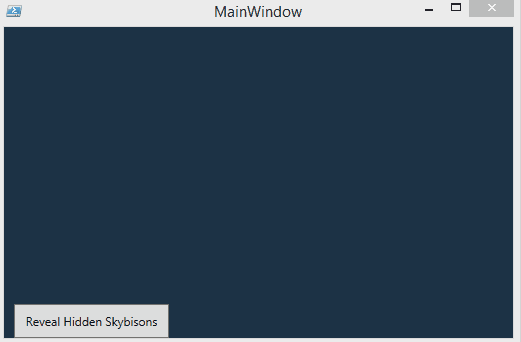
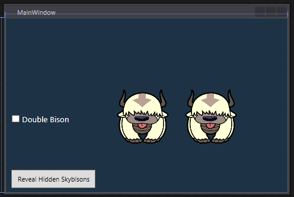
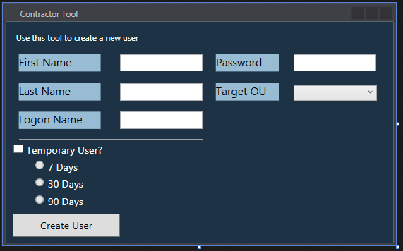
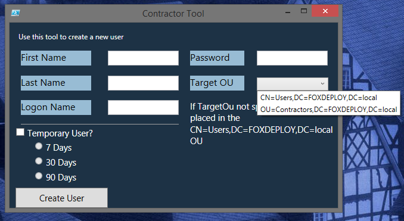
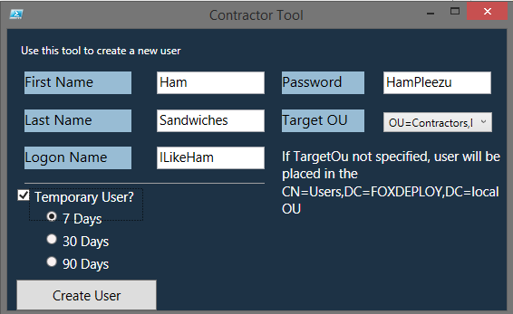
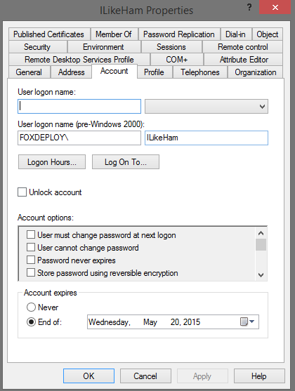

[](http://foxdeploy.com/resources/learning-gui-toolmaking-series/)

**This post is part of the Learning GUI Toolmaking Series, here on FoxDeploy. Click the banner to return to the series jump page!**

* * *

Welcome back to the GUI Series here on FoxDeploy.com! In the previous weeks, I've had a lot of feedback and requests from you guys (which I absolutely love! Assuming I don't need sleep, I'm content to stay up till the wee hours of the morning helping you guys out and responding to your comments or requests, so keep 'em coming!). As for where this blog is heading…I've really been bit hard by the maker bug, and I recently purchased a RaspBerry Pi 2, which is super awesome and incredibly powerful. Direct deploying a program from Visual Studio to this little guy and seeing it light up and project content to my HDMI monitor really makes it feel like I'm doing something tangible. I'll be making a whole series of posts about cool things you can do with the Pi. If you have any ideas, send 'em over!

We're going to cover a number of topics in this one, namely 'how do I do ex' questions. We'll have two somewhat silly examples to start, followed by an actually useful GUI to create a user to wrap us up here.

We'll specifically be hitting all of these guys here, in order.

• Hide a UI Element (by special request) • Use Checkboxes • Use radio buttons (by special request) • Populate a drop-down box automatically

Also, in a big departure from the past, I'll not be posting full code on here anymore. From now on, code samples from here will always be linked and kept up-to-date on GitHub. You can find the code from this post here: https://github.com/1RedOne/Post\_III

Alright, let's get started. Power up Visual Studio and create a new project, specify 'WPF' as your type in the search box.

### Hide a UI element

We'll draw an image and set it to invisible, and then add a button that will make it appear or disappear. You can imagine and endless amount of examples where this could be useful

Now, let's add a meaningful image (read:skybison) and then make it hidden. Finally, let's add a button.

The XAML

\[code language="xml" collapse="true"\] <Window x:Class="BlogPostIII.MainWindow" xmlns="http://schemas.microsoft.com/winfx/2006/xaml/presentation" xmlns:x="http://schemas.microsoft.com/winfx/2006/xaml" xmlns:d="http://schemas.microsoft.com/expression/blend/2008" xmlns:mc="http://schemas.openxmlformats.org/markup-compatibility/2006" xmlns:local="clr-namespace:BlogPostIII" mc:Ignorable="d" Title="MainWindow" Height="350" Width="525"> <Grid x:Name="background" Background="#FF1D3245"> <Image x:Name="image" HorizontalAlignment="Left" Height="100" Margin="171,154,0,0" VerticalAlignment="Top" Width="100" Source="C:\\Users\\sred13\\Dropbox\\My Code\\Migmon\\htdocs\\Appa.png" Visibility="Hidden" /> <Button x:Name="button" Content="Reveal Hidden Skybisons" HorizontalAlignment="Left" Height="34" Margin="10,277,0,0" VerticalAlignment="Top" Width="155"/>

</Grid> </Window>

\[/code\]

This will give us a form with an image, and a button. To hook the button up to the image, we just need to add a few snippets of code:

\[code language="powershell" light="true"\] $WPFbutton.Add\_Click({ if ($WPFimage.Visibility -ne 'Visible'){$WPFimage.Visibility = 'Visible'} else {$WPFimage.Visibility = 'Hidden'} }) \[/code\]

And…that's it!



Clicking the button will reveal or hide the image. You could use the same mechanism to set an item from Disabled to Enabled as well, we're just illustrating the principles here. Moving right along...

### Use Checkboxes

Alright, what we'll do now is draw a check box, and add a second Sky Bison. We'll make both Bisons invisible, and if you check the box, you'll get TWO bisons for the price of one! If you uncheck the box, the Bison dies. I'm sorry kid, but that's just a fact of life.

To save space, I'll only show you the PowerShell behind making this work. Check the github link if you want the XAML or Project file.

This got a bit confusing, making the second skybison only appear when the first was visible and then checking for the checkbox IsChecked when the 'show bisons' button is clicked.

```powershell    $WPFbutton.Add\_Click({ if ($WPFimage.Visibility -ne 'Visible'){ if ($WPFcheckBox.IsChecked -eq $true){$WPFimage.Visibility,$WPFimage\_Copy.Visibility = 'Visible','Visible'} else {$WPFimage.Visibility = 'Visible'} } elseif ($WPFimage.Visibility -ne 'Visible' -and {$WPFcheckBox.IsChecked -eq $false}) {$WPFimage.Visibility = 'Visible'} else{$WPFimage.Visibility,$WPFimage\_Copy.Visibility = 'Hidden','Hidden'} })

$WPFcheckBox.Add\_Checked({if ($WPFimage.Visibility -eq 'Visible'){$WPFimage\_Copy.Visibility = 'Visible'}else{$WPFimage\_Copy.Visibility = 'Hidden'}}) \[/code\] And the result :

\[caption id="attachment\_2323" align="alignnone" width="496"\] Clicking the checkbox makes TWO Appa's appear!\[/caption\]

### Use Radio Buttons and auto-populate a Combo Box/Dropdown Box

Beginning with this example, we'll start by combining some of the above approaches and work towards making a more useful tool, a GUI that wraps around making a new user and makes it a bit easier to set an account expiration date. We'll use this tool to wrap the New-ADUser Cmdlet, so we should first check the requirements for that command.

We'll need to define the user's Given (first name), their surName (last name), account name and PW.

For the components we'll use: • Checkbox - click the checkbox to specify the user is a temp and should expire • ComboBox - a drop-down box filled with acceptable places for a new user to be placed • Radio buttons - use the radio buttons to specify 7 days, 30 days, 90 days account life • Textblock - we'll use these as pretty labels for our tool

You can drag and drop them however you'd like, here's what I came up with:

\[caption id="attachment\_2324" align="alignnone" width="571"\] Ohhh, so gooey!\[/caption\]

So, here we go. We've got a first name, last name, logon name and password textboxes. You'll use those as you would, expect to use them. At first, we'll be displaying the PW in plaintext but on the next revision, we'll add the feature to display asterisks and require you to click to reveal the PW. Finally, we have two new classes here, the combo box and the radio button.

**ComboBoxes** are used to provide a user history (similar to auto-complete in your web browser of choice) or to constrict the user to only certain options. We'll use the ComboBox to provide three or four places where a contractor can go.

**Radio Buttons** are used to present the user with a number of preset options, and allow them to only select one of them at a time (usually, there is a weird thing called a tri-state radio button, which means you can select two, but those are uniformly hated and loathed by users and devs alike, and should be killed with fire and/or the delete key).

#### Let's code these up!

I wrote a few chunks of code here. First, when the user clicks the checkbox to enable a limited timespan user, I needed to add some logic to enable the radio buttons and pick one of them, which you see here. This is done by adding a script block to the Checkbox using the Add\_Checked and Add\_Unchecked methods:

\[code language="powershell" light="true"\] #Add logic to the checkbox to enable items when checked $WPFcheckBox.Add\_Checked({ $WPFradioButton\_7.IsEnabled=$true $WPFradioButton\_30.IsEnabled=$true $WPFradioButton\_90.IsEnabled=$true $WPFradioButton\_7.IsChecked=$true }) #when this box is unchecked, make sure that none of the option bubbles are selected $WPFcheckBox.Add\_UnChecked({ $WPFradioButton\_7.IsEnabled=$false $WPFradioButton\_30.IsEnabled=$false $WPFradioButton\_90.IsEnabled=$false $WPFradioButton\_7.IsChecked,$WPFradioButton\_30.IsChecked,$WPFradioButton\_90.IsChecked=$false,$false,$false})

\[/code\]

Next, we need to link the Create User button up to the code to make a new user. Because the user may or may not be set to expire, I wanted a method to easily end up with an object called $Hash that contains the needed settings to make a new user account. I ended up writing a helper function called Get-FormField which will gather all of the settings the user specifies into the form, which is then used later on when you click the 'Create User' button like so:

\[code language="powershell" light="true"\] $WPFMakeUserbutton.Add\_Click({ #Resolve Form Settings $hash = Get-FormFields New-ADUser @hash -PassThru $Form.Close()}) \[/code\]

Finally,  populating the combo box, it's actually super easy. The combo box name in this example is targetOu\_ComboBox, which ends up becoming the PowerShell object $WPFtargetOU\_ComboBox. We call its AddChild method to add entries to the list. I ran a quick LDAP query [(thanks to this post on SuperUser for showing me the way!](http://serverfault.com/questions/453864/how-can-i-retrieve-the-default-user-computer-ou)) to get the default OU for a new user and stored that in $defaultOU, and then manually typed in the Distinguished Name of the other OU I wanted to provide as an option.

\[code language="powershell" light="true"\] $defaultOU = (get-adobject -filter 'ObjectClass -eq "domain"' -Properties wellKnownObjects).wellknownobjects.Split("\`n")\[-1\].Split(':') | select -Last 1

$defaultOU,"OU=Contractors,DC=FOXDEPLOY,DC=local" | ForEach-object {$WPFtargetOU\_comboBox.AddChild($\_)} \[/code\]

This results in both names pre-populating our dropdown box, like so:

\[caption id="attachment\_2325" align="alignnone" width="660"\] Just use $WPFCombo.AddChild() to add more items to the dropdown\[/caption\]

The radio buttons are used to pick 7, 30 or 90 days as the expiration date for this account. We first check to see if the Checkbox for temporary user account is checked, and if so, we then check to see which bubble/radio button is checked. We then reset $Expiration date to equal get-date.AddDays($expirationDate) and pass that along too, using Get-FormFields, this is done in lines 7-10 below.

Here's the full code for the '#Making it work' block.

\[code language="powershell" collapse="true" highlight="7,8,9,10"\] $defaultOU = (get-adobject -filter 'ObjectClass -eq "domain"' -Properties wellKnownObjects).wellknownobjects.Split("\`n")\[-1\].Split(':') | select -Last 1 $WPFDefaultOUMsg.Text = $WPFDefaultOUMsg.Text -replace "@anchor",$defaultOU

#gather all of the settings the user specifies, needed to splat to the New-ADUser Cmd later function Get-FormFields { $TargetOU = if ($WPFtargetOU\_comboBox.Text -ne $null){$WPFtargetOU\_comboBox.Text}else{$defaultOU} if ($WPFcheckBox.IsChecked){ $ExpirationDate = if ($WPFradioButton\_7.IsChecked -eq $true){7}\` elseif ($WPFradioButton\_30.IsChecked -eq $true){30}\` elseif ($WPFradioButton\_90.IsChecked -eq $true){90}

$ExpirationDate = (get-date).AddDays($ExpirationDate)

$HashArguments = @{ Name = $WPFlogonName.Text; GivenName=$WPFfirstName.Text; SurName = $WPFlastName.Text; AccountPassword=($WPFpassword.text | ConvertTo-SecureString -AsPlainText -Force); AccountExpirationDate = $ExpirationDate; Path=$TargetOU; } } else{ $HashArguments = @{ Name = $WPFlogonName.Text; GivenName=$WPFfirstName.Text; SurName = $WPFlastName.Text; AccountPassword=($WPFpassword.text | ConvertTo-SecureString -AsPlainText -Force); Path=$TargetOU; } } $HashArguments }

$defaultOU,"OU=Contractors,DC=FOXDEPLOY,DC=local" | ForEach-object {$WPFtargetOU\_comboBox.AddChild($\_)}

#Add logic to the checkbox to enable items when checked $WPFcheckBox.Add\_Checked({ $WPFradioButton\_7.IsEnabled=$true $WPFradioButton\_30.IsEnabled=$true $WPFradioButton\_90.IsEnabled=$true $WPFradioButton\_7.IsChecked=$true })

$WPFcheckBox.Add\_UnChecked({ $WPFradioButton\_7.IsEnabled=$false $WPFradioButton\_30.IsEnabled=$false $WPFradioButton\_90.IsEnabled=$false $WPFradioButton\_7.IsChecked,$WPFradioButton\_30.IsChecked,$WPFradioButton\_90.IsChecked=$false,$false,$false})

#$WPFMakeUserbutton.Add\_Click({(Get-FormFields)}) $WPFMakeUserbutton.Add\_Click({ #Resolve Form Settings $hash = Get-FormFields New-ADUser @hash -PassThru $Form.Close()}) \[/code\]

[**For the full source, click here!**](https://github.com/1RedOne/Post_III/blob/master/New-ContractorTool.ps1)

Let's use my favorite test-user, I like Ham.

\[caption id="attachment\_2327" align="alignnone" width="566"\] My wife HATES ham\[/caption\]

And in testing this in my environment…it works!

\[caption id="attachment\_2326" align="alignnone" width="420"\] I titled this picture 'The Expiration of Ham', it cracks me up\[/caption\]

### What's next?

I'd planned to include building a tabbed interface, making a progress bar and finally building an all-in-one management tool using PowerShell in this post, but I'll be saving those now for part IV of the series, as my fingers are tired and me no-wanto-writey anymore! Until then, please let me know here, on e-mail, or on Twitter if there are any other GUI features you'd like to see me outline!

[Part IV - Creating a Tabbed Interface and handling events](https://foxdeploy.com/2015/09/08/powershell-guis-how-to-handle-events-and-create-a-tabbed-interface/)
