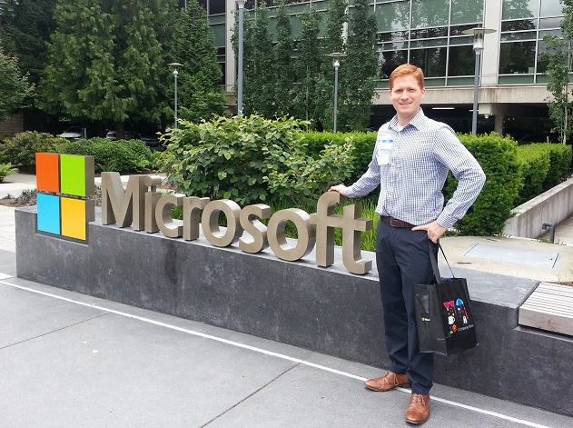
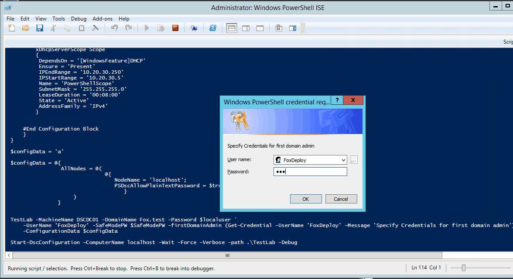
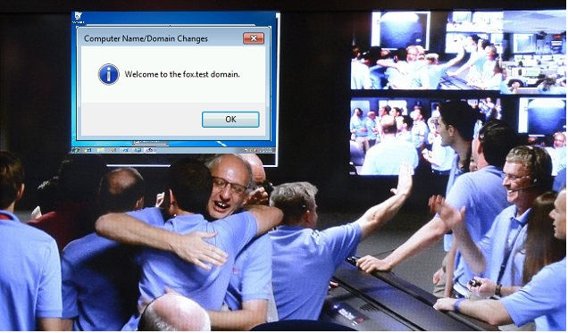

**This post is part of the Learning PowerShell DSC Series, here on FoxDeploy. Click the banner to return to the series jump page!**

* * *

Hey guys, I haven't forgotten about you, but it's been a very busy month here, with me traveling to Redmond ( Microsoft HQ! I have to post a pic!) for some exciting Microsoft meetings and then back and forth to Minneapolis for a new client!

I didn't know what to do with my hands in this picture.

* * *

I've been receiving your messages and have now released the final step in this one-click Domain controller DSC Build. To recap, we left off with a DSC Config that would make our machine a domain controller, but that was it.

We didn't have functional DHCP for clients to find us, or any other bells and whistles. In this post, we'll be **adding on DHCP** so clients can get an IP address, as well as **DNS** to help our Machines **Domain Join** to our new DC. If you tried Domain Joining with our build from last time, you would have been quite disappointed. Not this time!

### What has to go :

Previously, we had a single config file that did some really good stuff for us, setting up a workgroup and then making a new local admin. We're going to gut all of that stuff, because setting up a system with a DSC Config needs to be idempotent. That means that the config needs to be able to run over and over without breaking stuff, and the previous build would do just that. If we draft a config that will result in changes every time the config is validated, we've created a problem.

The issue in our last config stemmed from the fact that it would change the system's name and also add it to a work group. Then, later in the config we make it a domain controller. What would happen if the DSC config were re-evaluated is that the machine would throw an error when it got to the portion of the .mof telling it to join a workgroup. Domain Controllers can't leave a domain until they've lost all of their FSMO Roles, so this is an invalid config. Bad Stephen!

As it is, that bit about joining a workgroup turned out to be wasted space, so we'll remove that too. The full code is available below, as well as here [on my GitHub site](https://github.com/1RedOne/BlogPost_DSCpt4).

### What's new and what does it do

For this post, you'll need the xNetworking Resource, found here

- https://gallery.technet.microsoft.com/scriptcenter/xNetworking-Module-818b3583

As well as the xDHCPServer Resource, found here

- https://gallery.technet.microsoft.com/xDhcpServer-PowerShell-f739cf90#content

You'll also need the xComputerManagement and xActiveDirectory Resources, which can be found here:

- https://gallery.technet.microsoft.com/scriptcenter/xActiveDirectory-f2d573f3
- https://gallery.technet.microsoft.com/scriptcenter/xComputerManagement-Module-3ad911cc

Prepare your DSC Target Node by copying the folders in the zips to the Modules folder, in this path

\[code\]$env:ProgramFiles\\WindowsPowerShell\\Modules\[/code\]

The big new steps we're adding are the following:

#### Set a Static IP Address

The end goal of this whole shebang was to have a working DHCP server, and DHCP can't give out IP Addresses unless they have a fixed IP themselves. In this config block , we set a Static IP of 10.20.30.1 and rename the Adapter along the way.

\[code language="powershell" light="true"\] xIPAddress NewIPAddress { IPAddress = "10.20.30.1" InterfaceAlias = "Ethernet" SubnetMask = 24 AddressFamily = "IPV4"

}

\[/code\]

#### Enable the DHCP Windows Feature

This one was kind of a pain, as it was hard to figure out what the name was of the DHCP Server Role! Turns out it's DHCP not DHCPServer (as it is listed in Get-WindowsFeature). All we do here is make sure that the DHCP server is installed, and we do it after configuring the IP address to prevent an error which would shut down our config.

\[code language="powershell" light="true"\] WindowsFeature DHCP { DependsOn = '\[xIPAddress\]NewIpAddress' Name = 'DHCP' Ensure = 'PRESENT' IncludeAllSubFeature = $true

}

\[/code\]

#### Enable the DHCP Address Scope

You can get super complex with Windows Server Networking using DHCP and DNS, but I always like to keep things simple, especially in my testlab. This configuration resource essentially runs us through the DHCP Wizard and ensures that a DHCP Scope Exists, giving out IP addresses from 10.20.30.5 all the way up to 250.

\[code language="powershell" light="true"\] xDhcpServerScope Scope { DependsOn = '\[WindowsFeature\]DHCP' Ensure = 'Present' IPEndRange = '10.20.30.250' IPStartRange = '10.20.30.5' Name = 'PowerShellScope' SubnetMask = '255.255.255.0' LeaseDuration = '00:08:00' State = 'Active' AddressFamily = 'IPv4' }

\[/code\]

#### Specify the DNS server for DHCP clients to use

If you don't get this part, your DNS Clients will throw up an ' ERROR: Could not join to the domain VAS\_ERR\_DNS: unable to lookup any DNS SRV records for', which should be your clue to ensure that you've specified option 6 in your DNS settings

\[code language="powershell" light="true"\] xDhcpServerOption Option { Ensure = 'Present' ScopeID = '10.20.30.0' DnsDomain = 'fox.test' DnsServerIPAddress = '10.20.30.1' AddressFamily = 'IPv4' }

\[/code\]

### The Complete Config

If you're following from home, go ahead and delete everything from the last DSC post from line 29 to 54.

Or, if you're laz--uh, more efficiently minded, copy and paste this code instead.

\[code language="powershell" collapse="true"\] $secpasswd = ConvertTo-SecureString 'IWouldLiketoRecoverPlease1!' -AsPlainText -Force $SafeModePW = New-Object System.Management.Automation.PSCredential ('guest', $secpasswd)

$secpasswd = ConvertTo-SecureString 'IveGot$kills!' -AsPlainText -Force $localuser = New-Object System.Management.Automation.PSCredential ('guest', $secpasswd)

configuration TestLab { param ( \[string\[\]\]$NodeName ='localhost', \[Parameter(Mandatory)\]\[string\]$MachineName, $firstDomainAdmin, \[Parameter(Mandatory)\]\[string\]$DomainName, \[Parameter()\]\[string\]$UserName, \[Parameter()\]$SafeModePW, \[Parameter()\]$Password )

#Import the required DSC Resources Import-DscResource -Module xActiveDirectory Import-DscResource -Module xNetworking Import-DscResource -module xDHCpServer Import-DscResource -Module xComputerManagement

Node $NodeName { #ConfigurationBlock

xComputer NewNameAndWorkgroup { Name = $MachineName

}

WindowsFeature ADDSInstall {

Ensure = 'Present' Name = 'AD-Domain-Services' IncludeAllSubFeature = $true }

WindowsFeature RSATTools { DependsOn= '\[WindowsFeature\]ADDSInstall' Ensure = 'Present' Name = 'RSAT-AD-Tools' IncludeAllSubFeature = $true }

xIPAddress NewIPAddress { IPAddress = "10.20.30.1" InterfaceAlias = "Ethernet" SubnetMask = 24 AddressFamily = "IPV4"

}

WindowsFeature DHCP { DependsOn = '\[xIPAddress\]NewIpAddress' Name = 'DHCP' Ensure = 'PRESENT' IncludeAllSubFeature = $true

}

WindowsFeature DHCPTools { DependsOn= '\[WindowsFeature\]DHCP' Ensure = 'Present' Name = 'RSAT-DHCP' IncludeAllSubFeature = $true }

xADDomain SetupDomain { DomainAdministratorCredential= $firstDomainAdmin DomainName= $DomainName SafemodeAdministratorPassword= $SafeModePW DependsOn='\[WindowsFeature\]RSATTools' DomainNetbiosName = $DomainName.Split('.')\[0\] }

xDhcpServerScope Scope { DependsOn = '\[WindowsFeature\]DHCP' Ensure = 'Present' IPEndRange = '10.20.30.250' IPStartRange = '10.20.30.5' Name = 'PowerShellScope' SubnetMask = '255.255.255.0' LeaseDuration = '00:08:00' State = 'Active' AddressFamily = 'IPv4' }

xDhcpServerOption Option { Ensure = 'Present' ScopeID = '10.20.30.0' DnsDomain = 'fox.test' DnsServerIPAddress = '10.20.30.1' AddressFamily = 'IPv4' }

#End Configuration Block } }

$configData = 'a'

$configData = @{ AllNodes = @( @{ NodeName = 'localhost'; PSDscAllowPlainTextPassword = $true } ) }

TestLab -MachineName DSCDC01 -DomainName Fox.test -Password $localuser \` -UserName 'FoxDeploy' -SafeModePW $SafeModePW -firstDomainAdmin (Get-Credential -UserName 'FoxDeploy' -Message 'Specify Credentials for first domain admin') \` -ConfigurationData $configData

Start-DscConfiguration -ComputerName localhost -Wait -Force -Verbose -path .\\TestLab -Debug \[/code\]

Now that we know what we're doing, let's give it a whirl!

### Testing it out

My network is laid out like this

I've got my future DHCP Server and a random client Windows 10 VM both sitting on the same network. Now we're going to enforce the configuration on my DSC Client, and then watch and see my workstation pull down a DHCP Address!

You might be thinking:

> 'Hey Stephen, why not just copy the files down with DSC!'

and that's a great question. As it turns out, you can do something like that by using what's called a DSC Partial Configuration…which I'm still figuring out. Once I understand it, I'll write a post about it. The long and short of it now is that you can't reference a resource and also copy a resource within the same config because...uh...reasons.

### You're boring me, let's get to it!

The only thing that's left is to hit F5 and watch as my machine gets config'd! First we apply the new computer name… which needs a reboot

Now, we reboot and just relaunch the configuration. We could just wait…but it's more fun to hit -Force and watch the whole thing happen in real time

If all of this worked (and it looks like it did!) we should now be able to go over to our test machine and run a DHCP /renew and see an IP address come over.

An important piece of getting this Domain Controller accepting domain joins is to make sure that new PCs to the domain can find the DC. This means that they need to ask a DNS server for the SRV record of a Domain Controller holding the Global Catalog role. We'll run a ipconfig /all and see if our DNS Server setting is registered.

Now is where I started to get excited. See, my whole reason for going down this path is that I think making a domain controller in a Lab environment can be very daunting for first-timers, and wanted to help lower that barrier to entry. If my client machine can see the DC, then it should be able to Domain Join now. So the moment of truth...

Now...to hit OK...

\[caption id="attachment\_2409" align="alignnone" width="636"\] Welcome to the FoxDeploy Domain!!!\[/caption\]

### Wrapping it up

I will admit, I jumped up and down when I got this part to work. We now have a one-click, single-stop Domain Controller build, perfect to use a stepping stone into whatever else you'd want to do on a domain controller. It really is kind of amazing to me that this all works, knowing how hard it would be to do this level on configuration using something like SCCM/Configuration Manager.

From here? The next step in our series will have us joining clients to this domain as well, and from there, we can do whatever you'd want to do with DSC. If you've got an idea or a situation from work, send me a message, and you might just be the next blog post here in this series.
