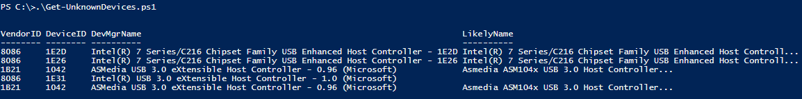

One of the most arduous tasks for a ConfigMgr admin is to build images to support new models of hardware for Operating System Distribution. As a SCCM Engineer, I've done this process for probably more than a hundred models now, and here's how it normally goes.

#### How I solve missing drivers

• Connect my new device to the network • Do a fresh install off of a thumb drive or PXE of my current image and see what breaks • Boot into Windows and then look at Device Manager.

At this point, I'll either jump up and down or I start crying, based on how many of my devices have an Exclamation point.

 

The process to figure out the device is to look at the device, in device manager->Properties->Details->Hardware IDs

I then lookup the info in an online repository. Like the PCI Database or Windows Update to find the actual driver from the vendor.

This works…but it could be better.

#### Using PowerShell

Johan Arwidmark is a well-respected SCCM God. He's pretty much the best, period. He had a [great blog post about the method he uses to find drivers](http://deploymentresearch.com/Research/Post/306/Back-to-basics-Finding-Lenovo-drivers-and-certify-hardware-control-freak-style), centered around a Walkthrough on a newer Lenovo system.

If you look into that post you'll find a PowerShell one-liner that gives you a listing like this:

Which you can then use to step through your hardware reference site of choice.

#### Taking it one step further

I've been wanting to write something like this for a while, and a conversation with my friend Julie Andreacola over at CBfive prompted me to start coding. Why look up item by item, when you can use PowerShell to search through all of the listings and resolve all the names at once? Full download link on the text below.

#### [Get-UnknownDevices](https://github.com/1RedOne/Get-UnknownDevices)

Using Johan's code as a starting point, I've expanded it out, to now locate missing devices, grab the hardware and vendor IDs and then search the database for the device name using PowerShell!

Standard output looks like this

When used in conjunction with an offline machin, simply Export the file

Then Import on another system with Internet Access using the -Import switch to resolve those drivers issues

I hope you like it! Full code will live on GitHub here : https://github.com/1RedOne/Get-UnknownDevices
