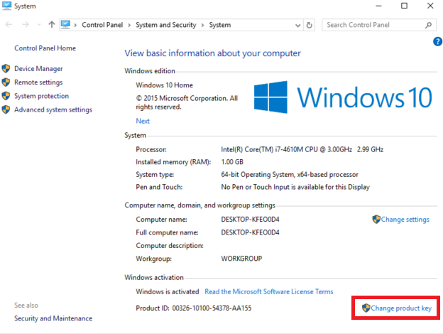
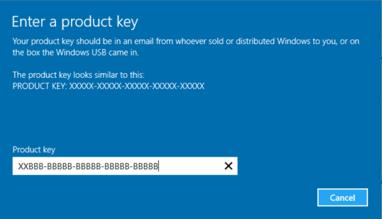
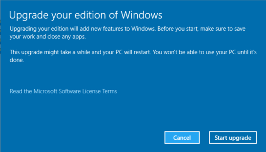
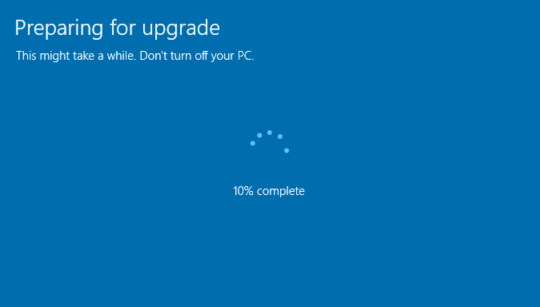
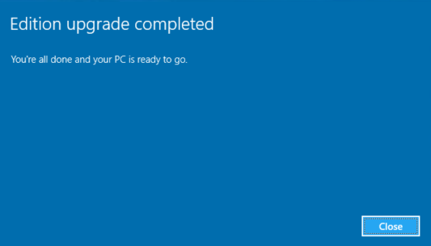
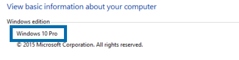

One of the hotly anticipated features of Windows 10 is the ability to change your Windows version on the fly, without even needing to reinstall the OS!

This means that if you're a Home user and want to start using advanced features like Hyper-V, which is only available on Pro, or to begin using your computer with BranchCache and other technologies only found on Enterprise, you don't need to reinstall anymore.

WalkThrough

You decide one day that Hyper-V sounds awesome and you want to be able to run Virtual Machines on your laptop/desktop. You go to 'Turn Windows Features on or off' and

…you don't see Hyper-V listed

](images/nohyperv.png) Hyper-V is a Pro and Enterprise only feature, sorry!\[/caption\]

As we know now, Hyper-V is a pro and enterprise feature only.  Double checking the version (using Windows+X, System) confirms that we're running Windows 10 Home.

However, we now have the option to buy an upgrade and apply it at any time.  Assume you've paid to upgrade and now have a valid Windows 10 Pro license.  You can go back to System, and on the bottom, click Change product key.

This will prompt for Admin rights, so provide them, and you'll see this screen.

](images/nohyperv3.png) No, this is not a valid license key.\[/caption\]

If the key is valid, you'll be prompted that your system needs to reboot.

](images/nohyperv5.png) I hope you saved your files, as the upgrade waits for no man.\[/caption\]

After a reboot, you'll see the following. 

And just to confirm...

](images/nohyperv7.png) Pretty cool that we can now do this at any time without having to reinstall windows. The same works to go back to Home as well, just provide your license key and away you go!\[/caption\]
