**Update:** Turns out I was pretty wrong about Storage Spaces and have been totally schooled and corrected about them here, on Reddit and at Redmond.  I'll be revising this post heavily, adding some iometer numbers.  Stay tuned!

In this post, I'll share my results comparing hardware to software RAID on modern Windows 10, then to take things up a notch, I'll see how a Storage Spaces volume with Parity (maybe Microsoft is charged money for using the word 'Raid', because they avoid that word like the plague!) compares to the hardware solution (Spoilers: it ain't pretty) in pretty much every configuration I could think of.

I've had a lot of issues in the FoxDeploy lab recently. Two months ago, I had a number of SSDs in a Storage pool on Server 2012 R2, then decided I should go to the desktop experience, and moved to Windows 10.  Let's call this rebuild #1.

Since then, I've had an SSD fail in a Windows Mirror, resulting in a total loss of VMs, as I didn't have backup working.  Rebuild #2

Next, I decided to take three drives, two physical SSDs and a chunk of unpartioned space from a six year old spinner, and put them in a Raid-5.

As it turns out, this kills the drive.  Goodbye, Big Betty, I will miss you. Rebuild #3.

At this point, I had it with these janky solutions.  I've recently come into possession of some new SSD drives, and this time, I'm going to do it right, damn it! I wanted to finally have some resiliency in case one of my drives died.  But along the way, I needed to know how it would perform.

### Findings - Raid 0 Testing

For starters, here's our benchmark.  It's a single OCZ 120 GB SSD disk, connected via 3GBPS sata.

##### Single disk, sata 3

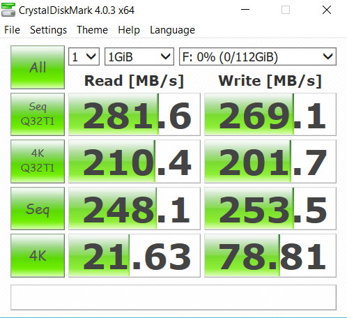](images/singledrive.png) Single Disk Performance\[/caption\]

Not bad, very respectable. Now, let's see what happens when I use Windows to take two of these and stripe them. This is also called Raid 0, as in 'you have zero parity and are totally hosed if one of these drives dies'.

**Expectations:** You gain the full capacity of both drives and speed to spare, as data is randomly written across drives.  Speed should be roughly double that of a single drive.  However, if one dies, you are up a creek, because you will not be able to recover your data. You'll tend to get ~double the read and write performance when striping.

##### two disks, SATA 3, windows raid 0

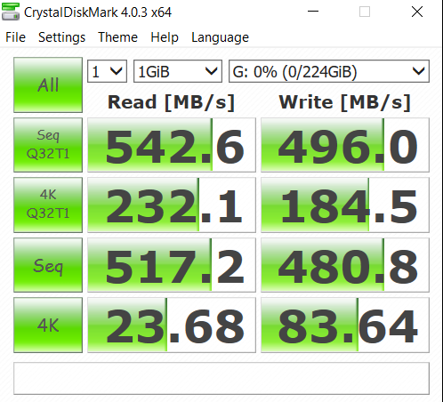](images/twodriveswindowsraid0.png) WIndows Raid 0\[/caption\]

If we compare the two, we see roughly double the performance as well.  Windows raid is achieving parity via the OS. Since data striping (putting chunks of data on the disk) is handled by the operating system, there is a potential for disk performance to suffer when the rest of the OS is under heavy load.  Microsoft has had years to work out the errors and speed things up though, so don't let this stop you if your motherboard doesn't support Raid.

Now, Let's see how Windows Raid-0 stacks up to actual hardware raid.

##### TWO DISKS, SATA 3, Hardware RAID 0

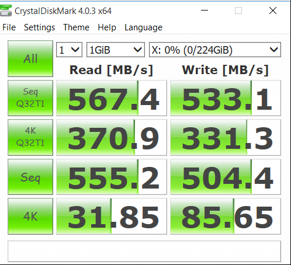](images/twodrivesintelraid0.png) Hardware Raid 0\[/caption\]

To put those side-by-side, here's the difference you can expect when comparing hardware Raid-0 to Software Raid-0.

##### SIDE BY SIDE, INTEL % CHANGE VS SOFTWARE RAID 0

\[caption id="attachment\_2615" align="alignnone" width="268"\]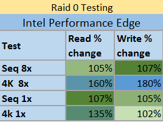 Intel Performance Increase over Microsoft\[/caption\]

**Winner - Intel** There is quite a performance edge to gain by using a hardware controller, even nowadays. I was very surprised to see such a disparity here.  In every regard there were noticeable speed gains, at least on paper.

### Findings - Raid 1 testing

Now, these big numbers were very fun, but as I'm doing this to test my performance while operating safely with parity, I needed to see what would happen when actually using mirroring.

**Expectations** - With Raid 1, you should receive roughly double read speed, while writes will suffer, because of the need to create and distribute parity sets across disks. You lose the whole capacity of one drive, but have a full backup of your active volume in case it dies. Nothing is safer than Raid 1! First, I tested in Windows for Raid 1, also known as a 'Mirrored Set'.

##### TWO DISKS, SATA 3, WINDOWS RAID 1

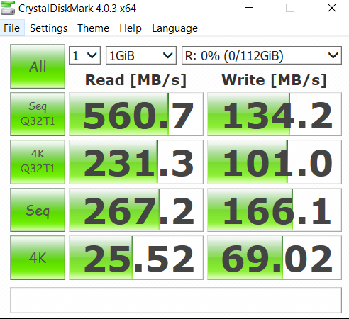](images/twodriveswindowsraid1.png) Windows Raid 1\[/caption\]

Wow, the reads are still good, but boy does the writes take a huge faceplant. Writes were roughly half of the write speed for a single drive, which was surprisingly bad, in my opinion.  Functionally, this makes sense, as the OS has to track syncing writes to two different disks.  Who knew that it would levy such a heavy penalty though.

Now, to compare this to using dedicated Raid hardware.

##### TWO DISKS, SATA 3, hardware RAID 1

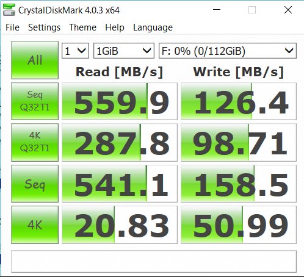](images/twodrivesintelraid1.png) Intel Raid 1\[/caption\]

While the Intel raid controller blows the Software Raid out of the water on sequential reads, surprisingly the Windows software Raid was better in nearly every other respect. It seems that no matter if you use a hardware or a software Raid controller, you should expect to lose performance when you're duplicating every write, which makes sense.

We can compare this to our single disk performance though, and see something else happening.

##### Side by side, intel % change vs software raid 1

\[caption id="attachment\_2616" align="alignnone" width="239"\]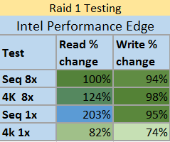 Intel % increase over Microsoft Software Raid\[/caption\]

**Winner - Windows** If you need super fast sequential reads, like you're working with a single big file that happens to be on one contiguous area of disk, if you could control that, then you'd want the Intel Controller. If not, Windows looks to be good enough, and takes the lead in most categories.

### Findings - Raid 5 testing

Raid 5 was the defacto standard for parity across volumes smaller than a TB. Now, it's been replaced with other Raid and parity options, but it's still probably the most prevalent way of safely allowing for disk failures without a tremendous speed loss. With Raid-5, you lose the space of one drive.  With that being said, you can get some beefy performance, and have parity!

#### Raid 5 in Windows 10, some notes before we begin

In this round, we'll be leaving the Disk Management wizard for Windows and instead go into the control panel to create a Storage Space!  Previously, there was no way for end user running home or PRO Windows to do make a parity volume, which reserved that feature for Windows Server users only.  Storage Spaces is Microsoft's new, much easier to use approach to Disk Management with loads of options.

](images/storagespaces.png) You can configure this any way you want to! Just spend a LOT of time reading documentation.\[/caption\]

While Microsoft doesn't call it 'Raid 5', it's possible using Storage Spaces to create a Parity Pool, which will effectively achieve the same results.

](images/storagespaces-resil.png) Raid-5 by any other name. Double Parity would be Raid-10!\[/caption\]

It should be noted that I had to tune this array to get these results.  First off, a default Storage Spaces drive will be created with a Write-back Cache of 1 GB.  It should also be said that there IS a distinct performance penalty at play here.  In order to play things safe, there is some mandatory disk journaling involved here, meaning that your writes aren't going to be cached very much.  Instead, the storage subsystem will wait for confirmation of all writes, and it does so VERY conservatively.

It's not uncommon to see R/WR delays into the tens of thousands of milliseconds while writes are performed.  You can somewhat minimize this behavior by running these two PowerShell cmdlets.  The first GREATLY boosts the write cache amount, which I've seen to boost performance, while the second cmdlet specifies that there is Power protection (like a UPS).  To quote the help documentation 'If you specify a value of $True for this parameter, the storage pool does not perform flush operations, and the pool removes write-through attributes from commands.'  It also helps.

Get-StoragePool | select -First 1 | set-storagepool -WriteCacheSizeDefault 8GB Get-StoragePool -FriendlyName "Storage Pool" | Set-StoragePool -IsPowerProtected $true

Now, after that length pre-amble, let's hop to it.

##### three DISKS, SATA 3, HARDWARE RAID 5

\[caption id="attachment\_2608" align="alignnone" width="486"\]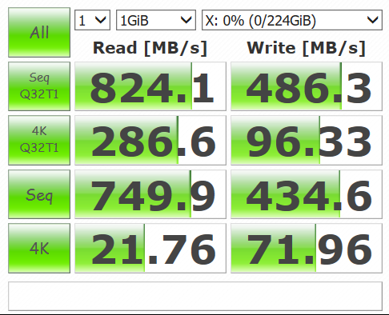 Hardware Raid 5\[/caption\]

As expected from hardware Raid 5, we receive roughly 100% read speed from all drives, for some truly mammoth read speeds.  Writes hang out around 2/3rd's of the total write speed for all drives, making this the power-user's option.  It should be noted that I had to specify a custom disk policy for this Raid 5 volume to enable write caching and disable flush operations.  This is definitely a power-mode configuration, but depends on battery backup to ensure there is no data loss.

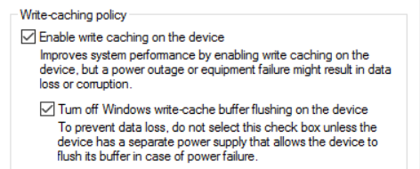](images/raidconfig.png) Be warned, you will lose data if you have a power outtage. Only check these if you've got reliable UPS in place.\[/caption\]

If you're using Raid 5, you're probably data loss averse, so only specify these settings if you've actually got a battery backup.

Now, onto the final option, Storage Spaces with Parity.  This is super secure for your data, however...writes...well...

##### THREE DISKS, SATA 3, Storage spaces parity volume (raid 5)

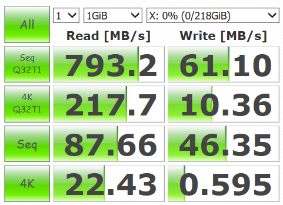](images/storagespaces-nowritebackcache.png) Storage Spaces Journaling aggressively protects data, but at a cost\[/caption\]

I reached out to some peers for help, to see if I was mistuning this array, because, frankly, _damn._ 

According to Aidan Finn, Microsoft MVP of Datacenter and Hyper-V, I'm doing it wrong.  This is not meant for performance, nor is it a good idea for storing VHD files.  You should be using parity volumes as a replacement for a super expensive NetApp or LeftHand SAN Solution, with wonderful configurability for hundreds of potential configuration.  You use this to save money for your archival storage, but shouldn't expect to get equal performance.

Still, the numbers are pretty shocking.  Here's Storage Spaces Parity volume compared to a single drive, and to a Raid 5 Volume.

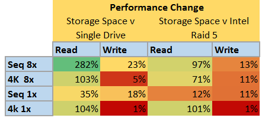](images/storagespace-v-everything-else.png) Great for Reads versus a single drive, but writes suffer incredibly.\[/caption\]

### Winner - Intel

Now, Storage Spaces can do things you cannot do using a simple Intel Raid Controller.  For instance, you could easily take four full JBOD (Just a bunch of disk) arrays, filled with 8 TB drives and also slap in a stack of PCI-e or SSD storage to create a wonderfully resilient storage system with excellent performance.

But it's not the answer to every problem.  In this case, the Intel Raid Controller was the clear winner, absolutely smoking the Storage Spaces Controller.  This graph says it all

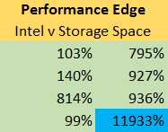](images/finalimage.png) 12,000% improvement in writes is mindblowing\[/caption\]

### In Conclusion

If you want maximum performance for a small number of disks, need some basic parity support, and don't have more than 13TB in a volume, and you have a hardware Raid Controller, then you should definitely use hardware Raid 5 over storage spaces.

You need maximum speed and will backup your data - Use Raid 0 and backup data

You need maximum speed and some resilience to disk failure - Use Raid 1 or Raid 5

You need to archive monstrous amounts of data across insane configurations of disk arrays - Use Storage Spaces.

Finally, some random charts.

\[caption id="attachment\_2614" align="alignnone" width="236"\]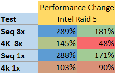 Intel RAID-5 performance over Single Disk\[/caption\]

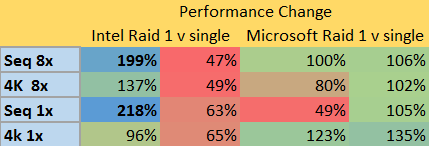

Did I do it wrong?  Am I missing something?  Correct the author by e-mailing me at Stephen@foxdeploy.com, or commenting here.
