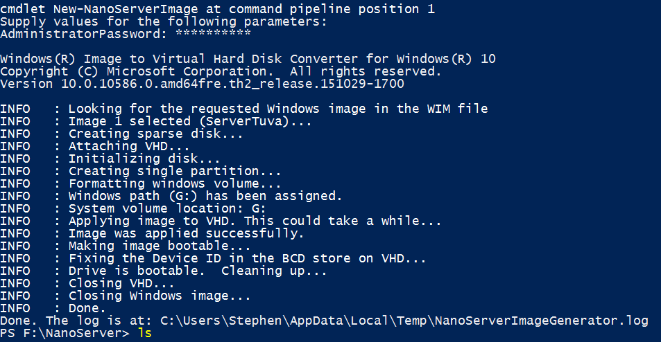
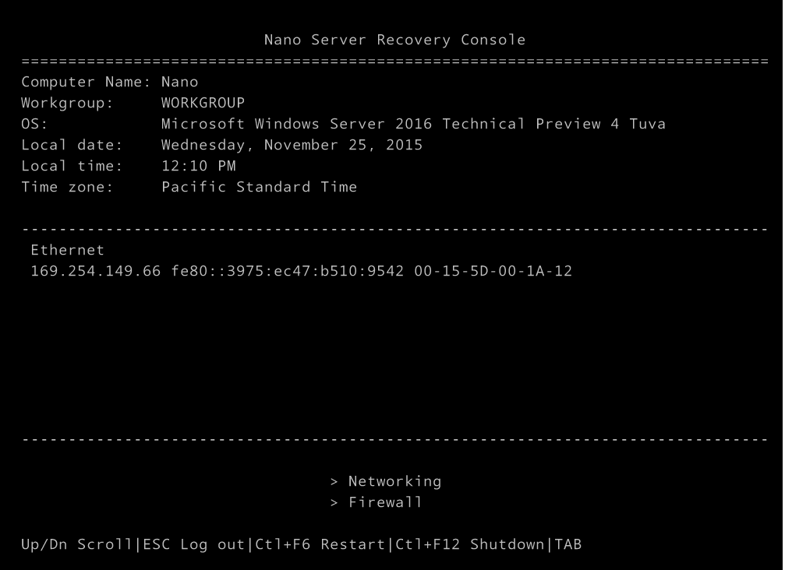

Hey guys,

Super quicky here.  With Windows Server Tech preview 4 shipping now, we have a new release of Server Nano to play with.  [Ben Armstrong wrote a guide for tech preview 3,](http://blogs.msdn.com/b/virtual_pc_guy/archive/2015/09/14/running-nano-from-windows-server-2016-tp3-on-hyper-v.aspx) but the cmdlets have changed since then, so I figured I'd write this out to help you as well!

Step 1: [Get the Server tech preview 4 media here](https://www.google.com/url?sa=t&rct=j&q=&esrc=s&source=web&cd=1&cad=rja&uact=8&ved=0ahUKEwj_9_PurqzJAhXJLSYKHen1AcIQFggcMAA&url=https%3A%2F%2Fwww.microsoft.com%2Fen-us%2Fevalcenter%2Fevaluate-windows-server-technical-preview&usg=AFQjCNEgGeDegxHRLDjD9chuBPAlktHnig&sig2=LX9TJn5xIFWConogz8oQ0Q&bvm=bv.108194040,d.eWE)

Step 2: Launch PowerShell, browse to the media\\NanoServer folder.  (In my case, Drive F:)

Step 3: In PowerShell run the following: ```powershell New-NanoServerImage -MediaPath F:\\ -BasePath X:\\Nano -TargetPath 'X:\\Nano\\VHD\\NanoServer.vhd' -GuestDr ivers -Containers -EnableEMS -ComputerName Nano \[/code\]

Let's break down those parameters:

- MediaPath - the Server TP 4 drive, in my case F:\\
- BasePath - the staging directory, this cmdlet will dump a lot of stuff here to do its magic to convert the WIM into a VHD
- TargetPath - where to put the completed VHD
- GuestDrivers - this switch injects the Hyper-V guest Drivers
- Containers - want to try Docker Containers?  Put this param in!
- EnableEms - want to play with the new Emergency Management Console for Nano?  Sure you do, include this one too!
- ComputerName - Whatcha wanna call this new computer?

These are probaby the most important params.

If it worked, you'll see something like the following

Now, be warned that this will create a .vhd, so you're stuck with a Gen 1 VM, which really isn't so bad, given how little Nano can do today :p

To boot her up:



My next step is to do domain join, and see what all we can load up on her!
