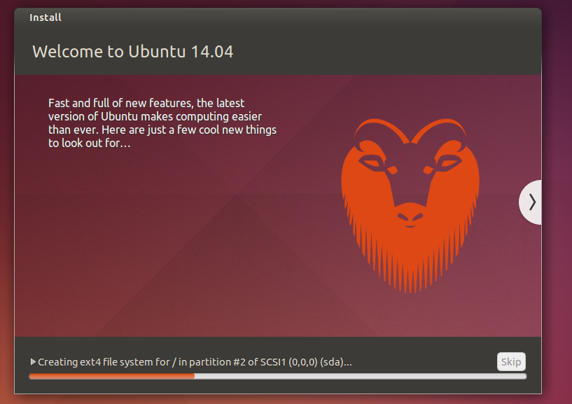
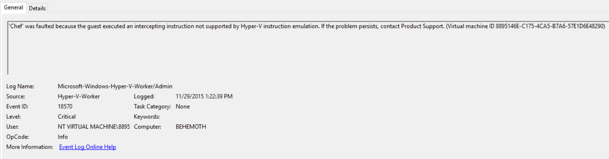

Recently, I've been getting more and more interested in Chef, and decided it was time to build out a testlab in my Hyper-V.

I started imaging a new VM using the 14.10 LTS release of Ubuntu, one of the supported environments for Chef Server.

However, during install, my VM would freeze here:

 

At the same time, I noticed a critical level event from Hyper-V.

**'Chef' was faulted because the guest executed an intercepting instruction not supported by Hyper-V instruction emulation. If the problem persists, contact Product Support. (Virtual machine ID 8895146E-C175-4CA5-B7A6-57E1D6E48290)**

I did a bunch of googling and found...almost no one with this same issue, and I thought it was related to Hyper-V on Windows 10 Tech Preview.  As it turns out, this is caused by some generation 2 Virtual Machine features, namely Dynamic Memory.

**Symptom**

Install of Ubuntu or other \*Nix distro freezes during install on Hyper-V, as a Gen 2 VM

**Cause**

Dynamic Memory does not appear to be supported during install of Ubuntu, and will manifest as errors during OS Install and Parititoning

**Resolution**

Disable Dynamic Memory until install is completed.  After installing, run 'sudo apt-get update' to ensure drivers are up to date, for optimum VM sveltness.
