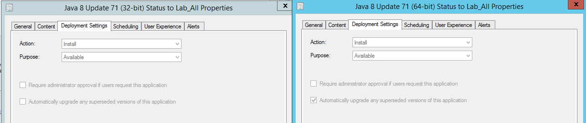
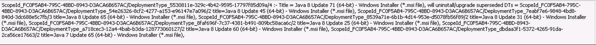
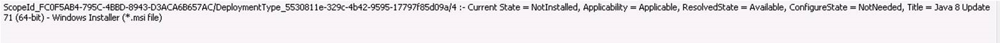
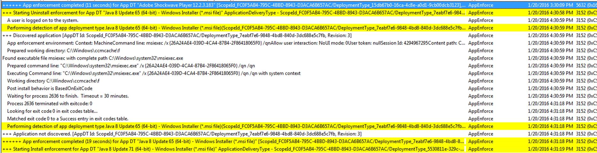
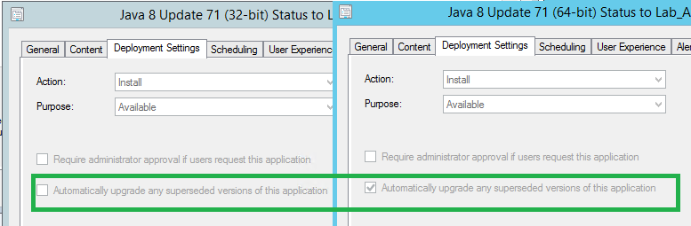
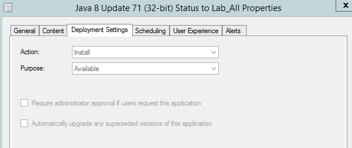
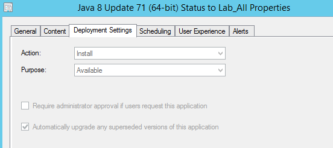

This post is part of the 'Scripting SCCM' series on FoxDeploy, click the banner for more!  

* * * 

You might be wondering how to control this box in your SCCM 2012 R2 SP1 (or ConfigMgr SP2, pretty much the same thing) deployments.

I've finally been able (with the help of my friend and future ConfigMgr MVP nominee, Eric Anderson) to track down precisely what is going on in the confusing world of applications and supersedence in SCCM.

### The Scenario

· Machines all had the old version of Java, Java 8 Update 65, which is deployed via either a Task Sequence , or with a firm-wide mandatory advertisement · We made a new deployment of Java, Update 71, and set this to supersede the old version · The new version of Java was deployed as Available yesterday, not required, to a small subset of machine (5 or so) · Today, these machines have all automatically updated to the newest version of Java even though it was an Available deployment!!

Looking into the logs, we see this:

AppIntent –

The Juicy part : Will uninstall/upgrade superseded DTs (deployment types)

Then, in AppEnforce a few moments later-

So, we can observe that the machines saw the new advert, and began to automatically apply it, even though we never checked a box to ‘Automatically upgrade clients’...

Or wait...maybe it is.

As it turns out, the checkbox listed in the screen shot above, this one here:

**This option is never actually displayed to the SCCM ADMIN while making a deployment**.  The check box is conditionally displayed after configuring a deployment, and It's only shown if the application has a supersede rule specified.  If so, the box will appear after completing the New Deployment wizard.

**Whether or not the box is checked depends, strangely enough, on if the application supersedence rule was configured before or after the app deployment was created.**

The worst part about this is that the checkbox isn't available for the Admin to control when making the new advertisement, but instead appears after the Deployment Wizard finishes. And deployments can't be altered after they're created, so no fixing it afterwards either.

# Here's the scoop: this is either a bug or a serious design flaw in SCCM.

[This should be fixed, so click here for the userVoice bug so that we can get it fixed.](https://configurationmanager.uservoice.com/forums/300492-ideas/suggestions/11532669-fix-supercedence-behavior)

But you still need to know how to control the behavior of supersedence, which actually isn't too complicated, once it's laid bare.

### To allow users in the collection to upgrade to the new version of an app , without being forced to upgrade

Create the deployment of version 2.0 of the app, THEN create the supersedence relationship.

The app will be available to upgrade, and available for new users but will not be enforced on users of the old application, as shown in this screen shot below:

### To automatically upgrade users of the old version to the new version of an app, while allowing others the option of installing it

The only difference here is that you create the supersedence first, and then deploy as available to a collection of computers.

Users in the targeted collection who have the old version of the application will be automatically updated to the new version.  Users who do not have the app can install it at will, as expected.

 

### To Recap

It turns out this checkbox is only created after a deployment is made, and not actually presented to the user at all.

If a deployment already exists, and then later a supercedence is created, the checkbox of 'Automatically upgrade any superceded versions of this application' will be made visible on the deployment, but not checked. HOWEVER: If a supercedence is created FIRST, then a deployment is made, the checkbox will be added AND checked.  This has the same impact as making a new required deployment, even if the deployment is marked as Available.

Users beware, this could definitely bite someone in the butt.

### References

https://social.technet.microsoft.com/Forums/en-US/42b1e62b-ea25-4334-8e49-eb1934da7e2e/how-do-i-check-this-box-in-a-deployment-w-supercedence?forum=configmanagerapps

http://www.blogmynog.com/2013/08/12/system-center-2012-configuration-manager-sccm-prevent-automatic-upgrade-on-deployment-to-device-collection/

https://www.windows-noob.com/forums/topic/8952-possible-bug-in-sp1-cu1-client-applications-that-supersede-others-may-rollout-unexpectedly/

https://www.windows-noob.com/forums/topic/12598-supersedence-bit-me/
