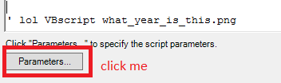
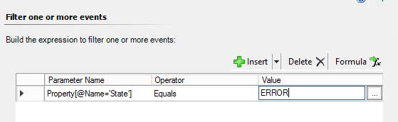
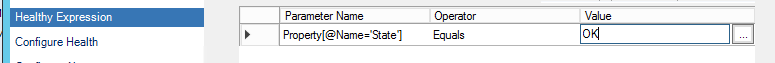
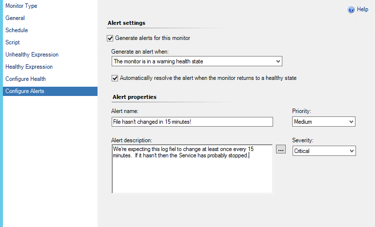
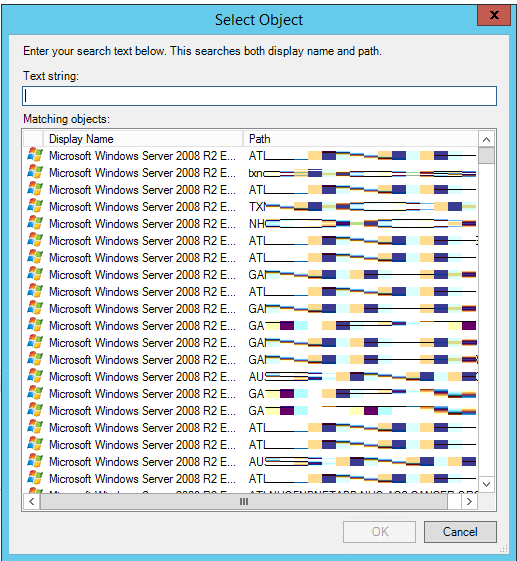
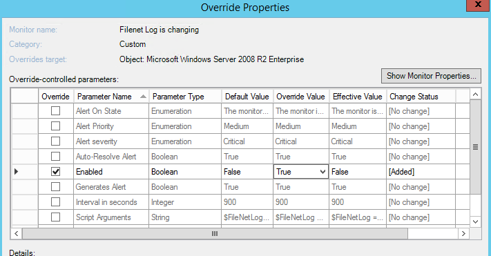

Dunno what it is, but a lot of SCOM information STILL persists on the web in VB Script and refering to SCOM 2007, when 2012 R2 has been out for YEARS now!

In this blog post, I'll walk you through monitoring a log file for changes, and throwing an alert if the log file hasn't changed.  And we'll do it in PowerShell, as the good saint Snover intended.

### How to make a two-state monitor in PowerShell

We're gonna make a monitor, so launch SCOM, and go to Authoring->Management Pack Objects, Monitors.  If you don't see the Authoring tab, you've got a baby account and need some added perms.

Right click Monitors and choose add new Unit Monitor.

](../assets/images/2016/02/images00.png)

Pick Scripting - Generic, Timed Script Two State Monitor and find a Management Pack to put this bad boy in.

](../assets/images/2016/02/images01.png)

Give it a name and a description, and then target it to Windows Server Operating System.

 FOR GOD's SAKE DON'T CLICK **MONITOR IS ENABLED**.  If you do this, every instance of Windows Server OS in your company is going to start running this script.  You probably don't want that, and instead only want one or two machines to run the script.


Instead, we're going to create this in a disabled state, then override it to on in order to pick a single Server OS to be our watcher.  This means we'll pick a PC, and it will run this script for us in whatever frequency we specify later.

Since SCOM is ancient, it still defaults to having an example VBScript, pretty silly, actually.

 You can put in your own name up top, I'll call this "MonitorForTextFileChanges.Ps1'

First, we can provide a param to the script to execute. This is a good idea rather than dumping it into the body of the script, because we can create overrides to later re-use this and target other systems, watching other log files for changes!

Here's how I'm providing the path to my file. Click Parameters at the bottom:



```powershell
$FileNetLog = \\\\someserver\\Somefile.txt
```

Now, for the actual code.

```powershell
 $API = new-object -comObject "MOM.ScriptAPI" $PropertyBag = $API.CreatePropertyBag() $LogFile = get-item $FileNetLog

if ($LogFile.LastWriteTime -ge (get-date).AddMinutes(-15)){ #good, the file has changed, lets emit a positive object $PropertyBag.addValue("State", "OK") } else{ #no is good, the file hasn't changed, let's emit a fail $PropertyBag.addValue("State", "ERROR") }

$PropertyBag

#source http://opsit.blogspot.com/2013/11/scom-scripting-basics.html #source http://www.systemcentercentral.com/forums-archive/topic/monitoring-for-expired-certs-on-windows-2012/#post-217585 #source https://www.reddit.com/r/scom/comments/30iqgl/twostate\_powershell\_monitor\_in\_scom\_2012\_r2/ 
```

We hook into the SCOM Scripting host to make a property bag, which is a gross sounding thing that SCOM counts on to understand what's happening when a monitor is running. This bag will return one property, called State which is specified on either line 7 or 11, and has a value of OK or ERROR.

The code is simple. Create a reference to a file and call it `$logFile`, then use a simple If Greater or Equal to see if the `$logFile.LastWriteTime` is greater than this moment, 15 minutes ago. If it IS, return STATE:OK, if it ain't, return STATE:ERROR. Finally, echo out the `$propertyBag` so that SCOM knows we're done with the script.

Finally, let's tell SCOM how to interpret the values this will be throwing. Proceed on to 'Unhealthy Expression'.

In this window, we need to tell SCOM which value will be an unhealthy state for this monitor. The syntax is a bit odd. Click Parameter Name and put in `Property[@Name='State']`, then set the Operator to Equals, and finally for the value, put in `ERROR`, as seen below.



Next, do the same for Healthy Expression, but set the value to be `OK`, as seen here.



Finally, verify that the Health Icons make sense, and then proceed to Alerts if you want to throw alerts when this monitor fails. You probably do, even though we disabled the monitor earlier (we DO want to configure alerts so that when we over-ride this to 'ON' for certain servers, we'll get alerts and not have to come revisit this process)



And that's it! The final step is to simply find your monitor in the list, and then override it to enabled for a single instance of the Windows Server Operating System class, and just pick the server you'd like to monitor for changes.

 Make sure to pick 'a Specific Object of this class'

This will let us pick a single computer to run this monitor.

 Ugliest ever way to censor computer names FOUND!

 Make sure to check the box to turn it on!

Then click the box for 'Override: enabled', and pick the over ride value of True. Finally, save it in a management pack and you're golden!

#### Sources

Couldn't have figured this out without the help of these posts!

#source http://opsit.blogspot.com/2013/11/scom-scripting-basics.html #source http://www.systemcentercentral.com/forums-archive/topic/monitoring-for-expired-certs-on-windows-2012/#post-217585 #source https://www.reddit.com/r/scom/comments/30iqgl/twostate\_powershell\_monitor\_in\_scom\_2012\_r2/
