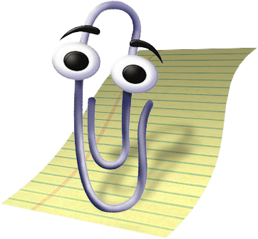
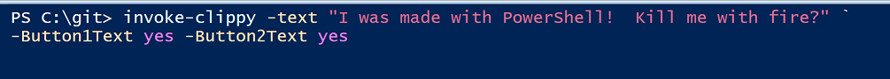
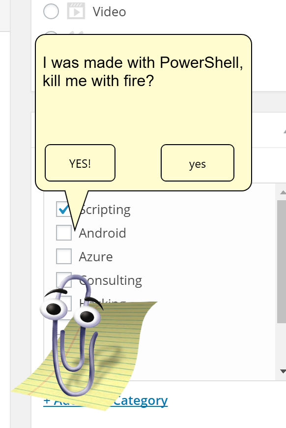

Back with the release of Office '97 in November of 1996, Microsoft introduced a beloved new helper tool to assist users in navigating through the daunting changes in Microsoft Office,

## Microsoft Clippy!

 Copyright : Microsoft

Clippy was wildly beloved by end-users and IT Professionals alike, just checkout it's many accomplishments!

> _[Smithsonian Magazine](https://www.wikiwand.com/en/Smithsonian_(magazine))_ called Clippy "one of the worst software design blunders in the annals of computing".[\[16\]](https://www.wikiwand.com/en/Office_Assistant#citenote16) _[Time](https://www.wikiwand.com/en/Time_(magazine) "Time (magazine)")_ magazine included Clippy in a 2010 article listing fifty worst inventions.[\[17\]](https://www.wikiwand.com/en/Office_Assistant#citenote17)

The creator of Clippy went on to great things, and was definitely never haunted by the memory of Clippy, [as you can see in his keynote discussion at ROFLCon.](https://archive.org/details/roflcon2010video)

For too many years, Clippy has gone missing in Windows, and admins were left with horrible solutions, like sending e-mails or talking to their users face-to-face.

### But now he's back!

I am proud to share with you my newest slap-dash project,  '[Invoke-Clippy!](https://github.com/1RedOne/Invoke-Clippy/)'

 Clippy, how I've missed you!

Today, it pretty much just pops up the familiar character.  Being a very lazy retreading of [Chrissy's code from her 'Hey Scripting Guy' article](https://blogs.technet.microsoft.com/heyscriptingguy/2015/11/02/creating-pop-ups-by-using-powershell/), it also features the PowerShell logo in the system tray to end the code!  AND it runs hidden!

You have the option of specifying -Button1 or -Button2 to add additional buttons.  If you'd like the buttons to do anything, add some code for them to the empty script blocks on line 71 and line 80.

Consider this a framework to use to annoy--, er notify your coworkers with helpful reminders.

### Suggestions

- Scheduled Task on your coworkers machine every 15 minutes to remind them to check the ticket queue
- Add two buttons, and make the second button spawn another instance of Clippy (consider reversing the X,Y values to make Clippy appear on the other side)
- Use this as a nice and professional way to communicate mandatory reboots to your end users

No matter what you come up with, share it with the class!  Did you find a way to make this appear interactively on a remote session?  Did you add `-ComputerName` support (If you did, AWESOME!).

Either comment here or make your own fork and send me a Pull Request.  I'd love to see what you come up with.

### References

Pretty much everything here I learned on the spot thanks to Stack Overflow.  Also big big thanks to [Chrissy Lemaire in her excellent Scripting Guys article, 'How to Create Popups' in PowerShell](https://blogs.technet.microsoft.com/heyscriptingguy/2015/11/02/creating-pop-ups-by-using-powershell/).  Most of the code for window sizing comes from her work!

- [How do I apply a style to all buttons](http://stackoverflow.com/questions/16530184/apply-style-for-buttons-in-all-windows-in-wpf)
- [How to make rounded corners on a button](http://stackoverflow.com/questions/6745663/how-to-create-make-rounded-corner-buttons-in-wpf) [Corner Rounded Buttons in WPF](http://stackoverflow.com/questions/30479746/corner-rounded-flat-button-in-wpf)
- [Creating a custom template in WPF](http://markheath.net/post/creating-custom-wpf-button-template-in)
