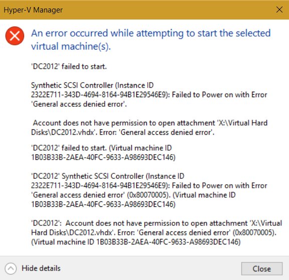
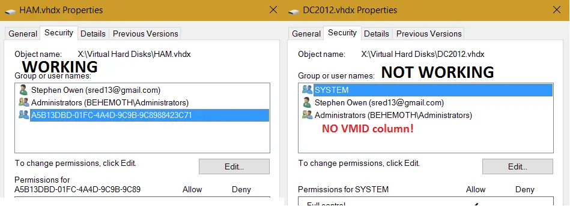
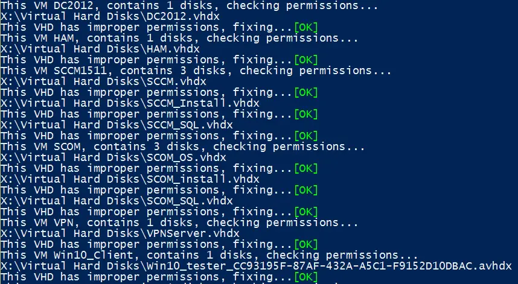
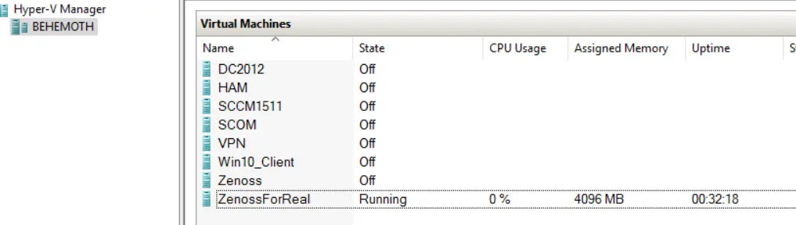

Today, I woke up to a nasty error in the FoxDeploy Hyper-V lab.  All of my VMs were stopped, and wouldn't start!  When I tried to start one, I'd see this error:



> An error occurred while attempting to start the selected virtual machines: General Access Denied Error...
> 
> VMName: Account does not have permission to open attachment <PathToVHD>

In my case, this happened because I have a Raid of SSDs for maximum IOPs for my VMs (can't stand something being slow!) and I lost a drive.  Somehow in rebuilding the volume, permissions were lost for some items on the drive, in addition to corrupting my Recycle Bin.

**Symptom**

Can't start any pre-existing VMs but are able to make a new one.

**Cause**

Something is wrong with permissions (namely, the VM doesn't have Full Control rights to it's VHD anymore. In this image below, you can see a new and working VM on the left, and a broken VM on the right.  Note the missing VMid entry.



**Fix**

You could fix this by hand by getting the VMId of the VM and adding it with Full Control permissions manually.  I didn't like this approach because some of my VMs have more than one VHD (like my SCOM VM, six VHDs!), and I've got 8 VMs anyway.  Way too much work!

All we need to do is get a list of our VMs, then iterate through each disk and apply the right Full Control perms.  This depends on the [NTFS Security Module](https://gallery.technet.microsoft.com/scriptcenter/1abd77a5-9c0b-4a2b-acef-90dbb2b84e85) being installed.  If you're running PowerShell v4 or higher, it will attempt to install the module for you.  If not, download and install it first.

Code

```powershell
#Import the NTFSSecurity Module, if not available, prompt to download it
If ((Get-Module).Name -notcontains 'NTFSSecurity'){
    Write-Warning "This script depends on the NTFSSecurity Module, by MSFT"
        if ($PSVersionTable.PSVersion.Major -ge 4){
            Write-Output "This script can attempt to download this module for you..."
            $DownloadMod = Read-host "Continue (y/n)?"
 
            if ($DownloadMod.ToUpper() -like "Y*"){
                find-module NTFSSecurity | Install-Module
                }
                else{
                #User responded No, end
                Write-Warning "Please download the NTFSSecurity module and continue"
                break
            }
 
        }
        else {
            #Not running PowerShell v4 or higher
            Write-Warning "Please download the NTFSSecurity module and continue"
            break
        }
    }
    else{
    #Import the module, as it exists
    Import-Module NTFSSecurity
 
    }
 
$VMs = Get-VM
ForEach ($VM in $VMs){
    $disks = Get-VMHardDiskDrive -VMName $VM.Name
    Write-Output "This VM $($VM.Name), contains $($disks.Count) disks, checking permissions..."
 
        ForEach ($disk in $disks){
            $permissions = Get-NTFSAccess -Path $disk.Path
            If ($permissions.Account -notcontains "NT Virtual Mach*"){
                $disk.Path
                Write-host "This VHD has improper permissions, fixing..." -NoNewline
                 try {
                      Add-NTFSAccess -Path $disk.Path -Account "NT VIRTUAL MACHINE\$($VM.VMId)" -AccessRights FullControl -ErrorAction STOP
                     }
                catch{
                       Write-Host -ForegroundColor red "[ERROR]"
                       Write-Warning "Try rerunning as Administrator, or validate your user ID has FullControl on the above path"
                       break
                     }
 
                Write-Host -ForegroundColor Green "[OK]"
 
            }
 
        }
}
```

And here it is in action.



After working, I'm now able to launch my VMs again!



Note: if you've got a lot of differencing or template disks in your environment, you'll also need to resolve the parentpath for each disk, if it exists.  I'd recommend using [this fine code by Sam Boutrous](https://gallery.technet.microsoft.com/scriptcenter/Powershell-script-to-get-311afc3e), Get-ParentPath.
