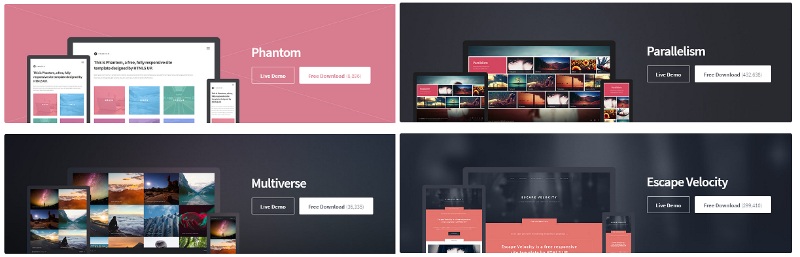
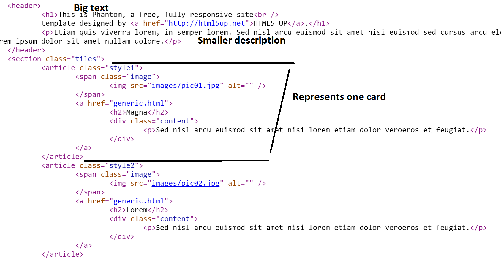
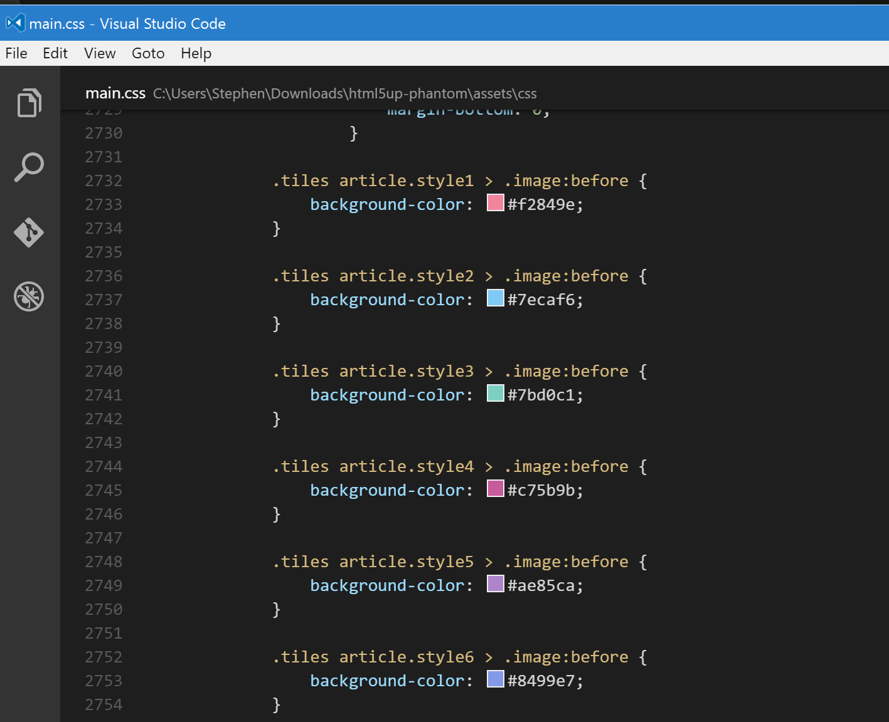
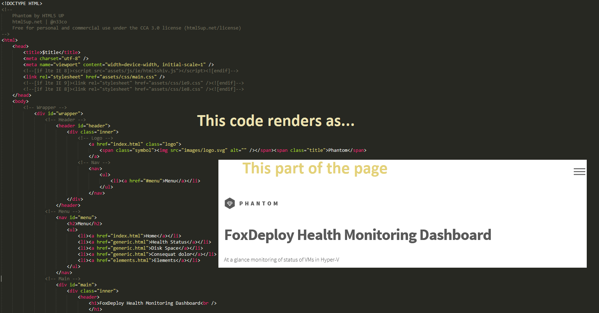
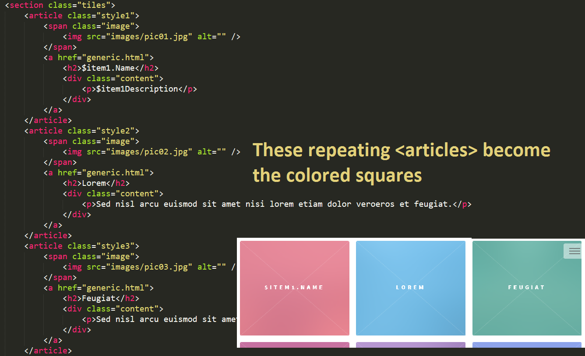
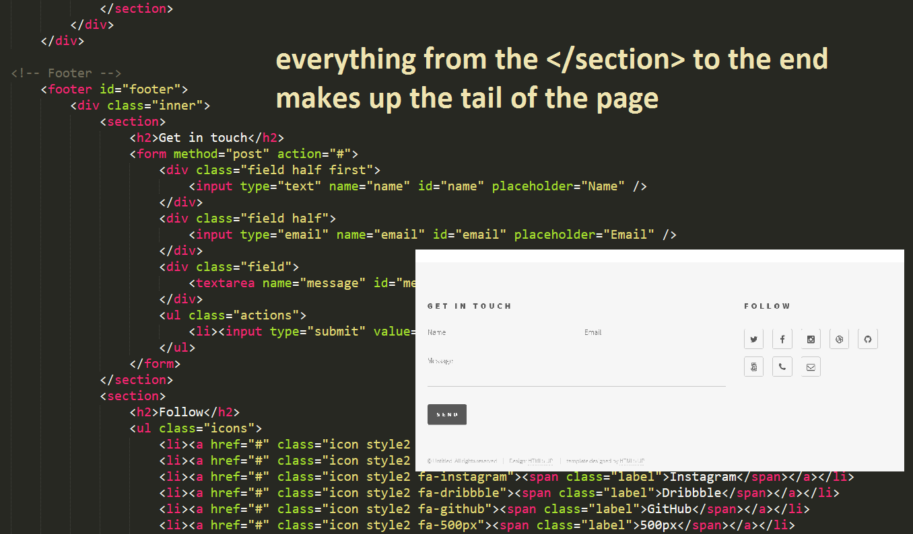
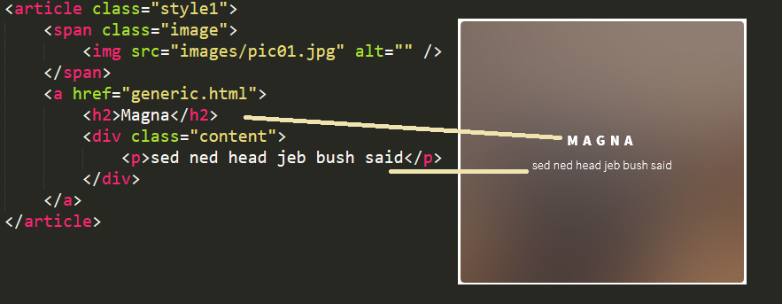

First off, YUUGE props to Flynn Bundy for shining lights on the possibility with his [post Making DSC Beautiful](https://flynnbundy.com/2016/04/06/making-dsc-beautiful/) and [@Neeco](https://twitter.com/n33co) of [HTML5Up.com](http://html5up.net/) for these gorgeous HTML5 and CSS templates.

If you check out HTML5up.com, there are a ton of absolutely beautiful templates, for free! (Well, you have to leave a link to the site, unless you pay $20, then you can edit it to your heart's content).



Some of them REALLY lend themselves well to a dashboard system for consumption of data.

...you know, PowerShell makes an excellent data collection and processing system.

It even has  native HTML capabilities, as we've covered previously in our post: [Using ConvertTo-HTML and CSS to create useful web reports from PowerShell](http://foxdeploy.com/2014/05/23/using-html-formatting-to-create-useful-webpage-reports-from-powershell/).  If you're lost and don't even know where to start, begin here.  I'll bet we could make some REALLY cool looking dashboards using PowerShell and Neeco's templates!

### Let's make a cool PowerShell Dashboard

So, I'll start by finding a template that I like.  I choose the gorgeous [Phantom](http://html5up.net/uploads/demos/phantom/), which is also the top one from the list.  Now, you might be asking yourself "FoxDeploy, did you even look at all of the templates first?" to which I would respond: SURE.

Let's take a look at Phantom.   It's got a nice set of fonts and a good layout, with a big title glob of text, then a smaller description below it.  It's followed by a big element or DIV called Tiles, with colored squares inside of it, called articles.


Let's take a look into the code and see how this is represented.



A few things jump out at me here.  Looking back at the image of the template itself, I see the first three squares/cards/cubes are red, blue and green.  Going back to the code, I don't see the colors listed there but I DO see a style, a different one for each.   It looks like the color of the tile is controlled by the style property in it's declaration, like this:

```html
<article class="style1">
  <span class="image">
  
  </span>
  <a href="generic.html">
    <h2>Magna</h2>
    <div class="content">
      <p>Sed nisl arcu euismod sit amet nisi lorem etiam dolor veroeros et feugiat.</p>
    </div>
  </a>
</article>
```

If you see a property like class= or id= within a HTML element, that's a good clue that the Cascading Style Sheet (cascading meaning you can have a base one for the site, then special sub-sheets for specific pages, and overlap them all in a precise, _cascading_ order) CSS will do some special processing on it when it's displayed to the user.

> What's CSS?

 If CSS is totally new to you, it's a great concept that allows us to pull the design and colors out of our HTML webpages.  Instead of specifying what font to use for this section of the page, and what color to make the background, we pull all of that style gunk out and leave behind just the meat and potatoes (the content, that is) of our site in HTML.  All style goes into the Cascading Style Sheet--the CSS file.

As we saw in the screen shot, each of the squares had a different color, and looking at the code, the only real difference between each of the squares in code was that a different style was listed. So, we'll look into the CSS files and see what it says for coloring.

For this and all web design work, I like to use [Visual Studio Code](https://code.visualstudio.com/Docs/?dv=win), by the incredible [David Wilson \[MSFT\]](https://twitter.com/daviwil).  Especially for CSS, it makes finding color assignments super easy, since it depicts the color in a little box next to it, you know, in case you don't say things like "Wife, your eyes are the most beautiful shade of #7eccfb"

The colors are down near line 2700.  (Hit Control+G to bring up the 'Go to line' box, and type in the number.)



So we can see that style1 is red, style2 is blue, style3 is green, etc.  Now I know what I want to do...

### Time to Code

I'm going to make a dashboard to show the status of my Hyper-V VMs.

As I tend to do, first I'll begin with a working PowerShell sample.  I'll run Get-VM to see all of my VMs.  If the status of the VM is running, I'll use the Green (style3) indicator.  If it's Stopped, I'll use the Red (style1), and if it's something else, I'll use style2.  This would include Critical or some other weird state.

```powershell
$VMS = get-vm | sort State 
 
ForEach ($VM in $VMS){
    $Name=$vm.Name
 
    if ($vm.State -eq 'Off'){
        $style = 'style1'
        }
        elseif($vm.state -eq 'Running'){
        $style = &amp;quot;style3&amp;quot;
        }
        else{
        #VM is haunted or something else
        $style = &amp;quot;style2&amp;quot;
        }
 
    #Now we know what state to pick
}
```

I know what I need to set for each square, but don't know how to add my squares to the actual index.html of this page.

#### And now, to do something unholy to the HTML

I use an unorthodox approach that totally works well.  Once we understand how the HTML in index.html is rendering the page, what we'll do here will make perfect sense.

Starting at the top of the document, let's visualize what each chunk of code represents when parsed by a browser...



So, that's the top part.  After that, beginning with the `&lt;section class="tiles"&gt;` tag, we have a big repeating structure which gives us all of the squares/tiles.



Finally, beginning with the closing </section> tag, we have the bottom of the page, with it's contact forms and all of that.



To do this the easy way, let's just cut it into three files!

I'll take the core file here (which is index.html) and I'll break it into two chunks.  Everything from the top of the file including the line <section class="tiles"> goes into head.html.  Now, start at the bottom of the file and take the last line all the way up to and including the line </section> and save that as tail.html.

Now we need to make our cards

#### Structure of a card/tile/square

Let's look into the structure of one of these tiles for a moment.



I can see how this should look.  I've already got my code to say what style to use, so when I'm making a card for each VM, I'll set the style to change the color of the square for On/Off/Other.

Next, instead of 'Magna' within the Header2 tags, I want my VM Name.

If the machine is turned on, I'd also like to see it's CPU usage and RAM pressure.  Finally, when I hover over the tile, a little section of text appears...I think that would be a cool place to list where the machine's VHD files are, and it's uptime.

I'll add another if{} scriptblock, and within this one, I'll test to see if the VM was online. If it was, I'm going to recast it's $name property, to add a new line after the name, with RAM and CPU.  I reuse $name, so that no matter if the machine is on or off, I can have the same block of code make a square for me.


```powershell
#if the VM is on, don't just show it's name, but it's RAM and CPU usage too if ($VM.State -eq 'Running'){

$Name="$($VM.Name)

RAM: $($VM.MemoryAssigned /1mb)

CPU: $($VM.CPUUsage)" }
```

I also want to have a little description of the VM, like where it's VHD files live, etc. So I'll set the value of $description like this:

```powershell
$description= @" Currently $($VM.Status.ToLower()) with a

state of $($VM.State)

It was created on $($VM.CreationTime)

Its files are found in $($VM.Path) "@
```

We've got all the bits we need to make a card, we can now just drop in the HTML for a card in a here-string, and put the variables we've made here in place of the name and descrption.

```powershell
$tile = @"
<article class="$style">
  <span class="image">
    
  </span>
  <a href="generic.html">
    <h2>$Name</h2>
    <div class="content">
    $($description)
    </div>
  </a>
</article>

"@
```

And now, repeat after me...

#### String concatenation isn't ALWAYS evil.

Because that's totally what we're about to do. We broke the file into three bits. Now it's time to put it back together. To end the for-each scriptblock for each card, we'll add the current card to $main.

Then, we build our completed file, by adding $head + $main + $tail, and then we dump that into an HTML file. Easy peasey!

```powershell
$main += $tile #EndOfForEach }

$html = $head + $main + $tail

$html > .\\VMReport.html
```

### Final Touches

Now you'll probably want to open up head.html and replace the text there with your branding. You'll also want to add in an image, most likely.

##### Adding the time

To add in the current time the report was generated, add in a string we can replae when importing the file. I added the string %4 to line 4 in head.html, like so:

```powershell
 <div class="inner"> 
  <header> 
    <h1>FoxDeploy Health Monitoring Dashboard</h1> 
    At a glance monitoring of status of VMs in Hyper-V updated at %4 </header>
```

 this gives me an easy anchor to replace when I import the file, so I can use -replace %4 with the current time, like this:

```powershell
$head = (Get-Content .\\head.html) -replace '%4',(get-date).DateTime
```

##### Auto refreshing the page

I'd like to make the page automatically reload every 30 seconds, so add this line to your head.html page.

```html
<meta http-equiv="refresh" content="20"; URL="path to your report.html">
```

##### Run forever

It would also be nice to have this automatically run until the end of time, so I'll just add an open-ended for loop to the script, and then add a Start-Sleep timeout at the end. This way, the report will generate once every 15 seconds or so, and the browser will auto refresh every 20 seconds, so the two should be mostly in sync.

```powershell
#Add to first line of the script For(;;){

#Last line of script Start-Sleep -Seconds 15}
```

And the finished product

### Next Steps

I've not completed this part, but a KILLER next step would be to make these buttons work when you click them.  Currently, they all link to generic.html, but instead, you could use this same process to create a page for each VM and name it VMname.html.  Then when you build the card, add the appropriate link and bam, you have a fully functional VM dashboard.

If you go this route, consider adding a Windows Event view, or deeper VM statistics.  You could really go hog-wild here.  Another cool idea is to make use of the images provided in this template, and provide a background image for the tiles.

I've got you this far, time for you to make it your own.

### I'm just scrolling till I see the word 'Download'

Here you go, buddy :) [Code Download](https://github.com/1RedOne/BlogPosts/tree/master/FoxDeploy%20VM%20Dashboard)