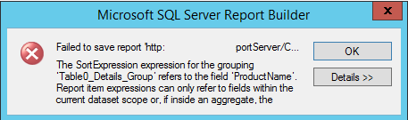
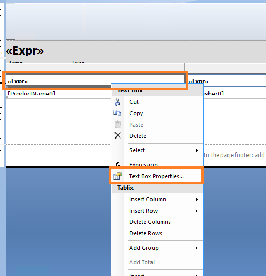
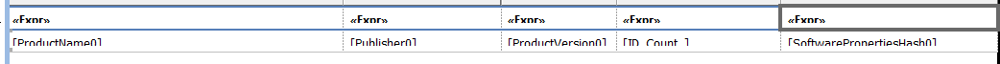

Ever run into this issue where you can't save a report you're editing in the report builder?

"Failed to save report (report server URL).  The sortExpression Expression for the grouping refers to the field 'ProductName' Report item expressions can only refer to fields within the current dataset scope'

This is a REALLY irritating one.  It happens when you edit a copy of one of the in-box SCCM reports and change the columns being returned.  Without us knowing it, there are a lot of settings customized that allow us to click on the top of each column to sort the rows based on our preferences.
<!--more-->
When we change the columns returned in an apport, we need to also update the header textbox for each column.

To fix this, right click up here, and go to interactive sorting and click each <<Expr>> box, then choose'Text Box Properties'

And go to Interactive Sorting.  You might notice that the value listed in the box is no longer relevant to the rows you're returning in your report now.  (Happens to me ALL the time, I always find a good starting report, then save a copy and edit (it's so hard to get the background looking pretty!))

Especially if you edited a built-in report, you'll need to do this for the header of each column.  That means each of these guys:

With this done, you should now be able to save the report again.
