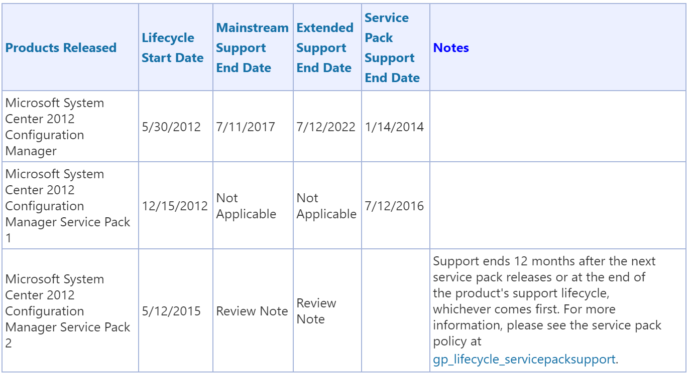
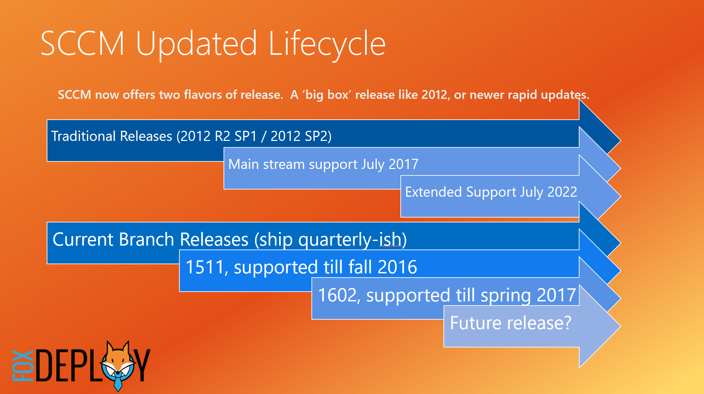

I write about PowerShell and automation tools a LOT.  However, I pay my bills as a Consultant by designing, installing and supporting System Center products; most often SCCM (ConfigMgr).

For this reason, I've been scouring the web and Tweeting my thumbs off recently to scrape together what information I can on the new version of SCCM, to be prepared when my customers ask questions about it.

This is mostly an info dump of what we know and what we suspect about how Current Branch will play out for SCCM.  This plan is currently in place for a number of my customers, including some big enterprise customers. It's how I'm doing it, but I will admit that I don't have any secret info here (nothing NDA breaking :0 here).

That being said, If you think I'm wrong, call me out (but be ready to back it up with a source).  I plan to revisit this article to keep it up to date, because we honestly _don't know_ yet what some parts of this are going to look like.

### SCCM as a Service = Current Branch

Some people refer to it as SCCM as a Service, but don't mistake this for Intune.  If you're sitting on an SCCM 2012 environment, you may wonder what this is and what it means for you.

It's the SCCM we love except it's also getting a TON of engineering effort and love from Microsoft right now.  We're getting these new mini-releases semi regularly, a few times a year, and we're getting a ton of new quality of life and feature updates for the SCCM Admin.  Redmond is listening.

You can call it simply SCCM Current Branch.  No more long names like System Center 2012 R2 ConfigMgr w/ SP1 or other tomfoolery, we have actual easy to pronounce names now.  Two digits for the year, two for the month, just the way Ubuntu linux has been done for years and years.

#### What we've got so far

The first release of SCCM Current Branch was SCCM 1511, meaning 2015 November was its ship date.  Since then, we've had another release of Current Branch, 1602.  From that pattern and the new monthly Tech Previews, it does look like we'll be getting CB releases a few times a year, maybe quarterly or a bit longer than that.  These are real production releases of SCCM, with killer features like automatic console upgrade, multiple deployments from one ADR, and tons of other great new abilities.  Don't confuse them for the monthly releases though, which are called Tech Previews.

### What's Tech Preview?

In addition to the Current Branch releases, we've got another new thing, these Tech Previews builds which have come out pretty much monthly, but those aren't meant to be used in production, and have the words 'TECH PREVIEW' all over everything.  Don't use them in prod, you're gonna have a bad time.  Maybe.

They are awesome though because you can see huge changes and improvements in SCCM from month to month.  If you really want to stay on top of things, have SCCM Tech Preview up and running in your test lab.  Just know that you can currently never convert a Tech Preview build over for regular use, they have a limited time line and then are done.  TP is for experimental builds and show off new features, but you won't get support if you try to run your company off of them.

> ## Make no mistake, the Current Branch releases **are ready for production. Over 8,600 companies have deployed it today, to more than 12MM endpoints.**

### How is Current Branch really different?

Previously with SCCM, it wasn't uncommon to stand up an environment, install clients, build some DPs and then go about daily operations for months or years without ever applying SCCM updates to your servers.  If you encountered a problem with OSD or PXE, you might Google and find a hotfix and install that, but for the most part you could count on years and years of support on whatever broken janky version you happened to install.

Things are changing.  It's a new and leaner Microsoft with a focus on listening to user feedback and pushing builds out the door.  Microsoft shifting to the much more open and social UserVoice system for feedback is a testament to this, as is the huge success of the Windows Insider Program.  In order to support this change, like a lot of companies, MS is contracting the platforms they'll support at any given time.  This means that if you decided to go with a Current Branch build, if you call Microsoft for help three years later, don't be surprised if you're recommended to update your environment before they'll help.

> ## With Current Branch, count on applying SCCM Updates to your environment at least once a year, to receive support.  SCCM Product lead Aaron Czechowski [has said this publicly on the ConfigrMgr blog](https://blogs.technet.microsoft.com/configmgrteam/2015/10/27/system-center-configuration-manager-support-for-windows-10-and-microsoft-intune/).

Here's the super cool thing, with Current Branch, updating **SCCM is really, _really_ easy.**

Nothing extraneous to download, all updating happens right in the SCCM console via this new node 'Servicing and Updating'

](../assets/images/2016/05/https://foxdeploy.files.wordpress.com/2016/05/sccmservicing.png) Just right click and hit install to apply the new Current Branch build

All you do is enable a new role in your environment and then refresh this view and you should see the update bits start trickling down (more on that process here).

It used to be a big pain to upgrade SCCM, with needing to hit every primary, and then all the clients and run SQL actions as well.  Things are much easier now.  We already got the awesome feature of SCCM Client Auto Upgrade from 2012 SP2, while 1602 added a brand new feature of SCCM Console Auto Upgrade as well.  Super simple!  No more tracking down Admin Console users to push Console upgrades anymore.  It now happens automatically when you launch the console after an upgrade.

### What can I expect from support?

Now, with SCCM as a service we still own the infrastructure locally BUT we're agreeing that we will keep our SCCM more up to date than we might have in the past.  We get frequent updates and know that MS is listening to us to make ConfigMgr better, and in exchange we'll apply the updates every so often.

We've seen something similar with other System Center products, if you call for support for Orchestrator or SCOM and you're using the RTM bits, you're VERY likely to be told to apply at least some of the Update Rollups released in the last few years to see if they fix your issue.

If you really want to, you could install 1602 and sit on your butt for five years, but if you want an Engineer or PFE to look at your environment, they're going to tell you to install the most recent or second most recent patch before they invest a lot of time on your system.

> ## This (push to update before getting support)is such a common response that within my company we call this the **two-back rule,** **because you need to be on either current, or two releases back.** 
> 
> ### I guess we can call it the 'year-back' rule now.

For Service Packs, this is nothing new.  Support for the initial release falls off a year after a Service Pack ships.  If SP2 comes out, SP1 is dropped after a year as well. Now we're doing the same thing with all releases, which honestly is how it should have been all along.

Beyond this, should we see regular quarterly releases of the Current Branch, this will only reinforce the notion of 'stay current or support yourself'.  This is actually a pretty common refrain from Redmond these days (Windows 10 Upgrade Prompts anybody?)

### Now that Current Branch is out, is SCCM 2012 still supported?

We have confirmation on this front, SCCM 2012 was released as a milestone product and has guaranteed Mainstream support through July 2017, with extended support until July 2022.  If you're still using SCCM 2012 in 2022, you must be working for the government.

To help us keep all of these dates in mind, I made this graphic.

## Key takeaways

- SCCM 2012 and R2 are good through July 2017 Mainstream and 2022 extended support.  If a new Service Pack ships for them during this time, you have a year until you need to install it for support.
- Current Branch releases can be used for a year, but must be upgraded to within the previous year if you want support.
- You don't have to apply every Current Branch release, you can skip them.  SCCM does a really good job letting you hop from one release to another (As demonstrated in the tech preview releases)

I hope this was helpful.  Leave your feedback for me below.  If it's years from now and this is really out of date, make sure to prod me and call me names too :p
