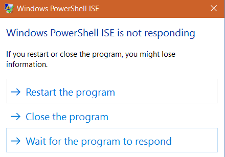
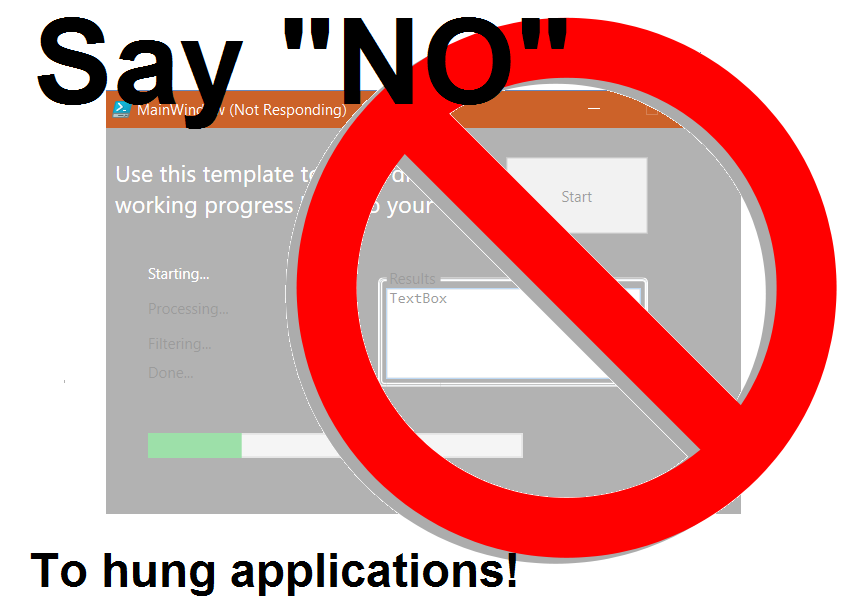
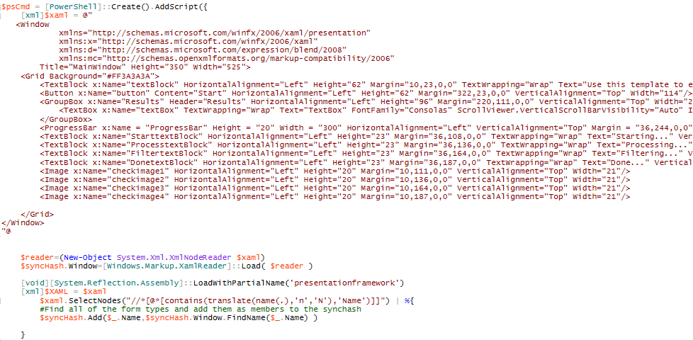
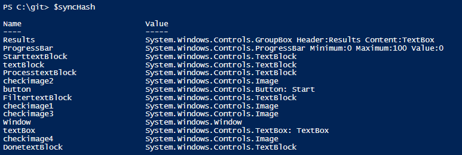
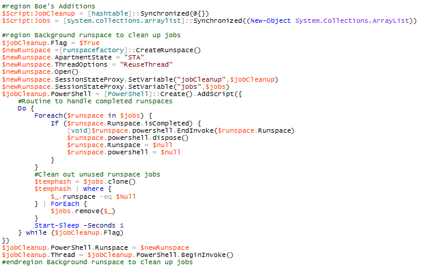
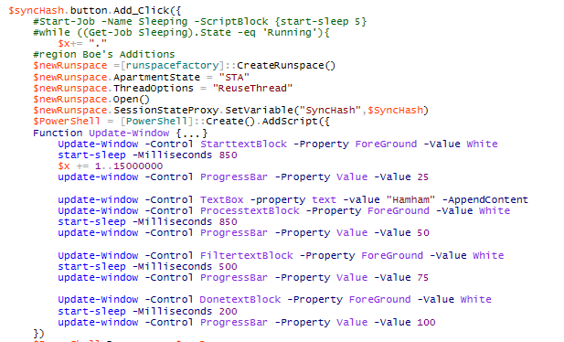
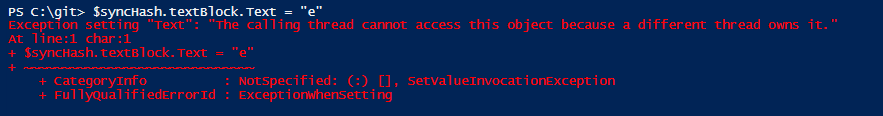
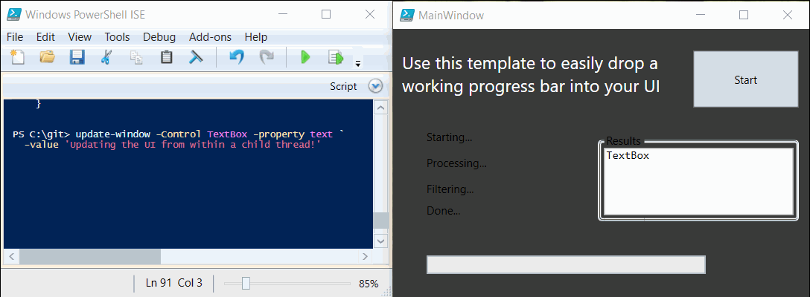

**This post is part of the Learning GUI Toolmaking Series, here on FoxDeploy. Click the banner to return to the series jump page!**

* * *

### Where we left off

If you've followed this series, you should know how to make some really cool applications, using WPF for the front-end and PowerShell for the code-behind.

What will now probably happen is you'll make a cool app and go to show it off to someone with a three letter title and they'll do something you never imagined, like drag a CSV file into the text box....(true story).  Then this happens.



We don't want this to happen.  We want our apps to stay responsive!

In this post we'll be covering how to implement progress bars in your own application, and how to multi-thread your PowerShell applications so they don't hang when background operations take place. The goal here is to ensure that our applications DON'T do this.



 

### Do you even thread, bro?

Here's why this is happening to us...

if we are running all operations in the same thread, from rendering the UI to code behind tasks like waiting for something slow to finish, eventually our app will get stuck in the coding tasks, and the UI freezes while we're waiting.  This is bad.

Windows will notice that we are not responding to the user's needs and that we're staying late at the office too often and put a nasty 'Not Responding' in the title. This is not to mention the passive-aggressive texts she will leave us!

If thing's don't improve, Windows will then gray out our whole application window to show the world what a bad boyfriend we are.

Should we still blunder ahead, ignoring the end user, Windows will publicly dump us, by displaying a 'kill process' dialog to the user.  Uh, I may have been transferring my emotions there a bit...

All of this makes our cool code look WAY less cool.

To keep this from happening and to make it easy, I've got a template available here which is pretty much plug-and-play for keeping your app responsive. And it has a progress bar too!

The full code is here [PowerShell\_GUI\_template.ps1](https://github.com/1RedOne/BlogPosts/blob/master/GUI%20Part%20V/PowerShell_GUI_Template.ps1).  If you'd like the Visual Studio Solution to merge into your own project, [that's here](https://github.com/1RedOne/BlogPosts/blob/master/GUI%20Part%20V/ProgressBarTest.sln).  Let's work through what had to happen to support this.

####  A little different, a lot the same

Starting at the top of the code, you'll see something neat in these first few lines: we're setting up a variable called $syncHash which allow us to interact with the separate threads of our app.

```powershell 
$Global:syncHash = [hashtable]::Synchronized(@{})
$newRunspace =[runspacefactory]::CreateRunspace()
$newRunspace.ApartmentState ="STA"
$newRunspace.ThreadOptions ="ReuseThread"
$newRunspace.Open()
$newRunspace.SessionStateProxy.SetVariable("syncHash",$syncHash)
```

After defining a synchronized variable, we then proceed to create a runspace for the first thread of our app.

> ####   **What's a runspace?**

This is a really good question.  A runspace is a stripped down instance of the PowerShell environment.  It basically tacks an additional thread onto your current PowerShell process, and away it goes.

Similar to a PowerShell Job, but they're much, much quicker to spawn and execute.

However, where PSJobs are built-in and have tools like get-job and the like, nothing like that exists for runspaces. We have to do a bit of work to manage and control Runspaces, as you'll see below.

Short version: a runspace is a super streamlined PowerShell tangent process with very quick spin up and spin down.  Great for scaling a wide task.

So, back to the code, we begin by defining a variable, $syncHash which will by synchonized from our local session to the runspace thread we're about to make.  We then describe $newRunSpace, which will compartmentalize and pop-out the code for our app, letting it run on it's own away from our session.  This will let us keep using the PowerShell or ISE window while our UI is running.  This is a big change from the way we were doing things before, which would lockup the PowerShell window while a UI was being displayed.

If we collapse the rest of the code, we'll see this.  


The entire remainder of our code is going into this variable called $pscmd.  This big boy holds the whole script, and is the first thread which gets "_popped out"._

The code ends on line 171, triggering this runspace to launch off into its own world with beginInvoke().  This allows our PowerShell window to be reused for other things, and puts the App in its own memory land, more or less.

#### Within the Runspace

Let's look inside $pscmd to see what's happening there.



Finally, something familiar!  Within $pscmd on lines 10-47, we begin with our XAML, laying out the UI.  Using this [great tip from Boe](https://learn-powershell.net/2012/10/14/powershell-and-wpf-writing-data-to-a-ui-from-a-different-runspace/), we have a new and nicer approach to scraping the XAML and search for everything with a name and mount it as a variable.

This time, instead of exposing the UI elements as $WPFControlName, we instead add them as members within $syncHash.  This means our Console can get to the values, and the UI can also reference them.  For example:

 Even though the UI is running in it's own thread, I can still interact with it using this $syncHash variable from the console

### Thread Count: Two and climbing

Now we've got the UI in it's own memory land and thread...and we're going to make another thread as well for our code to execute within.  In this next block of code, we use a coding structure Boe laid out to help us work across the many runspaces that can get created here.  Note that this time, our synchronized variable is called $jobs.

 

This code structure sets up an additional runspace to do memory management for us.

For the most part, we can leave this as a 'blackbox'.  It is efficient and practical code which quietly runs for as long as our app is running.  This coding structure becomes invoked and then watchs for new runspaces being created.  When they are, it organizes them and tracks them to make sure that we are memory efficient and not sprawling threads all over the system.  I did not create this logic, by the way.  The heavy lifting has already been done for us, thanks to some excellent work by Joel Bennett and Boe Prox.

So we're up to thread two.  Thread 1 contains all of our code, Thread 2 is within that and manages the other runspaces and jobs we'll be doing.

Now, things should start to look a little more familiar as we finally see an event listener:



 

We're finally interacting with the UI again.  on line 85, we register an event handler using the Add\_Click() method and embed a scriptblock.  Within the button, we've got another runspace!

This multi threading is key though to making our app stay responsive like a good boyfriend and keep the app from hanging.

### Updating the Progress Bar

When the button is clicked, we're going to run the code in its own thread.  This is important, because the UI will still be rendered in its own thread, so if there is slowness off in 'buttonland', we don't care, the UI will still stay fresh and responsive.

Now, this introduces a bit of a complication here.  Since we've got the UI components in their own thread, we can't just reach over to them like we did in the previous example.  Imagine if we had a variable called $WPFTextBox.  Previously, we'd change the $WPFTextBox.Text member to change the text of the box.

However, if we try that now, we can see that we get an error because of a different owner.



We actually created this problem for ourselves by pushing the UI into its own memory space. Have no fear, Boe is once again to the rescue here.  He created a function Called-Update window, which makes it easy to reach across threads.  (link)

The key to this structure is its usage of the Systems.Windows.Threading.Dispatcher class.  This nifty little guy appears when a threaded UI is created, and then sits, waiting  for update requests via its Invoke() method.  Simply provide the name of a control you'd like to change, and the updated value.

```powershell

Function Update-Window {
        Param (
            $Control,
            $Property,
            $Value,
            [switch]$AppendContent
        )
 
        # This is kind of a hack, there may be a better way to do this
        If ($Property -eq"Close") {
            $syncHash.Window.Dispatcher.invoke([action]{$syncHash.Window.Close()},"Normal")
            Return
        }
 
        # This updates the control based on the parameters passed to the function
        $syncHash.$Control.Dispatcher.Invoke([action]{
            # This bit is only really meaningful for the TextBox control, which might be useful for logging progress steps
            If ($PSBoundParameters['AppendContent']) {
                $syncHash.$Control.AppendText($Value)
            } Else {
                $syncHash.$Control.$Property = $Value
            }
        },"Normal")
    }    

```

We're defining this function within the button click's runspace, since that is where we'll be reaching back to the form to update values. When I load this function from within the console, look what I can do!


With all of these tools in place, it is now very easy to update the progress bar as we progress through our logic.  In my case, I read a big file, sleep for a bit to indicate a slow operation, then update a text box, and away it goes.

If you're looking to drag and drop some logic into your code, this is where you should put all of your slow operations.

```powershell 
Update-Window -Control StarttextBlock -Property ForeGround -Value White
start-sleep -Milliseconds 850
$x += 1..15000000 #intentionally slow operation
update-window -Control ProgressBar -Property Value -Value 25
 
update-window -Control TextBox -property text -value &amp;quot;Loaded File...&amp;quot; -AppendContent
Update-Window -Control ProcesstextBlock -Property ForeGround -Value White
start-sleep -Milliseconds 850
update-window -Control ProgressBar -Property Value -Value 50
 
Update-Window -Control FiltertextBlock -Property ForeGround -Value White
start-sleep -Milliseconds 500
update-window -Control ProgressBar -Property Value -Value 75
 
Update-Window -Control DonetextBlock -Property ForeGround -Value White
start-sleep -Milliseconds 200
update-window -Control ProgressBar -Property Value -Value 100
```

#### Sources

That's all there is to it! The hard part here was containing our app into separate threads, but hopefully with the template involved you can easily see where to drop you XAML and how to make your application hum along swimmingly!

I could not have done this post without the many examples provided by [Boe Prox](https://twitter.com/proxb) on his blog:

[Writing WPF Across Runspaces](https://learn-powershell.net/2012/10/14/powershell-and-wpf-writing-data-to-a-ui-from-a-different-runspace/) [PowerShell WPF Radio Buttons](https://learn-powershell.net/2014/08/10/powershell-and-wpf-radio-button/) [Multi-runspace Event Handling](http://stackoverflow.com/questions/15501938/powershell-multi-runspace-event-passing) [Asynchronous event handling in PowerShell](https://blogs.technet.microsoft.com/heyscriptingguy/2011/06/16/use-asynchronous-event-handling-in-powershell/)

Additionally, I had help from Joel Bennett ([JayKul](https://twitter.com/Jaykul)) of [HuddledMasses.org.](http://huddledmasses.org/)

I learned a lot from reading over [Micah Rairdon's](https://twitter.com/tiberriver256) [New-ProgressBar cmdlet from his blog](http://tiberriver256.github.io/powershell/PowerShellProgress-Pt1/), so check that out too.  Finally, [Rhys W Edwards](https://social.technet.microsoft.com/profile/rhys%20w%20edwards/ "Go to Rhys W Edwards's profile") has a [great cmdlet also on TechNet](https://gallery.technet.microsoft.com/scriptcenter/New-ProgressBar-8468da5c), with some more good demos if you're looking for help or inspiration.
