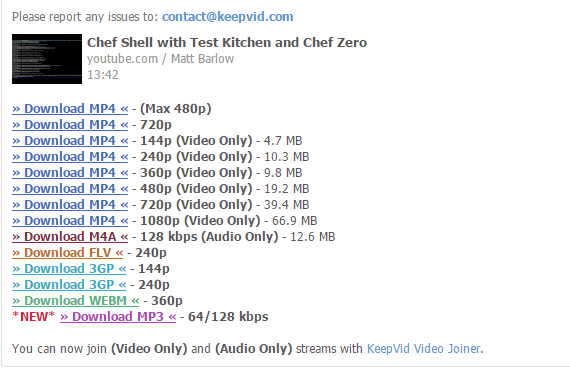
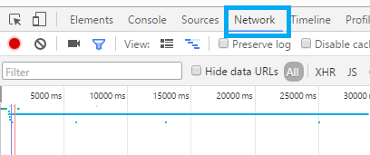
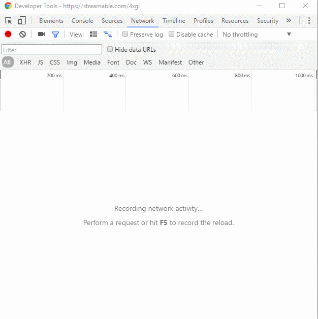
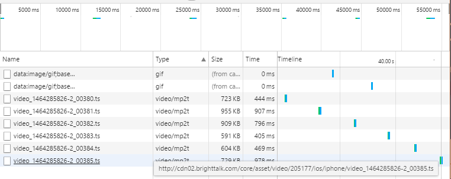
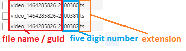
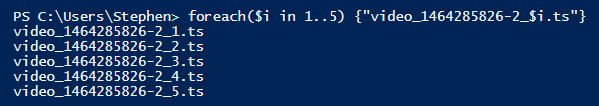
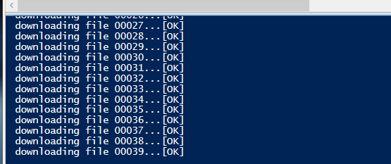

We live in an amazing world of on-demand video and always available bandwidth, where people can count on full reception at all times on their device.   If you want to watch cool videos from events or conferences, you can just load them on when you're on the road with no issues, right?

Yeah right.

Streaming is cool and all, but there are times when it's nice to have videos saved locally, like the huge backlog of content from MMS and TechEd.  However, a lot of streaming services want you to only view their videos within the confines of their web page, normally with a sign-in session.

In this post, I'll show you a few ways to download videos you'll run across online, and how you can use PowerShell to download some of the REALLY tricky ones.

#### How to do this on most platforms

If I need to save a video from YouTube or other sites like it, I go to [KeepVid](http://www.keepvid.com), first and foremost.

Google isn't a fan of this site as they want you loading up YouTube and watching ads whenever you watch a video, so they try to dissuade you from entering the site. They do this by displaying this scary warning page if you browse to the site from a google search, but the site can be trusted, in my experience.


This is an easy to use website which uses Javascript to parse out the streaming behavior of a video and then presents you with a link to download your video in many different resolutions.



This works for about 60% percent of sites on the web, but some use different streaming JavaScript platforms which try to obfuscate the video files.

#### How to manually save a video file using Chrome

If KeepVid doesn't work, there is a way to do what it does manually.

I've been into Overwatch recently, and have been watching people play on Streamable.  Sometimes you see a really cool video and you want to save it,  [like this one](https://streamable.com/4xgi) of this beast wiping out pretty much everyone in eight seconds.

Let's fire up Chrome and hit F12 for the developer tools.  Click on the Network tab.



This will show us a waterfall view of elements on the page as they're downloaded and being used.  We can even right click individual items to open them in a new tab.

Now, browse to the site with the video in question and click Play (if needed).  You need to trigger the video to begin playing for this to work.  Watch as all of the elements appear and look at the one with the longest line.  If it's one giant long line, you've found a .mp4 or .ts file somewhere, which is the video was want to keep.



In this gif, my mouse wouldn't appear but I let the site load, hit Play, and then click on the longest line in the timeline view on top. I then right click the item with the type 'Media' and here you can grab the file URL or open a new tab to this URL.  Do that and then you can save the video file.

This technique works for a LOT of the streaming videos on the Web and is especially good when your video won't download using keepvid.

However, some sites use insidious methods to make it nearly impossible to save files. For them...

### How to deal with the REALLY tricky ones

I have been all about learning Chef recently.  I see it as the evolution of what I do for a living, and I think in two or three years, I'll be spending a lot of time in its kitchen.  So I've been consuming learning materials like a fiend.  I found this great video on demand session by Steven Murawski.

[Steve Murawski, Chef Conf Talk](https://www.brighttalk.com/webcast/11349/196441)

And I [signed up for the presentation](https://www.brighttalk.com/webcast/11349/196441).  I watched the talk but was sad to see no link to download the video (which I would need, with no reception later that day). So I used the same Developer Tools trick I showed below and hopped into the tab, only to see this.



See how there are many different video files with an ascending number structure?  This site uses the JW player, similar to the platform used by Vimeo.  This is a clever streaming application, because it breaks apart files into 10 second snippets which it stitches together at playback.

Rather than one file to download, there are actually hundreds of them, so we'll need to find an easy way to download them all.  I used the chrome developer trick to download one chunk and popped one of these mp2 files in VLC, and found that each snip was ~ 10 seconds long, and the video was an hour, so I'd need to download roughly 360 files.

Obviously I wasn't about to do this by hand.

#### Figuring out the naming convention

If we look at the file URL, we see the video files seem to have this format:



If we could use some scripting tool to reproduce this naming convention, we could write a short script to keep downloading the chunks until we get an error.

Recreating the unique URLs isn't too hard. We know that every file will begin with

```
video\_1464285826-2\_
```

then a five digit number, followed by

`.ts`


We can test the first five chunks of the file with a simple

`1..5`

Put them all together to get:

```powershell
foreach($i in 1..5) {"video_1464285826-2_$i.ts"}
```

Finally, to put the number in the right format, we just need to use $i.ToString("00000"), which will render a 1 as 00001, for instance. Now to test in the console



#### Downloading the files

We can use PowerShell's `Invoke-WebRequest` cmdlet to download a file.  Simply hand it the -URI you want to download, and specify an output path.

To use this, pick the destination for the file for line 1, and then for line 2, replace this with the baseURL of your video file.(If the file is http://www.foxdeploy.com/videos/demo1.mp4, then the baseurl would be http://www.foxdeploy.com/videos/).

```powershell
$outdir = "c:\temp\VOD"
$baseUrl = "http://someserver.com/asset/video/"
cd $outdir
$i = 50
do {
 $url = "$baseUrl/video_1464285826-2_$($i.ToString("00000")).ts"
 Write-Host "downloading file $($i.ToString("00000"))..." -nonewline
 try { Invoke-WebRequest $url -OutFile "$outdir\$($i.ToString("00000")).ts" -PassThru -ErrorAction Stop | Tee-Object -Variable request | Out-Null}
 catch{
 write-warning 'File not found or other error'
 
 break
 }
 write-host "[OK]"
 Start-Sleep -Seconds 2
 $i++
 }
until ($request.StatusCode -ne 200)
```

After dropping in the right base URL and specifying your file naming convention, hit F5 and you should see the following.



#### Joining the files back together

At this point we've got loads of files, but we need to combine or concatenate them.

This is possible through VLC, but Video LAN client will create timestamp errors (fast forward won't work) if you use it. It's better to re encode them.

To join the files, you'll need FFMpeg.  Install it then run it from the start menu (which adds FFMpeg to your Path Environmental Variable, we need this later!).

> **Important!** Open a new PowerShell prompt and try to launch ffmpeg
> 
> If it doesn't work, copy ffmpeg into your C:\\windows\\system32 folder.

Assuming you need to merge a bunch of video files into one, just browse to the directory where you saved your files, and then run the following code.  Replace line 2 with the path to the source files (and the right extension), then on line 4, replace with the desired file name.

```powershell
#replace with the location containing files to merge
$source = c:\temp\videos\*.ts
 
#destination file
$output = "$home\Video\output1.ts"
 
#this looks weird, but FFMpeg must have files in a pipe seperated list, very weird working with PowerSherll!
$files = (Get-ChildItem $outdir | select -expand Name ) -join '|'
 
#execute
ffmpeg -i "concat:$files" -c copy $output
```

#### Accepting Challenges

Have another bulk file download/management task you need to tackle with PowerShell?  Leave me a message and I'll help you figure it out.
