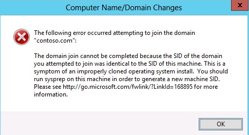

It's a common enough scenario: build one template machine and then mirror that to make a testlab, so you'd think this would be a built-in feature of Hyper-V, but its not.

Luckily, it's not too hard to do once you know how, and I'll guide you through the tough parts

#### Overall process

We'll be following these steps to get clones of our master VM.

- Create a source/master VM and install all common software and features on it
- Prepare it for imaging using sysprep
- Shutdown the source VM and remove it from Hyper-V
- Create differencing disks using the Source VM's VHD as the parent disk
- Create new VMs, using the newly created differencing disk

##### Create a source VM

To begin, create a new VM and name its VHD something like master or template.  We'll be building this one as the source for our VMs, and will eventually have to shut it down and never turn it back on again.  If we accidentally delete the VHD for it, or start it up again, we can make changes to it which will break all of our clones.

So make sure you give it a name that will remind you to not delete this guy!


Install Windows and whatever common apps you'll want your source machine to use, and when you've got it to the point that you're ready to copy it out...

##### Sysprep our VM

In our scenario here, we've built a source image and want to put it on other VMs.  Imagine if we wanted to push it down to multiple different laptops and desktops, however.  In that case, we'd need to ensure that all Hyper-V specific drivers and configurations are removed.  We also need Windows to run through the new user Out of Box Experience (OOBE), when Windows detects hardware and installs the right drivers, etc.

In the Windows world, particularly if machines are in an Active Directory Domain, you need to ensure that each machine has a globally unique identifier called a System Identifier, or SID.  This SID is created by Windows automatically during the OOBE process.  If you try joining two machines with the same SID to an AD Domain, you'll get an error and it won't be allowed, as a potential security risk.



To avoid this, and because it's a best practice, we're gonna sysprep this badboy.

Also, I should note that there's no going back.  Once we sysprep this machine, it will shutdown and we're done with it.  If we turn it back on, we're 'unsealing' the image and need to sysprep again.

###### How to sysprep a machine

Once all of the software is installed, launch an administrative command prompt and browse to `C:\windows\system32\sysprep.exe`, and then select 'Enter System Out of Box Experience' and Generalize.  Under Shutdown Options, choose 'Shutdown'


When this completes, your VM will shutdown.

##### Shutdown and remove

At this point, remove the source VM from Hyper-V.  This will leave the files on disk, but delete the VM configuration.  You **could** leave the VM in place, just remember to never boot it again.  If you boot the parent vm, it will break the chain of differencing.

##### create differencing disks & create new vms

You could do this by hand in the console, or you could just run this PowerShell code.  Change line 2 `$srcVHDPath` to point to the directory containing your parent VHD.

Change line 4 `$newVHDPath` to point to where you want the new disk to go.  This will create a new Differencing VHD, based off of the parent disk.  This is awesome because we will only contain the changes to our image in the differencing disk.  This lets us scale up to having a LOT of VMs with a small, small amount of disk space.

Finally, change line 8 `-Name NewName` to be the name of a VM you'd like to create.

```powershell
 #Path to our source VHD 
 $srcVHDPath = "D:\Virtual Hard Disks\Master.vhdx"

#Path to create new VHDs 
$newVHDPath = "D:\Virtual Hard Disks\ChildVM.vhdx" New-VHD -Differencing -Path $newVHDPath -ParentPath $srcVHDPath

New-vm -Name "NewName" -MemoryStartupBytes 2048MB -VHDPath $newVHDPath

```

That's all folks!

If you wanted to create five VMs, you'd just run this:

```powershell
 ForEach ($number in 1..5){ 
  #Path to our source VHD 
  $srcVHDPath = "D:\Virtual Hard Disks\Master.vhdx"

  #Path to create new VHDs 
  $newVHDPath = "D:\Virtual Hard Disks\ChildVM0$number.vhdx" 
  New-VHD -Differencing -Path $newVHDPath -ParentPath $srcVHDPath

New-vm -Name "ChildVM0$number" -MemoryStartupBytes 2048MB -VHDPath $newVHDPath } 
```


Let me know if this was helpful to you, and feel free to hit me up with any questions :)
