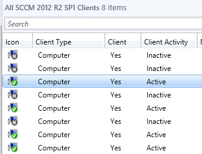
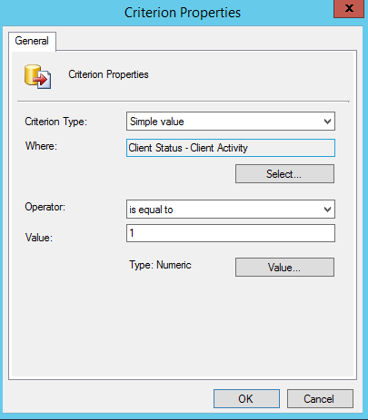

### Quickpost: SCCM 1602 Query - All Online Machines

With the Advent of client activity indicators in SCCM 1606:

We can now see which machines are online at a given time.  I love these green checkboxes.

I thought it would be cool to try to make a collection of only currently online machines.  So, into the query editor we go!  We'll add a new query rule, and then use the wizard to add a new value.  This is all that you need to grab only the currently online systems.

This collection works VERY well for Incremental Updates.  However, Scheduled Updates don't make much sense

And the end result:

