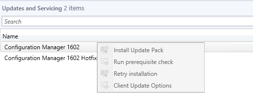
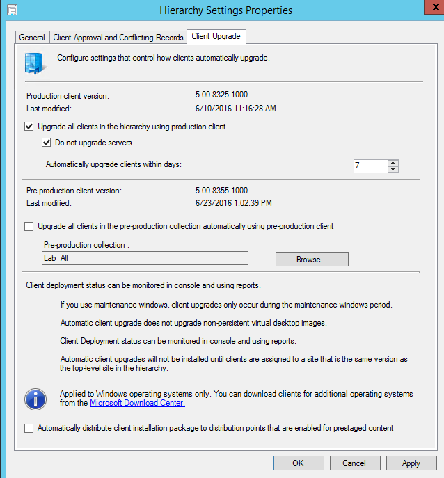
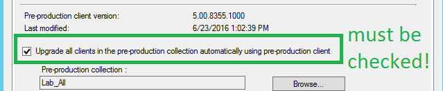
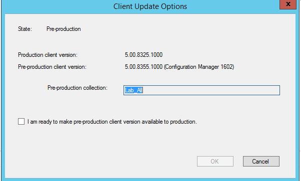
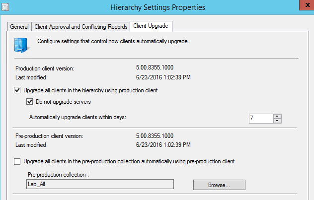

This was a bit tricky!  We completed an SCCM upgrade for one customer from SCCM 1511 to 1602, and made use of the nice pre-production client validation feature.

This allows you to specify a collection of test systems to receive the new SCCM client, for you to validate in your environment.

After a few days of validation, we were ready to pull the trigger and upgrade everyone. This is done under **Administration \\ Cloud Services \\ Updates and Servicing \\ Client Update Options**.  However, when we tried to do this, it was grayed out!

**Root Cause**

Before trying to upgrade the client, I thought we should un-check the pre-production Collection box in Hierarchy Settings.  This is done in **Administration \\ Sites\\ Hierarchy Settings**.

Don't do this!  If you uncheck this box, the SCCM ui will detect it, and gray out the SCCM won't display the UX we need to promote the SCCM client to production.

**Fix**

Make sure that you check the Pre-production client box.  If this isn't checked, SCCM doesn't know to show you the UI for upgrading the client across production!

Once this is done, you can go to Updates and Servicing, and click Client Update Options.

Complete this UI and SCCM will automatically uncheck the pre-production client for you as well.  Thanks SCCM!

