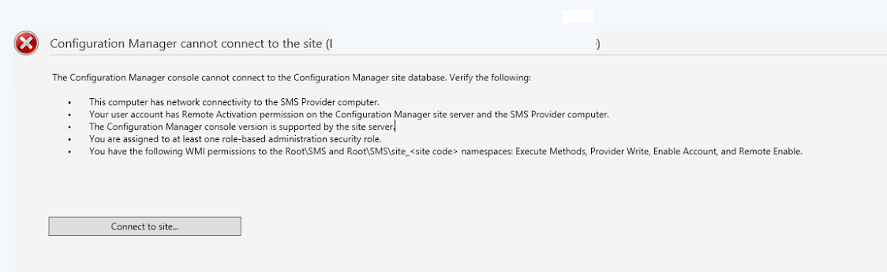
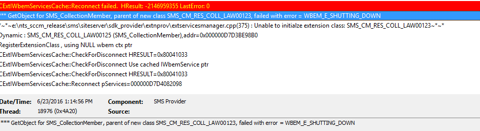
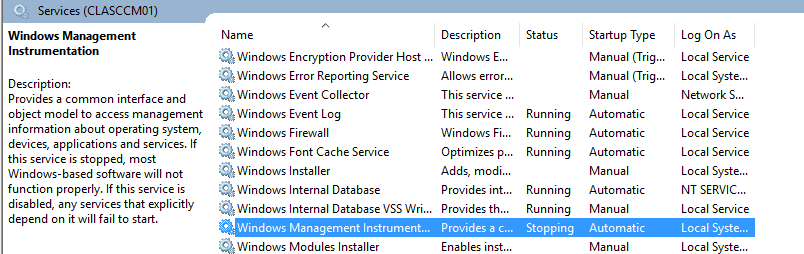
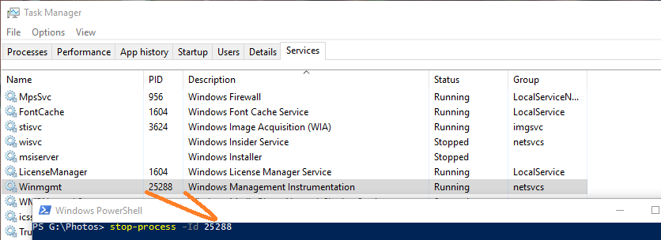

This week, we had a scary ConfigMgr 1602 upgrade.

Of course, as a consultant you have to be cool like a fighter pilot in the face of adversity, as crying is frowned upon by customers when they see your hourly rate.  So when everything falls over, and there are spiders coming out of the air conditioner, you say 'hmm, that's strange' and then whip out your laptop to begin opening log files like a fiend.

#### It was a day like any other

Before the upgrade, I ran through a practice run on my test lab domain, to try to prepare myself. We then used Kubisys to mirror our production SCCM and ran /TestDbUpgrade. All good.

However during the install we saw the install hang for a long time trying to stop sccm services.

_Note :We saw this before with [this same instance of SCCM when we upgraded to 1511](http://wp.me/p3Q7Nu-Ym); the install froze for an hour trying to stop the services. At that time, we manually stopped the SMS exec service and component Manger and the install proceeded_.

So when the install froze again, we gave it ten minutes before manually stopping the SMS exec service. Install proceeded like normally and all looked fine in the logs until we tried to open the console.

 Configuration Manager cannot connect to the site

When I see errors like this, I immediately think SMS Provider.

> **What's the SMS Provider?** Good question!  While we tend to think SQL when we think SCCM, in reality ConfigMgr really stores a lot of information in the WMI repository on the Primary sites and the CAS.  Additionally, WMI plays a role in how data is stored in the SQL Database for ConfigMgr as well.
> 
> The SMS Provider is critical for allowing this interaction between the SCCM Console, WMI and SQL.  If you don't have any working SMS Providers you can't use the ConfigMgr console!

So we knew the SMS provider (which does a bunch of WMI stuff) likely couldn't be reached, so I opened up the primary sites SMSProvider log \\primary\\SMS\_SiteCode\\logs\\SMSProv.log and check out this nasty looking message!
 
 Relevant piece: Failed with error "WBEM\_E\_SHUTTING\_DOWN"

Huh, that don't look good.  Even though my install of SCCM Completed, WMI was shutting down, so far as the SMS Provider was concerned?  Huh....

I wanted to see how WMI was doing, so I tired running a few WMI queries with PowerShell, and all errored out.  So I checked out Services.msc and sure enough, the WMI Service was in the 'stopping' state.

I tried my normal tricks, like looking up the process for this service in task manager, then killing the process.

 the ultimate trick up my sleeve, manually killing processes for services

But even this failed, giving me an error of 'process not in valid state', which was really weird.

We tried to reboot the machine as a final effort, but it hung forever at shutting down, probably because of the issue with WMI.  With WMI stuck in this state of 'Stopping', SCCM could never commit its final write operations, so the services wouldn't stop ever.

We had to go big...rebooting the VM via vSphere.

#### Seriously that's all you did, reboot it?

Yeah, kind of an unsatisfying ending, I'll admit, but everything was operating swimmingly after the reboot!
