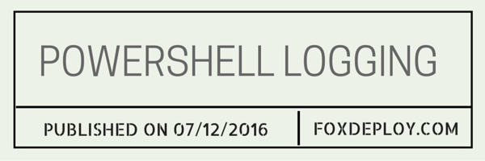
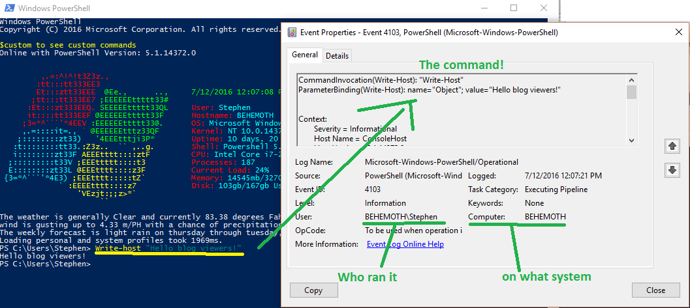
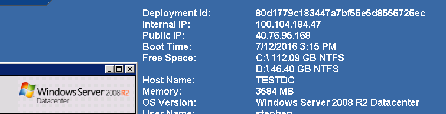
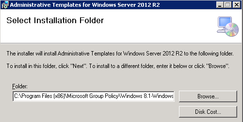
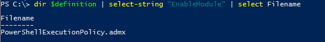
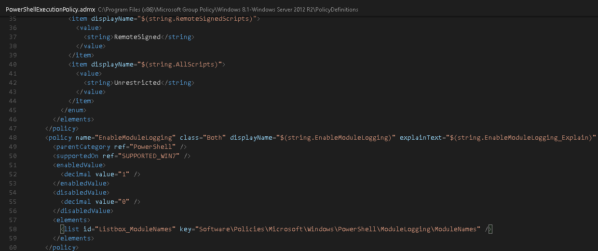
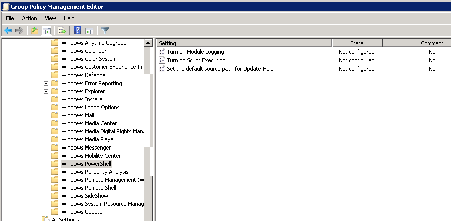
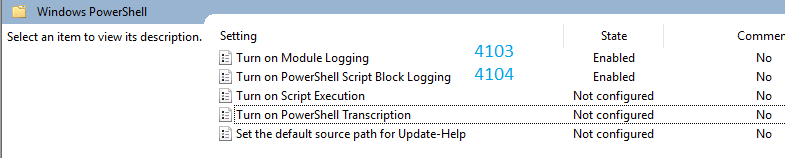

For one of my customers, we tried to enable PowerShell Module logging for 'Over the shoulder' event logging of all PowerShell commands.  We were doing this and enabling WinRM with HTTPs to help secure the company as we looked to extend the capabilities of PowerShell Remoting throughout the environment.  However, when we tried to enable the Group Policy Setting, it was missing in the GPMC!

In this post, we'll walk through why you might want to do this, and what to do if you don't see the settings for PowerShell Module Logging.

#### What is PowerShell Module logging?

PowerShell module logging allows you to specify which modules you'd like to log via a Group Policy or regkey, as [seen in this wonderful write-up (PowerShell <3's the blue team).](https://blogs.msdn.microsoft.com/powershell/2015/06/09/powershell-the-blue-team/)

It allows us to get an 'over-the-shoulder' view, complete with variable expansion for every command a user runs in PowerShell.  It's really awesome.  You can check the Event Log on a machine and see the results and all attempted PowerShell commands run by users.  If you then use SCOM or Splunk, you can snort these up and aggregate results from the whole environment and really track who is trying to do what across your environment.



We loved it and wanted to turn it on, but when we opened the GPMC..

We were missing the options!

### Enabling options for PowerShell Module and Event Logging

This is because the machine I was running this from was a Server 2008 machine, and these features were delivered with Group Policy in Server 2012 / Windows 8.1.  

The fix is simply to [download the Windows 8.1 & Server 2012 ADMX files](https://www.microsoft.com/en-us/download/details.aspx?id=36991).

#### Install the missing ADMX templates

> **Note:** These only need to be installed on one machine in the environment, the one from which you are writing Group Policy.

When you run the installer, copy the file path when you install the files.  The installer does not import them for you, but simply dumps them to a folder on this system.



#### Find the appropriate ADMX file

Next, we can look into the .ADMX files on disk to see which one contains our settings. Since I knew the setting was called 'Enable Module Logging' or something like that, I just used PowerShell's `Select-String` cmdlet to search all the files for the one that contained the right setting.  We're able to do this because ADMX files are simply paths to Registry Keys and some XML to describe to the end user what these keys control.

**Gross Oversimplification Warning**: Really that's all that Group Policy is in the first place: a front-end that allows us to specify settings which are just Regkeys, which get locked down so the end user can't change them.

```powershell
 PS C:\ $definition = 'C:\Program Files (x86)\Microsoft Group Policy\Windows 8.1-Windows Server 2012 R2\PolicyDefinitions' PS C:\ dir $definition | select-string 'EnableModule' | select Filename 
```



This tells us the file we need is 'PowerShellExecutionPolicy.admx'. I then opened it in Visual Studio Code to see if it was the right file. 

This was the file!

> **Warning:** Make sure you find the matching ADML file, which is in the appropriate nested folder.  For instance, if you speak english, you'll need the \\PolicyDefinitions\\**en-us\\**PowerShellExecutionPolicy.adml file too.
> 
> Failure to copy the ADML will result in strangeness in the GPMC, and the policies might not appear.

#### Copying the files

We now just need to copy the ADMX and the matching ADML file, which will be found in the appropriate language folder.

Copy these to '%systemroot%\\PolicyDefinitions', and be sure to move the .ADML file into the 'en-us' folder.  You should overwrite the original files.  If you can't, delete the originals and then copy the new ones in.


#### Reload the GPMC

The final step is to completely close the Group Policy Management Editor and Management Console.  Then reload it and browse back down to `Computer \ Admin Template\Windows Components\Windows PowerShell`.  While these settings also exist under User Settings, those are a relic of PowerShell development and are ignored.



#### Event correlation

I've been asked this question before.  If you're wondering which GPO causes which event, see this chart.



If you'd also like to enable PowerShell Script Block Logging and don't see the option in the GPMC, you'll need the Server 2016 Admin Templates.  [Here's the download link for those.](https://www.microsoft.com/en-us/download/confirmation.aspx?id=51957)  Follow the same steps to install them.

#### References

Thanks to this article here for the refresher on importing [2012 Admin Templates onto a 2008 machine](http://mutterances.com/adding-admx-gpo-templates-for-win-2008-group-policy-and-beyond/).
