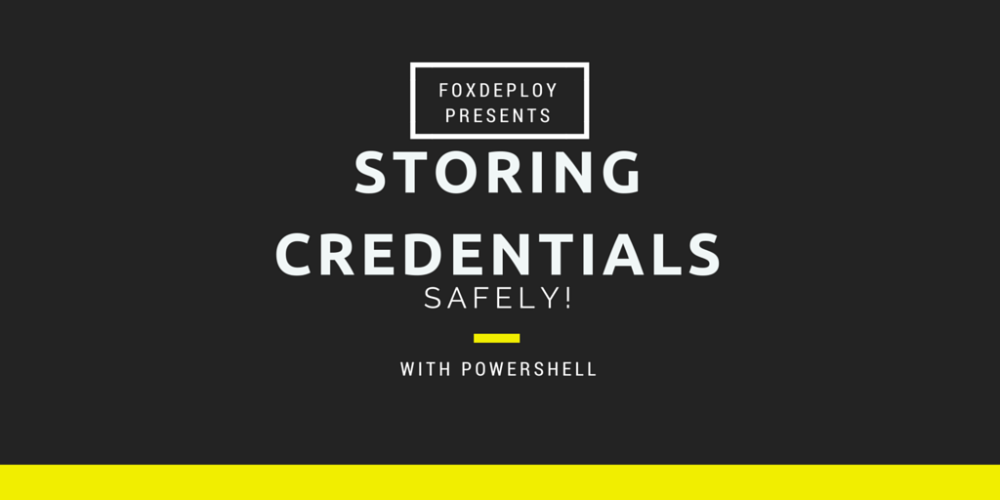

Hey guys,

This post is mostly going to be me [sharing an answer I wrote on StackOverflow](http://stackoverflow.com/questions/38360998/saving-a-powershell-object-across-sessions/38361274#38361274), about a technique I use in my PowerShell modules on Github to safely store credentials, and things like REST Credentials.  This is something I've had on my blogging 'To-Do' list in OneNote for a while now, so it feels nice to get it written out.

I hope you like it, feel free to comment if you think I'm wrong!

### The Original Question


### My Take on Safely Storing objects on a machine with PowerShell

Since I've written a number of PowerShell Modules which interact with REST APIs on the web, I've had to tackle this problem before. The technique I liked to use involves storing the object within the user's local credential store, as seen in my [PSReddit PowerShell Module](https://github.com/1RedOne/PSReddit).

First, to export your password in an encrypted state. We need to do this using both the ConvertTo and ConvertFrom cmdlets.

**Why both cmdlets?**

`ConvertTo-SecureString` makes our plaintext into an Encrypted Object, but we can't export that. We then use `ConvertFrom-SecureString` to turn the encrypted object back into encrypted text, which we can export.

I'm going to start with my very secure password of ham.

```
$password = "ham"
$password | ConvertTo-SecureString -AsPlainText -Force | 
  ConvertFrom-SecureString | Export-CliXML $Mypath\Export.ps1xml
```

At this point, I've got a file on disk which is encrypted. If someone logs on to the machine they can't decrypt it, only I can. If someone copies it off of the machine, they still can't decrypt it. Only me, only here.

**How do we decrypt the text?**

Now, assuming we want to get the same plain text back out to use late, we can add this to our PowerShell Profile, you can import your password like so.

```
$pass = Import-CliXML $Mypath\Export.ps1xml | ConvertTo-SecureString
Get-DecryptedValue -inputObj $pass -name password

$password 
>"ham"
```

This will create a variable called `$password` containing your password. The decryption depends on this function, so be sure it's in your profile: `Get-DecryptedValue`.


```powershell
Function Get-DecryptedValue{ param($inputObj,$name) $Ptr = [System.Runtime.InteropServices.Marshal]::SecureStringToCoTaskMemUnicode($inputObj) $result = [System.Runtime.InteropServices.Marshal]::PtrToStringUni($Ptr) [System.Runtime.InteropServices.Marshal]::ZeroFreeCoTaskMemUnicode($Ptr) New-Variable -Scope Global -Name $name -Value $result -PassThru -Force }
```

And that's it! If anyone knows who originally wrote the Get-DecryptedValue cmdlet, let me know in the comments and I'll give them full credit!`
