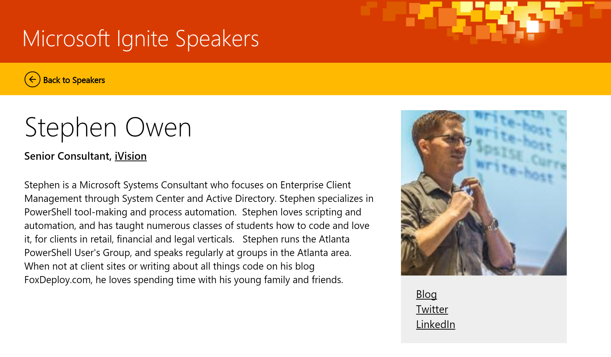

I am deeply humbled (and a bit scared) to be invited to deliver a session at Microsoft Ignite this year!

I'll be delivering the HubTalk for the topic of 'Intro to PowerShell' this year! By far my biggest audience yet, I'm super excited!

If you are coming to Ignite, [please sign up for my session, link is here](https://myignite.microsoft.com/sessions/20651)!

I'll be working on my slides for the next six weeks, so some of my posts might be a bit delayed.

As of currently...there are a few folks signed up for it already.

If you are coming to Ignite, please come heckle me and win swag. If possible, immediately sidetrack the discussion into the weeds on some minor issue while I grossly over simplify everything. :p

Wish me luck!