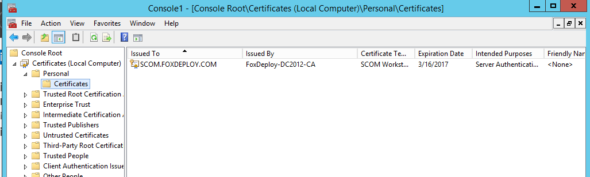
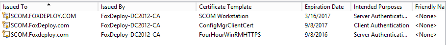
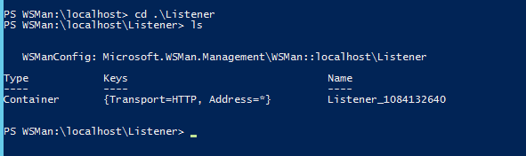
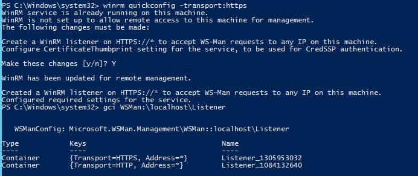
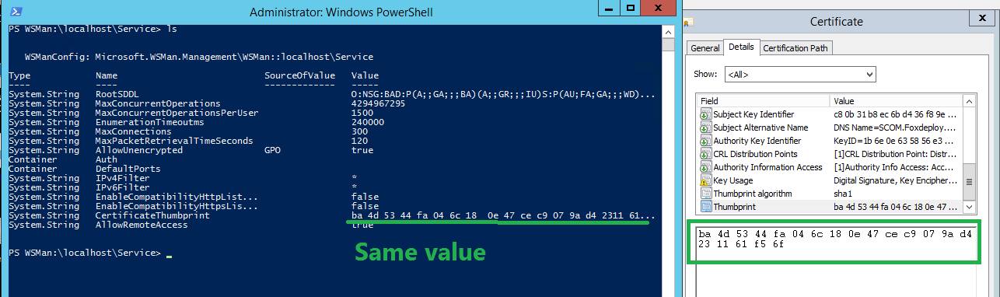
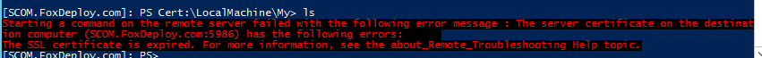
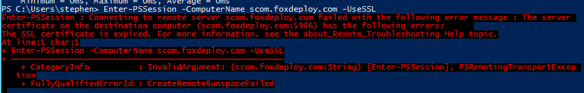

### Follow-up!

See the follow-up post 👻[The Case of the Spooky Certificate👻](http://foxdeploy.com/2016/09/16/winrm-https-and-the-case-of-ghost-certificate/) for what happens during a renewal!

* * *

For one of my largest customers, a burning question has been keeping us all awake at night:

> Where does the soul go when an SSL Certificate expires?

Er, I may be getting too caught up in this ghost hunting theme (I blame the Halloween decorations which have been appearing in stores since the second week of July!  Spooky!). Let me try again.

> If we enable WinRM with HTTPS, what happens when the certificate expires?

Common knowledge states that WinRM will stop working when a certificate dies, but I wanted to prove beyond all doubt, so I decided to conduct a little experiment.

### What's a WinRM listener?

Before you can run commands on remote systems, including anything like PSexec and especially remote PowerShell sessions, you have to run the following command.

WinRM quickconfig (-transport:https)

This command starts the WinRM Service, sets it to autostart, creates a listener to accept requests on any IP address, and enables firewall exceptions for all of the common remote managment ports and protocols WinRM, WMI RPC, etc. [For more info...](https://blogs.technet.microsoft.com/askperf/2010/09/24/an-introduction-to-winrm-basics/)

The last bit of that command, `transport:https` determines whether to allow traffic over regular WinRM ports, or to require SSL for extra security. By default, in a domain we have at a minimum Kerberos encryption for remoting--while non-domain computers will use 'Negotiate' level of security--but sometimes we need to ensure a minimum level of tried and true encryption, which https and ssl provides.

### How WinRM uses certificates

For a complete guide to deploying certificates needed for WinRM Remoting with SSL, stop reading and [immediately proceed to Carlos' excellent guide on his blog, Dark Operator.](http://www.darkoperator.com/blog/2015/3/24/bdvjiiw1ybzfdjulc5pprgpkm8os0b)

In our usage case, security requires we use HTTPs for WinRM Communications, so we were pretty curious to see what WinRM does to implement certs.

When you run `winrm quickconfig -trasnport:https` , your PC checks to see that you've got a valid cert, which issued by a source your computer trusts, which references the common name of your computer and is valid for Server Authentication.  Should all of these be true, a new listener will be created, which references in hard-code the thumbprint of the cert used.

When a new session connects, the listener looks at the thumbprint and pulls the cert related from the cert store and uses this to authenticate the connection.  This will work fine and dandy..but when a certificate expires...is WinRM smart enough to realized this and update the configuration of the listener?

### Testing it out: making a four-hour cert

To put this to the test, we needed to take a PC from no WinRM HTTPS listener, give it a valid cert, and then watch and see what happens when it expires.

I already had valid PKI in my test environment, thanks to Carlos' excellent guide I referenced earlier.  All I needed to do was take my current cert template, duplicate it, and set the expiry period down to a small enough duration.

First, I connected to my CA, opened up Certification Authority and choose to Manage my Certificates.

Next, I right-clicked my previous WinRMHttps template and duplicated it.  I gave it a new name and brought the validity period down to 4 hours, with renewal open at 3 hours.

Satisfied with my changed, I then exited Cert Management, and back in Certification Authority, I chose '**New Template to Issue**'

I browsed through the list of valid cert templates and found the one I needed, and Next-Next-Finished my way through the wizard.

Finally,I took a look at my candidate machine (named SCOM.FoxDeploy.com), and ran GPUpdate until the new cert appeared.

 F5-F5-F5-F5-F5-F5-F5-F5-F5-F5-F5-F5-F5-F5-F5-F5-F5

 Armed with a new Four Hour Cert I was ready to rock

### World's shortest WinRM Listener

I took a quick peek to see if there was a Listener already created for HTTPs, and there wasn't.

So I ran `winrm quickconfig -transport:https` and then checked again.

To validate which certificate is being used, you can compare the output of `dir wsman:\localhost\Services'` to what you see under `MMC->Certificates->Local Computer->Personal`, as seen below.

And for the magic, if both computers trust the same CA, all you have to do is run the following to have a fully encrypted SSL tunnel between the two PCs.

`Enter-PSSession -ComputerName RemotePC.FQDN.COM -UseSSL`

Now, I had merely to play the waiting game...only three hours to go!

#### The Waiting Game Sucks

I walked away from the PC at this point and came back after dinner, diapers and begging my children to sleep.

I left the PSSesson open, and was surprised to see the following message appear when I tried to run a command

 Starting a command on the remote server failed with the following error message: The Server Certificate on the destination computer has the following errors: The SSL Certificate is expired.

Here's the full text of that error message.

Starting a command on the remote server failed with the following error message: The Server Certificate on the destination computer has the following errors:  The SSL Certificate is expired.

Once the cert expires, you can't run ANY commands on the remote computer, until you reconnect without SSL.  Interestingly, you can't even run `Exit-Psession` to return to your PC if this happens.  I had to kill PowerShell.exe and relaunch it to continue.

All attempts at future reconnections also fail with the same error.

In short summary:

> When the cert expires, WinRM doesn't realize it and keeps presenting the old cert.
> 
> In other words :yo winRm gone be broke

### But what about auto renewal?

One question that came up over and over is whether auto renewal would step around this problem.

**It won't. It  SHOULDN'T** When a new cert is requested, you'll always end up with a new cert, with new validity periods and other data will change as well.  All of this means there will be a different hash, and thus a different thumbprint.

This means that the previous listener, which to our understanding is never updated _should not continue to function_.  However, some people have reported that it does, and thus I'm digging in even deeper with a more advanced test.

### Our take-aways

Today, WinRM's implementation of SSL presents problems, and in some way is incomplete.  Microsoft is aware of the issue, and it is being tracked publicly both in GitHub and UserVoice.

Show your support if you're affected by this issue by voting for the topics:

- [UserVoice](https://windowsserver.uservoice.com/forums/301869-powershell/suggestions/10990128-server-2012r2-winrm-https-listener-autocertificate) 
- GitHub

We're working on a scripted method to repair and replace bad certificates, which is mostly complete and available here.  [GitHub - Certificate Management.ps1.](https://github.com/1RedOne/WinRM_CertMgmt)

When this problem is resolved, I will update this post.

Edit: I'm performing additional research around cert autorenewal and will update you all with my findings!
