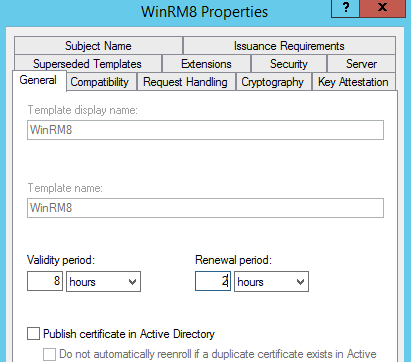
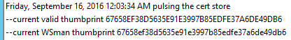
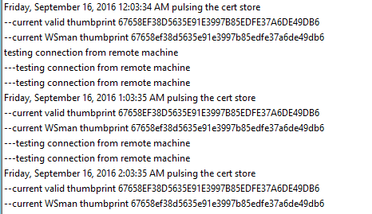
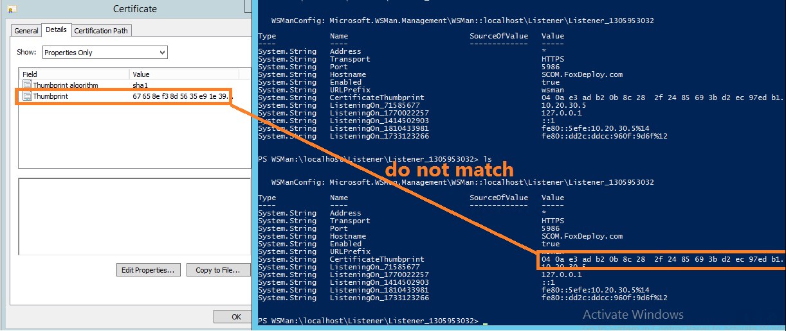

[](/series/LearningWinRM)

**This post is part of the Learning WinRM Series, here on FoxDeploy. Click the banner to return to the series jump page!**

* * *


This post is a follow-up to my previous post, [WinRM : What Happens when certificates die?](http://foxdeploy.com/2016/09/13/winrm-and-https-what-happens-when-certs-die/)

In the previous post, we found that in a WinRM & HTTPs deployment, if a certificate is allowed to expire WinRM will not notice a new certificate for the purposes of allowing connections using `Enter-PsSession -UseSSL`.

However, in the comments of that post, [Sandeep of Hakabo.com](http://www.hakabo.com/web/2016/04/powershell-remoting-over-https/) mentioned that he'd actually observed WinRM continuing to work after a cert renewal takes place, even though Microsoft best practice / recommendations state that the end-user needs to script around updating the listener.  Check out his post on [PowerShell Remoting over SSL](http://www.hakabo.com/web/2016/04/powershell-remoting-over-https/) for more on his findings.

Clearly, a test was in order.

### Setting the stage

First, we needed a good way to test cert renewal.  According [to this article from Microsoft](https://blogs.technet.microsoft.com/xdot509/2012/10/18/troubleshooting-autoenrollment/), the average Windows workstation will attempt to look for new certs and renew eligible certs once every eight hours.

To accurately test for what happens when a cert renews, I needed to worry about either lining up a cert renewal to the automatic period, or find a way to trigger a renewal manually.

I found that you can use the `certutil -pulse` command to manually trigger a renewal attempt, which uses the same mechanism which the Windows Certificate Services Agent uses.

For this test, I modified my previous template and now set an eight hour lifespan, with a two hour renewal period.



To handle cert renewal and make sure one happened successfully, I wrote this PowerShell one-liner to sit and wait and then try to pulse for certs once an hour.

```powershell while ($true){ "$(get-date | select -expand DateTime) pulsing the cert store"| tee -append C:\\temp\\Winrm.log start-sleep (60\*60) }
```

Now, I wanted a good way to capture certificate changes, so first I set about capturing the thumbprint of the currently valid cert, since this would be changing while my test ran.  Since I only had one cert, I simply grabbed the ThumbPrint value from the only cert issued to this machine.  I embedded this also within my log file output.

```powershell "--current valid thumbprint $(get-childitem Cert:\\LocalMachine\\My | select -ExpandProperty ThumbPrint)"| tee -append C:\\temp\\Winrm.log 
```

And finally, I also needed to see which cert thumbprint WinRM was presenting, or thought it was presenting.  These kinds of settings are stored within the `wsman:` PSDrive, under listener the HTTPS listener.  I parsed out this value (your listener name **will** be different, so remember to change this if you use this code).

\[code lang="powershell" quiet="true"\]</pre> <pre>get-item WSMan:\\localhost\\Listener\\Listener\_1305953032\\CertificateThumbprint |</pre> <pre> select -expand Value
```

Combing all of these diagnostics, I got this as the result, which echoes out to a file like this.

```powershell
while ($true){ "$(get-date | select -expand DateTime) pulsing the cert store"| tee -append C:\\temp\\Winrm.log ; "--current valid thumbprint $(get-childitem Cert:\\LocalMachine\\My | ? Notafter -ne '9/8/2017 4:48:40 PM' | select -ExpandProperty ThumbPrint)"| tee -append C:\\temp\\Winrm.log ; "--current WSman thumbprint $((get-item WSMan:\\localhost\\Listener\\Listener\_1305953032\\CertificateThumbprint | select -expand Value) -replace ' ')" | tee -append C:\\temp\\Winrm.log ; "---pausing for one hour" start-sleep (60\*60) }
```



Finally, I launched a PsSession from a remote PC, and had that session also echoing out to a log file twice an hour.

```powershell
while ($true){"currently connected at $(get-date | select -expand DateTime)">>c:\\temp\\winrm.log; start-sleep (60\*60)}
```

So the log file looks like this when both channels are dumping into the same file.



### What happened?

When I came back the next morning, my whole desk was covered in ectoplasm!!  Eww!  No, not really.  But I will still stunned!

**The PSSessions were still open**.  Even though the certificate renewed overnight!  I could validate this by checking the output in the log files.

This is kind of a complex graphic.  At the top, you'll see a snippet from my Certificate Authority, showing that a new cert was issued at 6:56 PM.

On the left, you see the log file from that time, echoing out to the screen with no interruption.  Then, on the right, you'll see the actual output from the console which was connected...no disruption.


So, that was all pretty interesting and conclusive proof that WinRM somehow is able to handle a cert renewing, and also not drop any current connections.

### This is where things get weird

> the clinging mist issuing forth from the derelict disk drive wrapped around the intrepid nerd's fingertips, threatening to chill his hands and adversely impact his APM, causing a huge drop in his DKP for this raid
> 
> \-Unknown author, from the Nerdinomicon

The reports we saw from Sandeep and one other person said that WinRM would either still list the old cert in the UI, or even still USE the old cert.  Previous tests showed that if an invalid cert is presented, WinRM will not work.  So now we took a look at the log file output.


This was puzzling!  I can see that a new cert was issued based on the changed thumbprint, but if my log could be tested, it looked like WinRM was still referencing the old cert!

Now I opened the cert itself in the MMC and compared it to the results within the WSMan settings.



So, the cert renewed and the PSSession remained open, but WSMan still stubbornly reported that it was using the previous thumbprint!

### But did you reboot it / restart WinRm/ etc?

Yes.  I tried everything, and no matter what, WinRM continued to reference the old certificate thumbprint.  However, WinRM SSL connections still worked, so clearly some mechanism was correctly finding the new Cert and using that!  The only way to get WinRM to reflect the new cert was to delete the old listener and recreate it, using `winrm qc -transport:https` all over again.

#### How is it even working?

I'm not sure, guys, but I did open an issue with Microsoft on the matter, here on Github.

[WinRM Certificate Implementation is REALLY weird](https://github.com/PowerShell/PowerShell/issues/2282)

Tests have been conducted from Server 2012 R2 machines running WMF 5.0 to other machines of the same configuration.  I'm conducting tests now with 2008 R2 machines ot see if we find the same behaviour.

Until next time...


