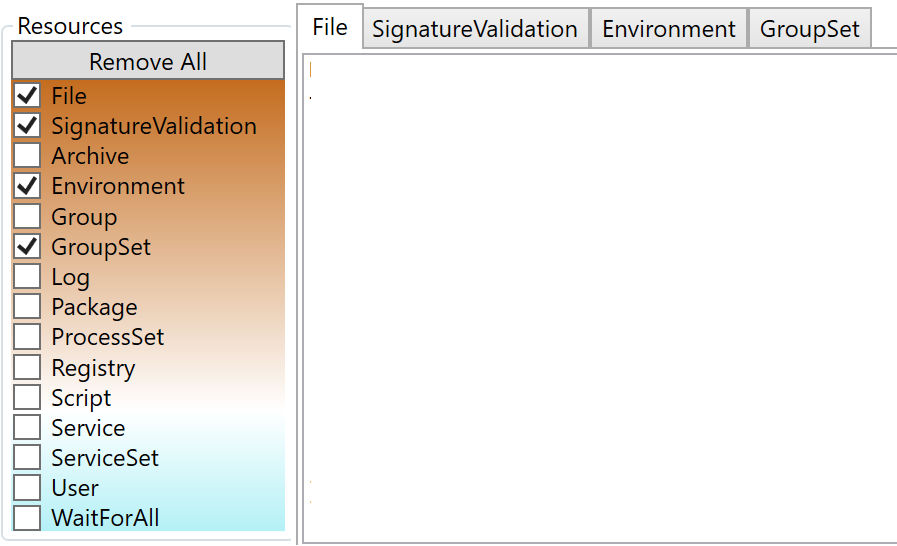
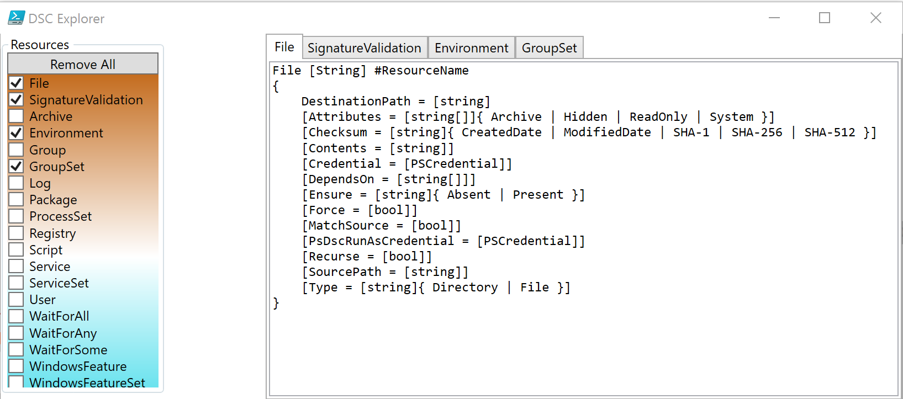
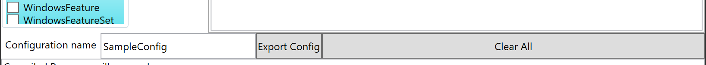
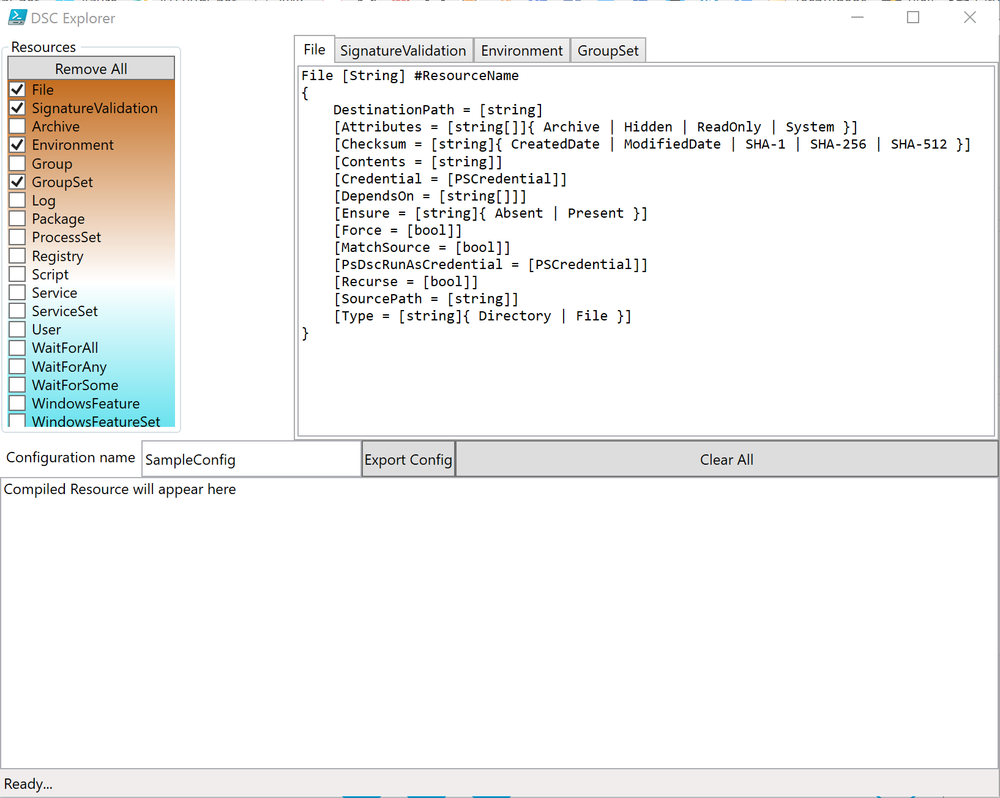
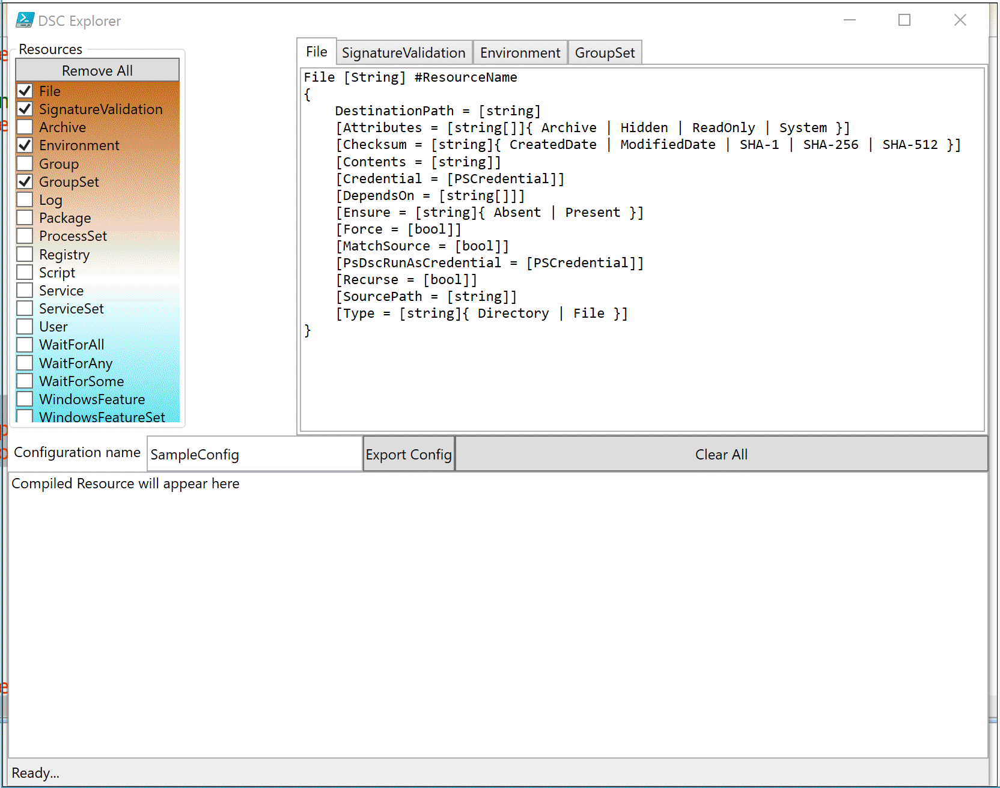
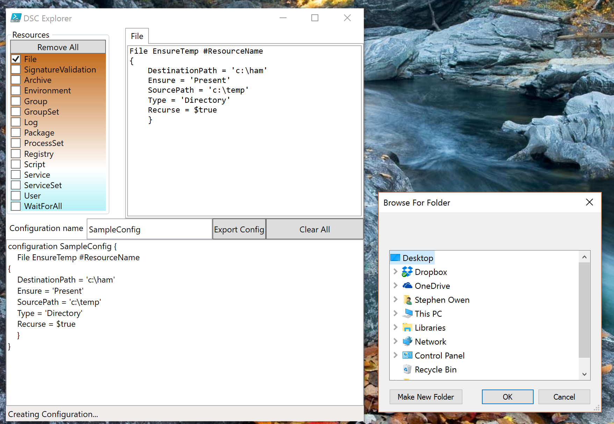
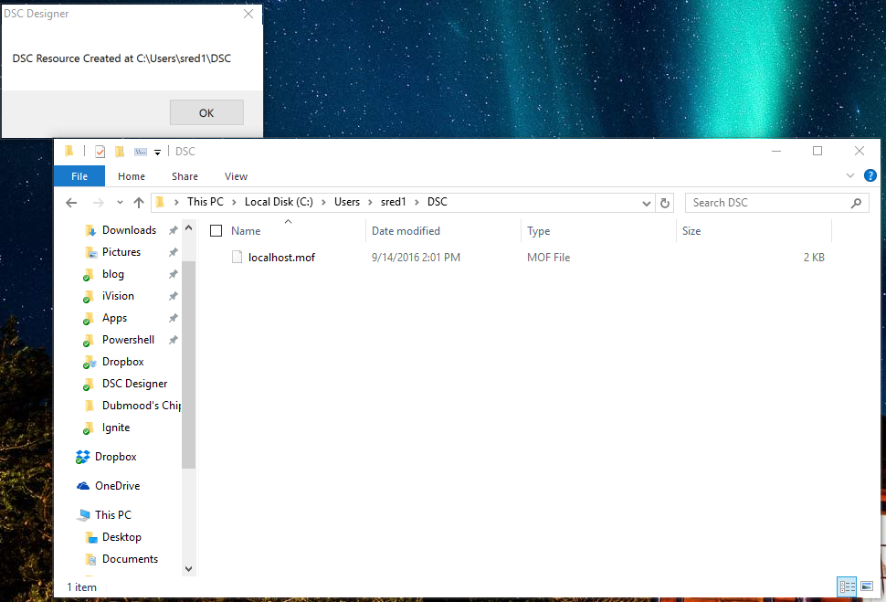

[Learning DSC](../series/LearningDSC)
**This post is part of the Learning GUI Toolmaking Series, here on FoxDeploy. Click the banner to return to the series jump page!**

* * *

### Where we left off

Thanks for joining us again!  Previously in this series, we learned all about writing fully-fledged applications, in [Posts 1](http://foxdeploy.com/2015/04/10/part-i-creating-powershell-guis-in-minutes-using-visual-studio-a-new-hope/), [2](http://foxdeploy.com/2015/04/16/part-ii-deploying-powershell-guis-in-minutes-using-visual-studio/) [and 3](http://foxdeploy.com/2015/05/14/part-iii-using-advanced-gui-elements-in-powershell/). Then, we learned some techniques to keeping our apps responsive in [Post 4](http://foxdeploy.com/2015/09/08/powershell-guis-how-to-handle-events-and-create-a-tabbed-interface/).

In this post, I'll walk you through my GUI design process, and share how that actually worked as I sought to create my newest tool.

Along the way, I'll call out a few really confusing bugs that I worked through in creating this tool, and explain what went wrong. In particular, I ran into quite a snag when trying to programmatically create event handlers in code when trying to use `$psitem`  or `$_`. This lead to many conversations which introduced me to a powerful solution: the `$this` variable.

#### What is the tool?

Introducing the [FoxDeploy DSC Designer](http://foxdeploy.com/2016/09/20/part-v-introducing-the-foxdeploy-dsc-designer/).

 Think something sort of like the Group Policy Management Console, for your DSC Configurations. But we'll get back to this in a few minutes.

### My GUI Design Process

Here's my general process for designing a front-end:

- Create the elevator pitch (Why does this need to exist?)
- Draw out a rough design
- Make it work in code
- Add feature by feature to the front end
- Release
- Iterate

It all started with me taking a trip to Microsoft last year for the MVP Summit.  I'd been kicking around my elevator pitch idea for a while now, and was waiting to spring it on an unwary Microsoft Employee, hoping to con them into making it for me:

#### Here's my elevator pitch

> To drive adoption of DSC, we need some tooling. First, we need a GUI which lists all the DSC resources on a machine and provides a Group Policy Management Console like experience for making DSC configs.
> 
> We want to make DSC easier to work with, so its not all native text.

I decided to spring this on Hemanth Manawar of the PowerShell team, since I had him captive in a room.  He listened, looked at my sketches, and then said basically this:

### 'You're right, someone should make this...why not you?'

Thanks guys.  _thanks_

So I got started doing it on my own.  With step one of the design process --elevator pitch-- out of the way, I moved on to the next phase.

#### Time to draw a Rough Draft of the UX

This is the actual sketch I drew on my Surface to show Hemant while in Redmond for the 2015 MVP Summit. It felt so right, drawing on my Windows 10 tablet in OneNote, with guys from Microsoft…it was just a cool moment of Kool-Aid Drinking.  In that moment, my very blood was blue, if not my badge.

](../assets/images/2016/09/images/roughdraft.png) 'oh, now I know why you didn't pursue a career in art'

What will be immediately apparent is that I lack both handwriting and drawing skills…but this is at least a start. Here's the second design document, where I tried to explain how the user will actually use it.


Stepping through the design, a list of all DSC resources on the left.  Clicking a Resource name adds a new tab to the 'config design' section of the app, in which a user would have radio buttons for Present/Absent, Comboboxes for multiple choice, and textboxes for text input.  On the bottom, the current 'sum' of all tabs would be displayed, a working DSC configuration.

Finally, an Export button to generate a .mof or Apply to apply the DSC resource locally.  We marked the Apply button as a v 2.0 feature, wanting to get some working code out the door for community feedback.

With the elevator pitch and rough draft drawing completed, it was now time to actually begin coding.

### Making it work in code

The code part of this is simple. Running `Get-DSCResource` returns a list of all the resources. If I grabbed just the name property, I'd have a list of the names of all resources. If I made one checkbox for each, I'd be set.


Now, to pipe this output over to `Get-DSCResource -Syntax`, which gives me the fields for each setting available in the Resource.


I started with a brand new WPF application in Visual Studio,  there were a lot of different panel options to choose with WPF, here's a [super helpful site explaining them](http://www.wpftutorial.net/ListView.html). I used a combination of them.

### Living on the Grid

I started with a grid layout because I knew I wanted my app to be able to scale as the user resized it, and I knew I needed two columns, one for my DSC Resource Names, and the other for the big Tab control.

You do this by adding in a Grid definition for either rows, columns or both. Then when you add containers inside of the grid, simply specify which Grid area you want them to appear within.

```xml
<code>
<Grid.ColumnDefinitions> 
<ColumnDefinition Width="1\*" /> <ColumnDefinition Width="2\*" /> </Grid.ColumnDefinitions>
```

 

Since I want my DSC Resources to appear on the left side, I'll add a GroupBox with the header of 'Resources' and a button on the left side. In the GroupBox, I simply add `Grid.Column="0"` to bind this container to the that Column.

\[code language="xml" light="true"\] <GroupBox x:Name="groupBox" Header="Resources" HorizontalAlignment="Left" VerticalAlignment="Top"  Margin="0,0,0,5"> <DockPanel x:Name="Resources" HorizontalAlignment="Left" Margin="0,0,0,0" VerticalAlignment="Top" Grid.Column="0"> <Button Content="Remove All" Width="137" /> </DockPanel> </GroupBox>
```

And the code to lock my Tab to the right column

\[code language="xml" light="true"\] <TabControl x:Name="tabControl" Grid.Column="1" > <TabItem Header="TabItem"> <Grid Background="#FFE5E5E5"/> </TabItem>
```

All of this footwork result in this UI.


Next, I needed a way to create new checkboxes when my UI loads. I wanted it to run `Get-DSCResource` and grab the name of all the resources on my machine. I came up with this structure

```powershell


$resources = Get-DscResource

ForEach ($resource in $resources){ $newCheckBox = New-Object System.Windows.Controls.CheckBox $newCheckBox.Name = $resource.Name $newCheckBox.Content = $resource.Name $newCheckBox.Background = "White" $newCheckBox.Width = '137' $newCheckBox.Add\_click({ $TabName = $resource.Name $tab = New-Object System.Windows.Controls.TabItem $tab.Name = "$($TabName)Tab" $tab.Header = $TabName $WPFtabControl.AddChild($tab) }) \[void\]$WPFResources.Children.Add($newCheckBox)

}


```

This seemed to work just fine, and gave me this nice looking UI.


However, when I clicked the checkbox on the side, instead of getting tabs for each resource, I instead...well, just look!


Only the very last item added to the list was getting added. That seemed like quite a clue...

### Here there be dragons

So I ran into a HELL of a snag at this point. I spent literally a week on this problem, before scripting superstar and general cool-guy Dave Wyatt came to save my ass.

Why was this happening? To quote Dave:

>  The problem is that when your handler is evaluated, $resource no longer refers to the same object that it did inside the loop. You should be able to refer to $this.Name instead of $resource.Name to fix the problem, if I remember correctly.

What's `$this`?

> $This In a script block that defines a script property or script method, the $This variable refers to the object that is being extended.

I'd never encountered this before but it was precisely the tool for the job. I simply swapped out the code like so:

`$TabName = $this.Name`

And the issue was resolved. Now when I clicked a checkbox, it drew a new tab containing the name of the resource.



### Loading the resource settings into the tab

When we run `Get-DSCResource -Syntax`, PowerShell gives us the available settings for that resource. To get this going as a POC, I decided it would be OK if the first release simply presented the information in text form to the user.

So, I added a text box to fill up the whole of the tab. First, when the box is checked, we create a new TabItem, calling it `$tab`  and then we set some properties for it.

Next, because I want to make a TextBox fill up this whole `$tab`, we make a new TextBox and define some properties for it as well, including, notably:

```powershell
 $text.Text = ((Get-DscResource $this.Name -Syntax).Split("\`n") -join "\`n") 
```

...which will grab the syntax for the command, and remove unnecessary WhiteSpace.

Finally, we set this `$text` as the Content value for the TabItem, and add the TabItem to our parent container, `$WPFTabControl`.

```powershell
 $newCheckBox.Add\_checked({ $WPFStatusText.Text = 'Loading resource...' $TabName = $this.Name $tab = New-Object System.Windows.Controls.TabItem $tab.Name = "$($TabName)Tab" $tab.Header = $TabName $text = New-Object System.Windows.Controls.TextBox $text.AcceptsReturn = $true $text.Text = ((Get-DscResource $this.Name -Syntax).Split("\`n") -join "\`n") $text.FontFamily = 'Consolas' $tab.Content = $text

$WPFtabControl.AddChild($tab) $WPFStatusText.Text = 'Ready...' })


```

Here's the resultant GUI at this point:



Now, to add the rest of our GUI.

### Adding final UI touches

Any DSC Configuration should have a name, so I wanted to add a new row to contain a label, a TextBox for the Configuration Name, a button to Export the Config, and finally a button to clear everything. I also knew I would need another row to contain my big compiled DSC configuration too, so I added another row for that.

\[code language="xml" light="true"\] <Grid.RowDefinitions> <RowDefinition Height="5\*" MinHeight="150" /> <RowDefinition Name="GridSplitterRow" Height="Auto"/> <RowDefinition Height="2\*" MaxHeight="30" MinHeight="30"/> <RowDefinition Name="GridSplitterRow2" Height="Auto"/> <RowDefinition Height ="Auto" MaxHeight="80"/> <RowDefinition Name="GridSplitterRow3" Height="Auto"/> <RowDefinition Height ="Auto" MaxHeight="30"/> </Grid.RowDefinitions>
```

I also wanted my user to be able to resize the UI using sliders, so I added some GridSplitters as well. Below you'll see the GridSplitters on either side of another dock panel, which is set to appear below the rest of the UI, based on the `Grid.Row` property.

\[code language="xml" light="true"\] <GridSplitter Grid.Row="2" Height="5"> <GridSplitter.Background> <SolidColorBrush Color="{DynamicResource {x:Static SystemColors.HighlightColorKey}}"/> </GridSplitter.Background> </GridSplitter> <DockPanel Grid.ColumnSpan="2" Grid.Row="2"> <Label Content="Configuration name"/> <TextBox Name="ConfName" Text="SampleConfig" VerticalContentAlignment="Center" Width='180'/> <Button Name="Export" Content="Export Config"/> <Button Name="Clearv2" Content="Clear All"/> </DockPanel> 
```

These elements render up like so:



Finally, to add the resultant textbox. The only thing out of the ordinary here is that I knew our DSC Configuration would be long, and didn't want the UI to resize when the configuration loaded, so I added a ScrollViewer, which is just a wrapper class to add scrollbars.

\[code language="xml" light="true"\] <DockPanel Grid.ColumnSpan="2" Grid.Row="3"> <ScrollViewer Height="239" VerticalScrollBarVisibility="Auto"> <TextBox x:Name="DSCBox" AcceptsReturn="True" TextWrapping="Wrap" Text="Compiled Resource will appear here"/> </ScrollViewer> </DockPanel>
```

We also added a status bar to the very bottom, and with these changes in place, here is our current UI.



### Compiling all tabs into one DSC Config

When a user makes changes to their DSC tabs, I want the Resultant Set of Configuration (RSOC!) to appear below in the textbox. This ended up being very simple, we only need to modify the code that creates the Textbox, and register another event listener for it, like so:

```powershell
 $text.Add\_TextChanged({ $WPFDSCBox.Text = @" configuration $($WpfconfName.Text) { $($WPFtabControl.Items.Content.Text) } "@
```

This single change means that whenever the textChanged event fires off for any textbox, the event handler will trigger and recompile the `.Text` property of all tabs. Nifty!



### Wiring up the Clear and Export Buttons

The final step is to allow the user to reset the UI to starting condition, by adding a event listener to my Clear Button.

```powershell
$WPFClearv2.Add\_Click({ $WPFResources.Children | ? Name -ne Clear | % {$\_.IsChecked = $False} $WPFDSCBox.Text= "Compiled Resource will appear here" })
```

And finally add some code to the export button, so that it makes a .mof file.  Here I used the System.windows.Forms.FolderBrowserDialog class to display a folder picker, and I access the value the user chooses, which persists once the picker is closed as `.SelectedPath`.

```powershell
 $FolderDialog = New-Object System.Windows.Forms.FolderBrowserDialog $FolderDialog.ShowDialog() | Out-Null $outDir = $FolderDialog.SelectedPath 
```

This results in this nice UI experience.



Last of all, I wanted a way to display a prompt to the user that the file was exported correctly.



## What's next?

This is what I've been able to complete so far, and it WORKS! If you'd like to, feel free to pitch in and help me out, the project is available here.


Here are my short-term design goals for the project from here on:

- Develop new UX to change from text driven to forms based UI with buttons, forms, comboboxes and radios
- Add support for multiple settings within one configuration type (currently you have to copy and paste, if you want to add multiple File configurations, for instance.
- Speed up execution by heavily leveraging runspaces (and do a better job of it too!)
