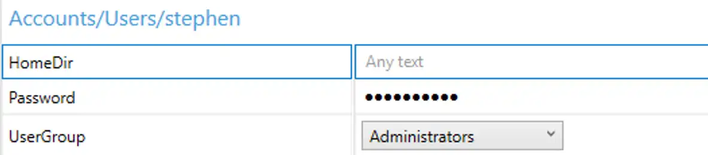

 

Let's face it, guys.  There are times that you JUST don't have access to SCCM, MDT or Kace, and need to deploy a completely automated and silent Windows install without our normal build tools.  If this is you, and you deploy systems frequently, you've probably spent way too much time looking at screens like this one

Not only does it stink to have to type a user name and password every time, it also **slows you down.** Admit it, whenever you start a Windows install, you start doing something else, and then an hour later check back and have to reload the whole task in your memory again.  It's a **giant waste of time and makes you less productive.**

To top it off, there are probably things you always do, like setup user accounts, join a machine to a domain, and set the time zones (we can't all live in the chosen timezone of Pacific Standard Time).

Previously, making these changes and baking them in to an unattended install meant using the terrible Windows SIM tool, which was horrible.  Seriously, no offense meant, but if you had a hand in designing the System Image Manager tool, I'm sure you're already ashamed.  Good, you should be.

Thankfully we now have the Windows Image Configuration Designer (Wicd) which makes this all super easy!

In this post, we'll walk you through everything you need to do to make a fully silent, unattended Windows Install, along with some useful settings too.  We will be installing WICD, which is part of the ADK, and then walk through configuring the following settings:

- 'Enable Remote Desktop out of the box'
    
- Set Default Time zone (no west coast time!)
    
- Set Default First User
    
- Silent Install (depends on setting a user account)
    
- Make the computer do a quick virus scan on first boot
    
- Optional - Domain Join
    
- Optional - Add files to the image
    
- Optional - Make Registry Changes on the Image
    

### Setting up WICD

To get access to the awesome WICD tool, you'll need to have the Windows 10 ADK.  I recommend using [version 1607, at a minimum (Download Link)](https://go.microsoft.com/fwlink/p/?LinkId=526740).  When installing the ADK make sure to check the two red boxes shown below, for full features.

If you're installing the ADK as a prerequisite for SCCM, be sure to check all four boxes shown above, at a minimum.

Next, download you'll need a copy of your Windows ISO, mount or unzip it.  We'll be looking for this file very soon, E:\\Sources\\install.wim.  Later on, we'll need to reference additional files from it too, so keep it mounted there till the very end!

Now, open WICD and click 'Windows image customization'

Click through the next few pages, specifying a project folder and then selecting 'Windows Image File'.

 

WICD supports working with Windows Flashable Image files as well, the FPU file format.  This is the only option for Win10Iot, but not relevant to what we're doing here, so select the top option (WIM File)

![wicd-5](../assets/images/2016/12/images/w

On the next page, browse to your source ISO, which we mounted earlier.  You're looking for the install.wim file, which will be found at E:\\Sources\\install.wim.

In the next page, we can import a ProvisioningPackage.ppkg if we have one available.  Import it, if you'd like, or continue on if you don't have one available.  Now we should be in this screen. Let's work through the settings, one by one.

### Enable Remote Desktop out of the box

Since I'm going to be deploying this image to my VMs, I want to natively be able to use the Enhanced Virtual Machine Connection feature available on Hyper-V Gen 2.0 VMs running a Windows 8.1 or higher.  The only dependency is that the 'Remote Desktop Service' must be enabled, so let's go ahead and enable that.

In the left side of the screen, scroll down to **Image Time Settings \\ Firewall \\ Firewall Groups**

We're going to create a new Firewall Group, titled Remote\_desktop.  Type this in as the ID up top and click Add.  This will add a new node to our configuration on the left hand side of the screen.

Clicking on the left side of the screen shows our available customizations.  

Select our group and choose '**Active = True', 'Profile = All' .**  Now for one more setting, scroll down to 'Image Time Settings \\ Terminal Services \\ Deny TS Connections'

Change this setting to false, and you're set.  Now Enhanced VM Connection will work out of the box for any VMs deployed with this image.

### Timezone

We can't all live in Pacific coast time, and I personally hate seeing the System Clock set to the wrong time.  I'll assume you all live on the 'Right Coast' like I do :p

Scroll down to **Image Time Settings \\ Shell \\ TimeZone**

You'll need to properly type your timezone name here.  I've seen it be VERY finicky, so [use this list to make sure you get the desired timezone correct](https://technet.microsoft.com/en-us/library/cc749073(v=ws.10).aspx)!  If you need to customize this based on multiple office locations, you'll be better off looking at MDT, which can very easily configure this setting dynamically.

### New User

In order to silently deploy this image, you must provide at a minimum the default user account.  Once we've done this, we can proceed to the next step of disabling the OOBE wizard.  But first things first, let's setup a user.  Scroll down to **Runtime Settings \\ Accounts | Users  > User Name**

As seen before, this will add a new node with some more configuration options.  At a minimum, you must specify a password and which group to stick this user in.

Finally, choose which group to put this user into.

With this setting completed, we can now disable the install wizard and have a completely silent, unattended install experience.

### Enabling Unattended mode

If you scrolled down to this point, make sure you specified a User Account first, otherwise this next setting will not do anything.

To enable unattended mode--truly silent Windows Installs!--we need to hide the Windows Out Of Box Experience.  Do this by scrolling down to **Runtime Settings \\ OOBE \\ Desktop \\ Hide OOBE > TRUE**.

**This setting is only avaialble when you create a user account**

### Turn on Windows Defender & auto-update

With these settings out of the way, now I'll walk through some of my favorite and must-have settings for Windows Images.  I absolutely hate connecting to a VM and seeing this icon in the corner.

You'll see this icon for a lot of reasons, but I normally see it if an AV scan has never run on a machine or if the definitions are too old.  It will typically resolve itself within a few hours, but when I'm automating Windows Deployments I almost always have someone connecting to a machine within a few hours, and have to answer support calls.

No more.  Scroll down to **Runtime \\ Policies \\ Defender** and set the following settings, which will run a QuickScan after Windows Install completes, and tell the definitions to update quickly.

* Allow On Access Protection - Yes 
* RealTimeScanDirection - IncomingFiles
* ScheduleQuickScanTime - 5 mins
* SignatureUpdateInterval - 8 hours

### Join to a domain while imaging

This is a simple setting but you'll want to be careful that you don't bake in a Domain Admin level account.  You should [follow established guides like this one](http://blog.coretech.dk/mip/creating-a-joindomain-account-for-use-with-sccm-osd/) to be sure you're safely creating a Domain Join Account.  Once you've done that, scroll down to **Runtime Settings \\ Account \\ Computer Account** and specify the following.

* Account - Domain\\DomainJoinAccount (insert your account name here!)
* AccountOU - DestinationOU 
* (Optional) ComputerName - Want to change the computer name?  You can!  I use FOX-%RAND:5% to make computers name FOX-AES12 or other random names.
* (Optional) DomainName - Domain to join Password - Domain Join Account Password

### How to save this as a image

Once you're satisfied with all of your changes, it's time to export our settings and get to imaging.  Click **Create \\ Clean Install Media**, from the top of the WICD toolbar.

Be sure to chose WIM format, then click next.

WICD has a super cool feature, it can **directly create a bootable Windows 10 thumbdrive for you!**  AWESOME!  So if you're happy building systems this way, go for it!  If you'd instead like to make a bootable ISO, select 'Save to a folder' instead.

Assuming you choose to save to a folder, provide the path on disk for the files.

Remember to click Build, or you can sit here at this screen for a LONG time!

When this completes, you'll have a folder like this one, which looks exactly like what you see when you mount a Windows Install disk.

We can now edit the files here on our build directory before we package it up in an image!

### Optional: Add files to the image

One thing I like to do on all of my images is include a good log file viewer.  If you'd like to add some files to be present on your machines imaged with this WIM, give this a shot.

First, create a directory to mount the file system from the .WIM file.  I made mine at C:\\Mount.

Next, browse out and find the install.wim we just saved in the last step, mine is in C:\\temp\\2016LTSBCustom

Now...to mount the filesystem.

> Dism /Mount-Image /ImageFile:C:\\temp\\2016LTSBcustom\\sources\\install.wim /index:1 /MountDir:C:\\Mount

With this done, we can now browse out to the disk and we'll see the install.wim file we just created earlier, as it will be expanded out on disk.  This is what it's going to look like when Windows has finished installing using our image!

It's such a pristine filesystem, just as it would be when freshly imaged!

Feel free to stage any files on disk, folders, you name it.  Go crazy here.  You can install portable apps and point it to the locations on this new Windows image.  Or you could copy your companies branding and logos down onto the machine, add a bunch of data or files you need every machine to have.  The sky is the limit.

For me, it's enough to copy CMtrace.exe into the C:\\mount\\Windows\\system32 folder, to ensure that it will be on disk when I need it!

If this good enough, scroll down to Pack up the image, or you could...

### Optional: Make Registry Changes on the image

While we have the filesystem expanded on our PC, you can also stage registry settings too!  That's right, you can edit the registry contained within a .wim file!  Awesome!

Most people don't know it, but the registry is just a couple of files saved on disk.  Specifically, they're found at C:\\Windows\\system32\\config.  That means in our expanded image, it will be found at c:\\mount\\Windows\\system32\\config.  Windows-chan is very shy and doesn't want you peeking under her skirt, so she makes you make SURE you know what you're doing.

 

These translate like so:

HKEY\_LOCAL\_MACHINE \\SYSTEM                    _\\system32\\config\\system_ HKEY\_LOCAL\_MACHINE \\SAM                           _\\system32\\config\\sam_ HKEY\_LOCAL\_MACHINE \\SECURITY                 _\\system32\\config\\security_ HKEY\_LOCAL\_MACHINE \\SOFTWARE               _\\system32\\config\\software_ HKEY\_USERS.DEFAULT                                         _\\system32\\config\\default_

We can mount these guys into our own registry and mess with them using Regedit!  Cool!  As an example, to mount the Default User's Profile for our new Image, you'd run:

> **reg load** HKLM\\Mount _c:\\mount\\windows\\system32\\config\\default_

When that completes, we can open regedit and...

When you're done hacking around, you can save the settings by running:

> **reg unload** HKLM\\Mount

Now, we're almost done...

### Packing up the image

We've made all of our changes, but still have the .WIM opened up on our computer, mounted at c:\\Mount.  To save the changes back into a .WIM file, run this command.

> **dism** /unmount-wim /mountdir:_C:\\Mount_ /commit

Here's the output....

And now, the very final step.

### Convert to a bootable ISO

With all of our  changes completed, it's time to take our file structure on disk and make it into a bootable ISO file for mass deployment.  You could spend hours fumbling around...or just use [Johan's awesome script, available here!](http://deploymentresearch.com/Research/Post/495/Beyond-Basic-Windows-10-Provisioning-Packages)

And that's it?  Any other must have automation tips you think I missed?  Let me know!  Of course, if you want to REALLY automate things, you need to look at WDS, MDT, or SCCM!  But for test lab automation, these settings here have saved me a load of time, and I hope they help you too!
