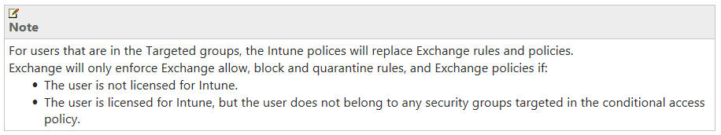

#### The Question

How does InTune Conditional Access Policy affect devices in the field?  (e.g. Bob's phone already has a manually configured mail profile.  What happens to Bob's e-mail when I enforce Conditional Access (i.e. saying a user must have InTune to receive e-mail?))

#### The Background

Consider this: A company with ~1000 mobile devices. They roll out InTune with SCCM and get it installed on 90% of devices in the field, and use it to push e-mail profiles to devices using Conditional Access.

However, 10% of the devices don't have InTune, but still have manually configured e-mail profiles, using either the built-in mail client (Exchange Active Sync or EAS) or the Outlook application.

The company wants to lock down mobile e-mail to only those with a healthy device, one with security policies being enforced. If you've got SCCM w/ InTune installed, you just go to the Microsoft Intune portal at (manage.microsoft.com) to enable Conditional Access.

We enabled the connector, and then applied a security policy to a custom group with our accounts in it.

This is really awesome, because you can test your policies VERY easily before rolling it out to the environment at large. I didn't show it in this screen shot, but you can also link to an AD Security Group of your super special VIP users, and totally omit them from Conditional Access.  This is a great idea for job security.

Now, the question from the customer was 'what will happen to phones in the field without InTune?'

Microsoft presents this helpful chart to help us understand what will happen…

However, this doesn't really tell us what would happen to devices in the field with e-mail today, but with no InTune. From the looks of the chart, one might think that a new profile would be blocked, while an existing mailbox might be fine. That's actually what I was expecting.

Now, if there is a device out there which has already been whitelisted in Exchange or Office 365, which policy wins?

Microsoft has this to say on the matter:

From <https://technet.microsoft.com/en-us/library/mt131421.aspx>

So, it LOOKS like InTune should replace my Exchange Policies, so long as I'm in the right group, right?

#### The Test

We're testing four scenarios: • iOS device w/o Intune and a manually created mail profile • iOS device w/o Intune and Outlook mail app • Android device w/o InTune and a manually created mail profile • Android device w/o InTune and Outlook mail app

#### The Results

Surprisingly, InTune conditional access was awesome, and pretty much just worked exactly as I hoped it would!

###### iOS device w/o Intune and a manually created mail profile

This was an iOS device, and roughly within five minutes of enabling Conditional Access for this group, we saw this email, promprting us to sign up for InTune

 

Result new mail blocked, user received email prompt to enroll in InTune

###### iOS device w/o Intune and Outlook mail app

This was an iPad, and we got a REALLY nicely designed prompt to enroll in InTune from within the app! Really well made, probably the best experience.

Result: new mail blocked, user received very nice notification from within app to enroll in InTune

###### Android device w/o InTune and a manually created mail profile

Pretty similar to our iOS experience for this LG phone. I bet if this were a Samsung device, we'd have an even better experience, as Knox integration is MUCH better than Android support for any other brand.  (Note: I don't have a screen shot of this one, but it was pretty much identical to the iOS scenario)

###### Android device w/o InTune and Outlook mail app

I've got to say, Microsoft hit the ball out of the park for this one too.

Again, really nice experience for our LG phone when we were using the Outlook app.

#### The Conclusion

My experience with Conditional Access in InTune w/ SCCM has been fantastic so far. I was hesitant, expecting that it, uh, might not be ready for prime time, given the rapid development of the product still. For this 6,000 seat customer, it was a huge success!
