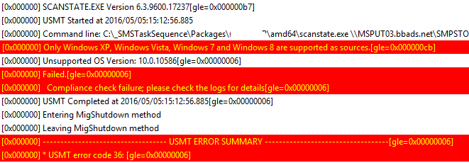
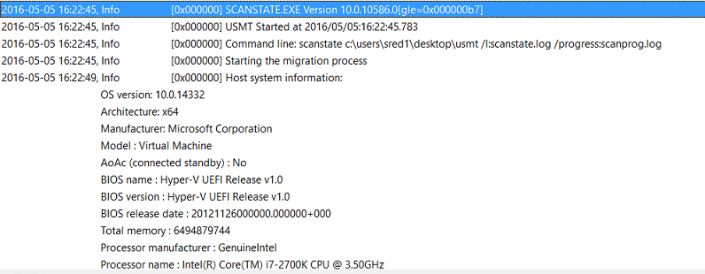

You might see this occasionally in your environment when trying to run a USMT capture on Windows 10:

USMT Returned error (0x00000024), 80070024 too many files opened for sharing.

This is actually a bit of a redherring error, and we should open scanstate.log as recommended in the SMSTS log file.  At this point, the error should jump out at you:

Only Windows XP, Windows Vista, Windows 7 and Windows 8 are supported as sources.

You'll see this error message if you're using the RTM version of the Windows 10 ADK, version number 10.0.26624.0.

### Solution

Upgrade and use the 1511 release of the ADK.  As it turns out, Windows 10 was not a supported operating system with the USMT files in the RTM bundle of the ADK.

You should simply upgrade to the newest release of the ADK, version 1511, then update the source files for your USMT Task Sequences.

**Note: don't install the 1511 version of the ADK without installing the [hotfix which came out in December](https://blogs.technet.microsoft.com/configmgrteam/2015/11/20/issue-with-the-windows-adk-for-windows-10-version-1511/).  Also, make sure you update your boot.wims afterwards too.**

Once you do that, you'll see a much happier log file for ScanState.

 

Happier SCCM Log, doesn't immediately fail like the first one.
