## UPDATE

This post is about the Cloud Proxy feature, which was included with Tech Preview 1606 of SCCM Current Branch.

While featured in the Tech Preview for 1606, Cloud Proxy was not included with the production release of SCCM 1606, which shipped on July 22, 2016.

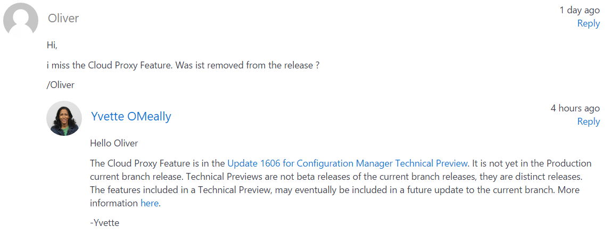

So, while you cannot use this SCCM 1606 today, it's still available in the tech preview.

SCCM 1606 Tech Preview brings a cool new feature to us, allowing us to manage machines even if they aren't in the office. We can push Windows updates, deploy software, and also configure devices using SCCM Client Settings and DCM, even if a machine is half-way across the world!

This feature is called the [Cloud Proxy service 🔗](https://technet.microsoft.com/en-us/library/mt732696.aspx), and in this step-by-step guide I'll tell you why it's cool and how to do it！

### What problems does this solve?

One of the biggest challenges to the SCCM Admin in managing machines is handling those systems which rarely are in the office.

Some types of staff-- such as our sales team --might cover a region and never bring their machine to the home office. If they don't VPN either, and you don't have DirectAccess set up, you might only see a machine once a year. Just a couple hours a week or month to push app updates ensure Antivirus is current and get those Windows updates installed. Very challenging.  You know what it's like, for some users you just have to send an e-mail like this:

> Please come to the office at some point this year, I'll even buy donuts!

Cloud Proxy in SCCM tp1606 allows us to configure our environment to use Azure and its global footprint to extend the functionality of our management point, distribution point and even software update point to the Web. It's like a freaking aircraft carrier for ConfigMgr, it extends our sphere of influence to cover the entire globe!

To the veterans out there, this might sound similar to a current feature however...

### How is this different from IBCM though?

SCCM has offered a feature called Internet based client management for a while now.  It does cover some of the same ground as Cloud Proxy, however the key difference between the two is that with IBCM, we are taking ownership of all of the work of securing access to our SCCM Infrastructure from the outside Web.

That means adding new servers into a DMZ and all of that network change request and security compliance meetings (BARF) which goes with a big, scary change.  In IBCM, we'll also have clients hitting our SCCM Infrastructure from over the Web so we also need to worry about our upload speed and take steps to ensure that serving content out doesn't impact the quality of service for our internal users too.

Compare this to the solution offered by Cloud Proxy, in which we allow Azure and Microsoft to shoulder the burden for some of those tasks, and only have to worry about our SCCM server having a route available to Azure instead.

#### Azure is not a free meal

However there are Azure costs for running this.

In my test lab with a handful of machines with Azure Proxy, it cost about $2 a day to run, purely to keep the Azure Servers online.  Speaking entirely out of my butt, I wouldn't expect the compute costs to be too high for managing machines, but I would factor in some fluff factor when presenting the costs to management, if you're doing something vastly different than me, you might be spending more like $5 a day to keep the lights on the Azure Cloud Proxy Service.

> **Note:** This is with two Azure hosts for redundancy, although you might decide to try to run with one host or maybe you need 10 depending on your risk tolerance.

You also will pay for data transfer out of Azure.  For the first 5 TB, the rate is $0.087 / GB, which is absurdly cheap.

To put this into perspective, let's say you need to deploy Adobe Premier (it's about 1 GB) to your entire remote marketing team, all 1000 of them (dear lord, can you imagine having to deal with 1,000 advertising primmadona's?  So much plaid and skinny jeans...).

If they're all remote, that's about a terabyte of traffic, so it'd cost about $85 to deploy that one app.  That ain't free but it's a lot cheaper than the license for ANY app, and probably less than what the company would pay for one hour of your [fully loaded cost to the employer🔗](http://smallbusiness.chron.com/calculate-fully-burdened-labor-costs-33072.html) .  Management will not care.

A more realistic scenario is Windows Updates or AV updates.  The average Forefront Definitions package is 250KB.  Three of those a day, 30 times a month is 24MB per system.  For those same thousand computers, it'd only be  24 GB, or $2 to ensure your machines always have up to date AV Definitions delivered by your company.

These are estimates for generic situations, so [read up on pricing 🔗](https://azure.microsoft.com/en-us/pricing/details/data-transfers/) before you decide to commit.

### Overview of the steps

We'll go through the following steps in this order.  This diverges slightly from [Microsoft's documentation 🔗](https://technet.microsoft.com/en-us/library/mt732696.aspx) but I have found that the order presented here prevents some irritating rework which will VERY likely come up if you follow MS's guide.

- Come up with a name for our SCCM Cloud Proxy Service
- Make a new cert template to use with the Cloud Proxy Service
- Request the cert from the CAS /primary
- Export the certificatie twice, once as a pfx and once as a. Cer
- Upload the cer as an authorized management cert in Azure
- Setup the proxy service in SCCM
- Configure roles to use the service
    - _Optional : configure a DNS Record for the service_
- Begin managing clients wherever they are

### Prerequisites

To get started, we'll need a few things setup or readily available.

- Know our Azure subscription ID
- Have the ability to create new Certificate Templates (Enterprise Admin is the easiest way to get this, or request delegation otherwise)
- Already have SCCM operating in HTTPS mode.  Follow this guide if you've not done that yet.   [Microsoft🔗](https://technet.microsoft.com/en-us/library/mt627852.aspx?f=255&MSPPError=-2147217396#BKMK_client2008_cm2012)
- Have SCCM 1606

##### Finding our Azure Subscription ID

To find your Azure Subscription ID, sign in to Azure, go to the Classic portal and then down to settings.  You'll see your ID listed here as shown below.

 

#### Name our SCCM Cloud Proxy Service

While we're still in Azure, we should come up with a good name for our Cloud Proxy Service.

Here's why the name matters: the way this whole thing works is that--once configured--the next time a client requests an update for policy, they'll receive settings for using the Cloud Proxy Service as an IBCM Point (effectively), and will try to access the client at <servicename>.domain.com.

This needs to route to <serviceName>.cloudapp.net, which is Microsoft Azure's root domain used for almost all Azure accessible machines and services.  This is true not just of ours, but for every one in the world who uses Azure for websites, services and things like SCCM Cloud Proxy.

**This means that our ConfigMgr Cloud Proxy Service MUST be unique in the world.** If you fail to do this, you'll get errors like this one later on in the process.

](images/error.png) Unable to create service, the name already exists\[/caption\]

To avoid this, let's find a good name for our service using a built-in feature for Azure that will only show us valid addresses.   Still in the Azure Portal, click **New, Compute \\ Cloud Service \\ Quick Create** and then use the box which appears here to test out the name for your Cloud Service.

](images/test-the-cloud-service-name.png) Every permutation of 'cloud', 'SCCM' and 'Slow Moving Software' I could think of was already taken\[/caption\]

As we can see, SCCMCloud was already taken, but after enough permutation, I found a good one.

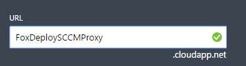](images/test-the-cloud-service-name-1.png) Rolls right off the tongue\[/caption\]

**Don't create the service!  We just did this to make sure our name wasn't taken yet!**

Write this stuff down, you've got both the name of the service, and our Azure Subscription. We're ready to move on.

#### Make a new cert template to use with the Cloud Proxy Service

Since we're opening this stuff up to the whole web using Azure, we are going to need some security and that means PKI certificates.  We'll make a new **Certificate Template**, configure it just so and allow our SCCM Server which will host the **Cloud Proxy Connector** role to enroll in this cert.  Don't worry, I'll walk you through the whole process.

First, connect to a machine which has **Certificate Authority** with an account that has appropriate permissions.  Domain or Enterprise Admin will cut it. Launch the CA Console. Go down to Certificate Templates and choose Manage.

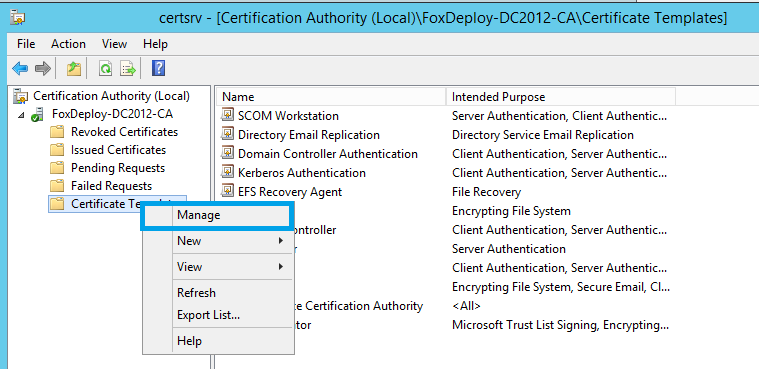

Scroll down to Web Server and choose duplicate.

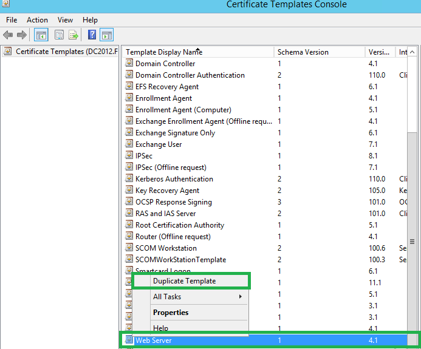

If you're prompted for **Compatibility**, always choose the oldest one.  Go with **Server 2003** if it doesn't default to that already.

On the **General** tab, it will default to the name of 'Duplicate of WebServer' which is garbage, so change the **Template Display Name**  to something like '**SCCM Cloud Certificate**'.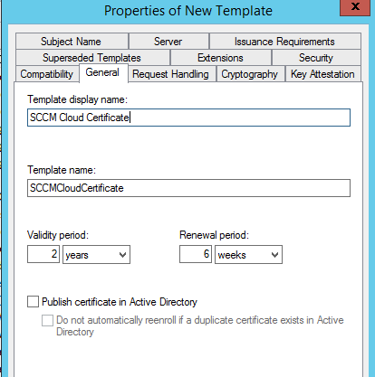

Next on the Request Handling tab, **make sure to check the box for 'Allow private key to be exported'** .  If you miss this one, you have to start over.

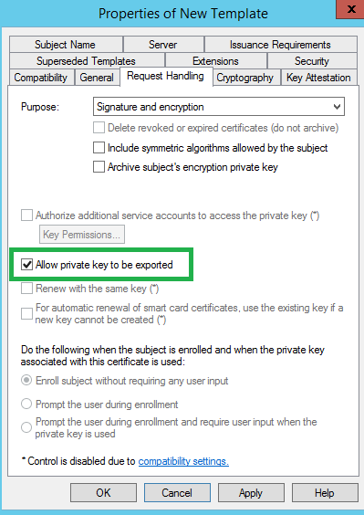

Next, on the **Security Tab**, **remove** the check for **Enroll** for **Enterprise Admins**.  You can probably skip this step, but I'd do it anyway.

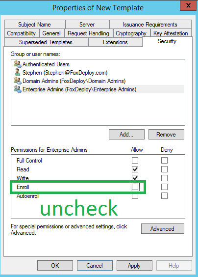

Next, click **Add** and specify a security group which contains your SCCM servers, and make sure they have at a minimum the **Read** and **Enroll** Permission.

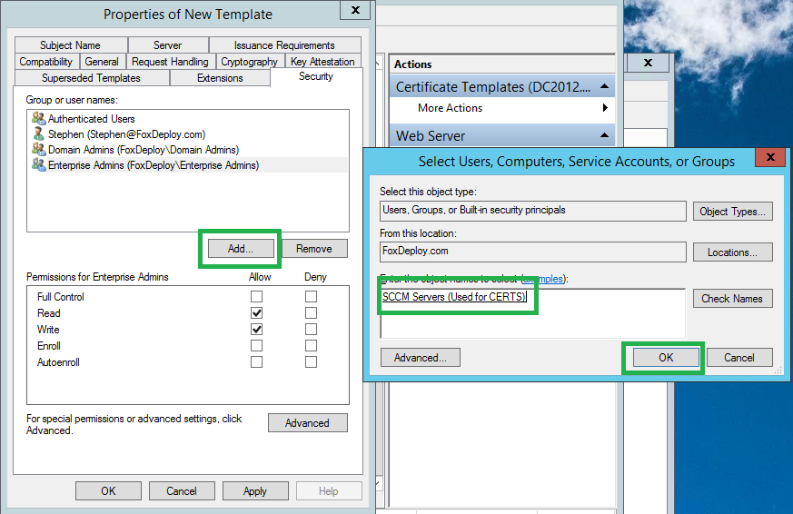

That's all the changes we have to make so hit **OK** and then close the **Certificate Templates** window.

Back in the Certificate Authority console, click **Certificate Templates \\ New \\ Certificate Template to Issue**.

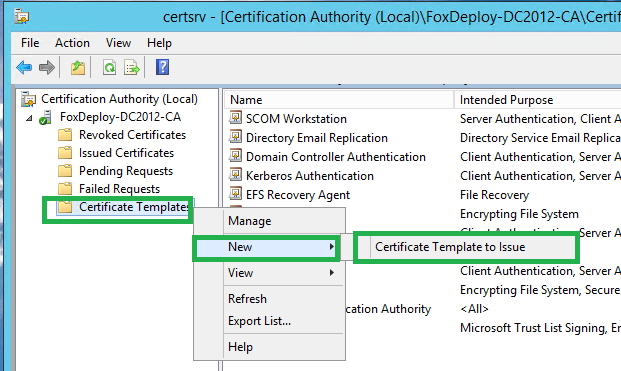

Choose the cert template we just created, **SCCM Cloud Certificate**.  (or whatever you called it)

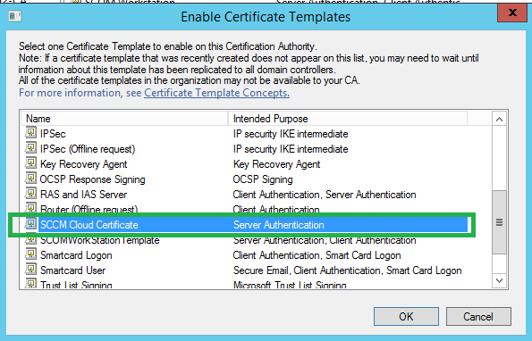

#### Request the cert from the CAS /primary

Now we've created a whole new type of Certificate and allowed our SCCM Servers to request it.  At this point, either GPupdate or reboot your SCCM Server which will host the Cloud Proxy Connector Role so it will update Workstation Group Policy.

**On the SCCM Server to host the Cloud Proxy Connector Role**, launch the **MMC** and add the **Certificates Snap-in**, for the **Computer**.

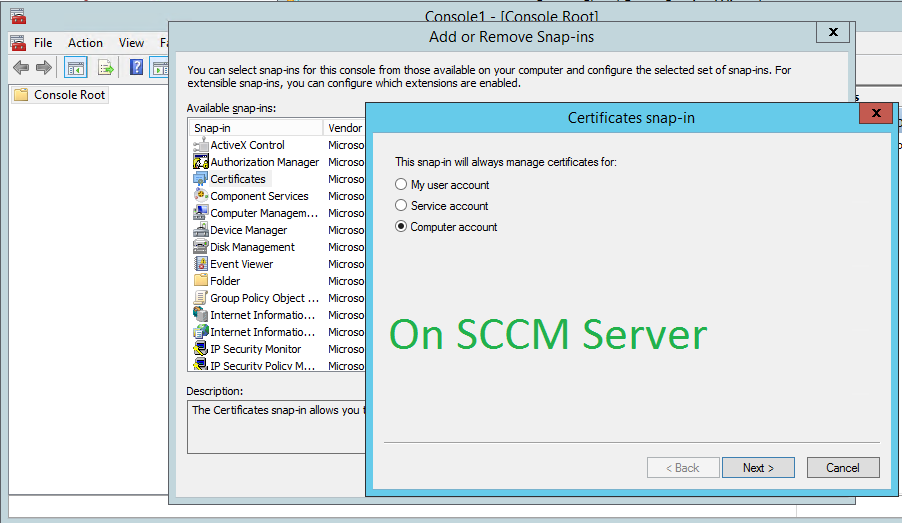

Now go to **Personal \\ Certificates \\ All Tasks \\ Request New Certificate**

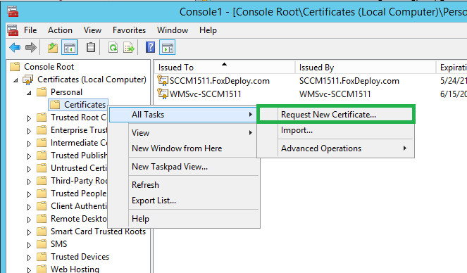

In this next window, you should see a fancy new cert available with the name we chose earlier, but it will say _More information is required to enorll for this certificate. _ Click that text.

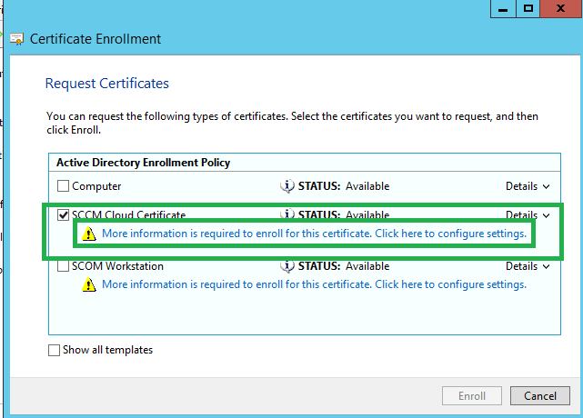

In the **Certificate Properties** wizard which appears, on the **General tab,** enter the name of our **SCCM Cloud Service.** Mine was FoxDeploySCCMProxy.foxdeploy.com, but yours is whatever you came up with in Azure.

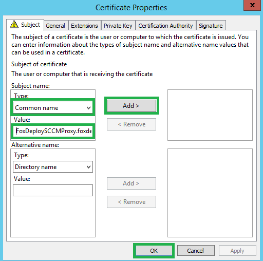

Once you've put your name in, hit **OK** and then **Enroll.**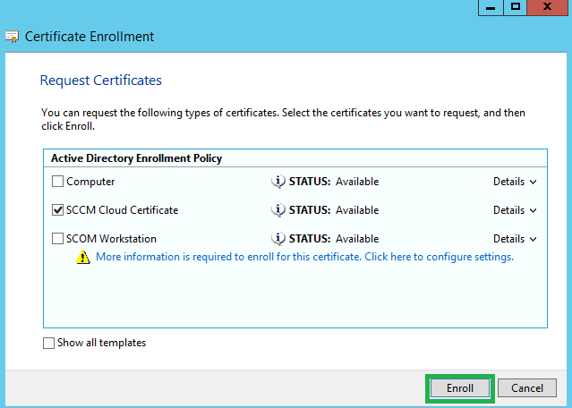

And now we should see our brand new certificate in the console here, issued to our cloud service.  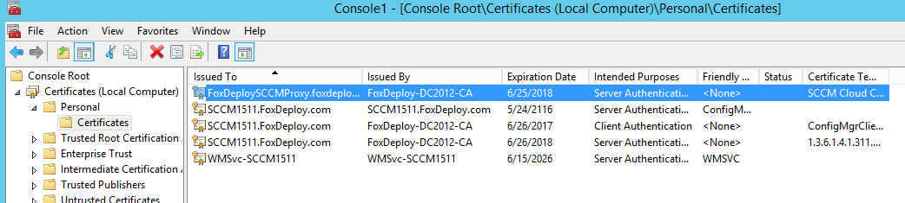

#### Export the certificate twice, once as a pfx and once as a .cer

One of the core tenants of PKI is validating who you're talking to and only trusting those who are vetted by someone you trust.  We created this cert so that our machines will trust the Cloud Proxy service when they interact with it later in lieu of our SCCM Servers.  So now that we've requested this cert, we need to export it in two different formats and put those files in the right place.

On the SCCM Server, select the certificate for our Cloud Proxy Service and choose **All Tasks \\ Export.** 

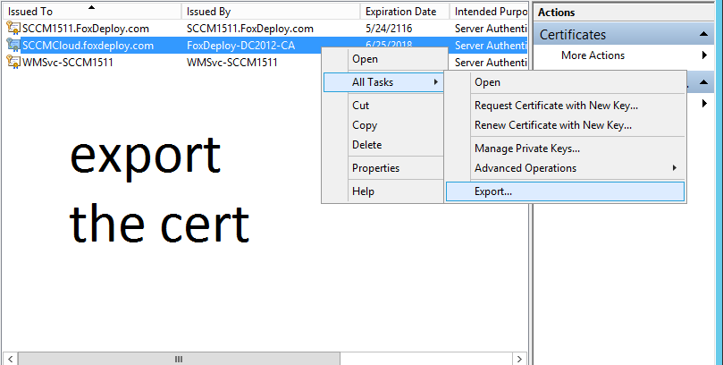

On the first run through, choose **Yes, Export the private key.**

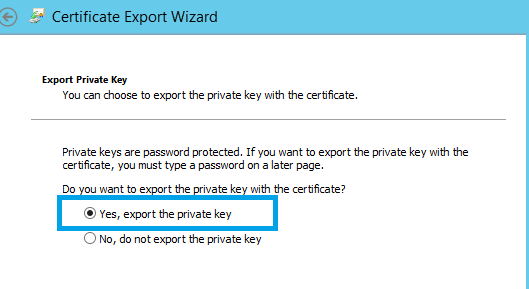

When you export the certificate with the private key, you must secure it with a password so pick something good. Don't forget this as you'll be prompted for it in about five minutes!

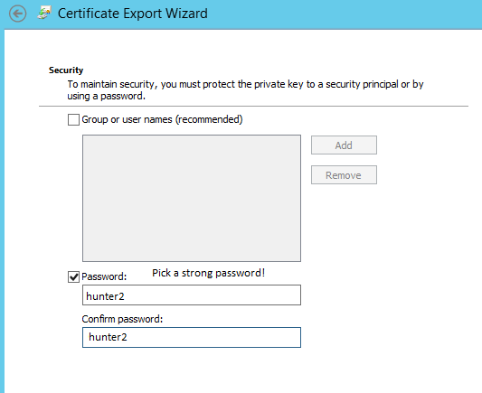

Put the certificate somewhere safe and then run through the wizard again.  This time choose '**No, do not export the private key'** and choose the .cer file format (the default works fine).

Now you should have two separate cert files, one with a .pfx and one in the .cer format.

#### Upload the cer as an authorized management cert in Azure

If you don't want to constantly enter credentials for Azure, you can use management certificates instead, and that's just what we're going to do with the .cer file we just created.  Later on in this process the SCCM Wizard will use this same certificate file to authenticate itself against Azure, and them make all the changes we need for Cloud Proxy to Work.

**Log back into Azure** \\ **Settings \\ Management Certificates \\ Upload**

In the next page, browse out to the .cer file you created and plop her in there.  Then hit **OK** and you're done.

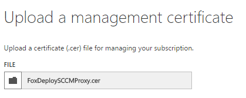

#### Setup the proxy service in SCCM

It only took 1700 words before we are ready to open the SCCM Console.  We're here!  Fire up the SCCM console and oh yeah, be sure you're running 1606 tech preview.  Browse over to **Administration \\ Cloud Services \\  Cloud Proxy Service** and choose '**Create Cloud Proxy Service**.'

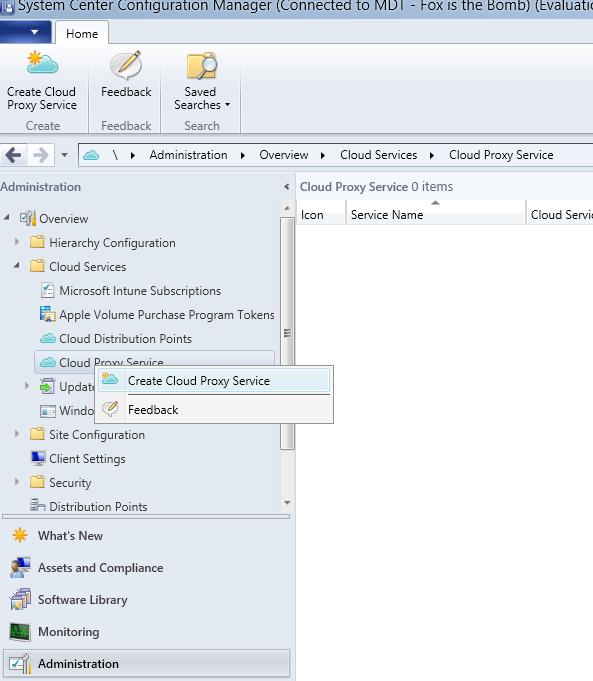

On the next page, paste in your Azure Subscription ID, and browse to the **.pfx** certificate we exported.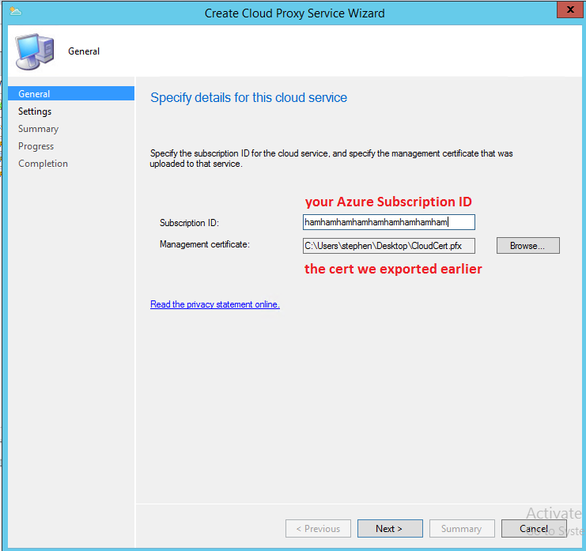

Now, the most important page:

- Service Name - the Service Name we tested earlier in Azure (so if you tested SCCMisCool.cloudapp.net, enter only SCCMisCool).
- Description - will end up in Azure as the flavor text for this new Azure Cloud Service.
- Region - Pick a geographical region which makes sense for your company
- Instance Number - How many instance you want to run.  At this time there is no guidance on how many you should have but two is the default
- Certificate File - Select the .pfx file one more time
- Root Certificate File - this should probably say management certificate instead, it's the .cer file.
- Verify Client Certificate Revocation - you would know if you needed to do this based on your organizational standards

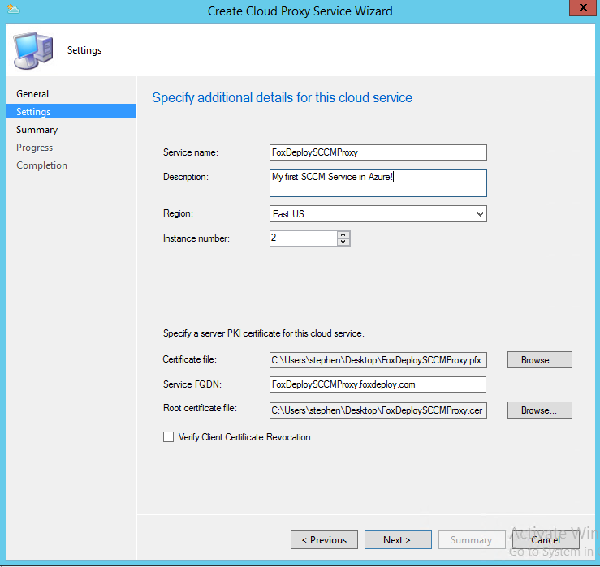

Alright you made it! Now verify everything looks cool in the summary page and hit **Next.**

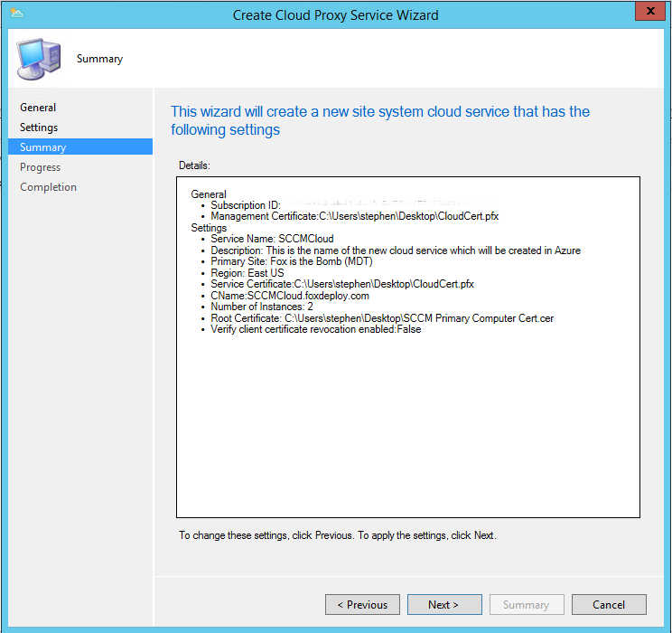

And we're off.  You can monitor the install status by refreshing the SCCM  Console under **Administration \\ Cloud Services \\ Cloud Proxy Service**, or if you're a real man, open up CloudMgr.logs.  You should see nothing for a bit and then 'Starting to Deploy Service'

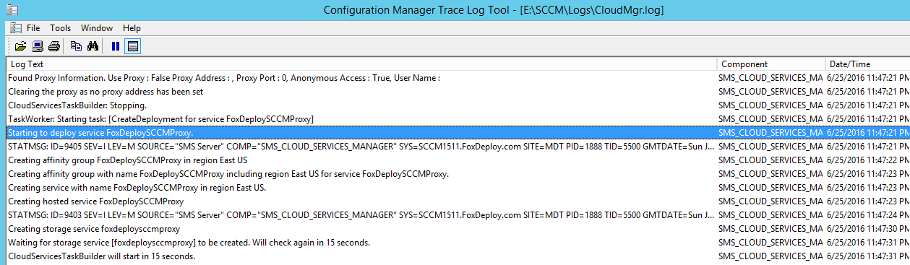

After a few minutes you will see 'Deployment instance status for service <ServiceName> is ReadyRole.'

You can also monitor this installation within Azure by clicking to **Cloud Services** and watching your new Cloud Proxy Service appear here.  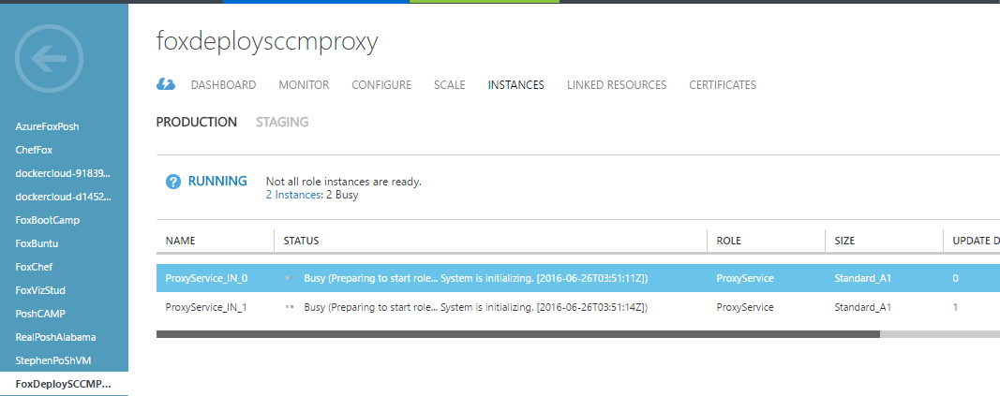

 

](images/6-1-service-is-running-2.png) Elapsed time between pictures is roughly ten minutes\[/caption\]

With this completed, we now have our Proxy SCCM roles running in Azure.  The final step is to install the connector locally and then configure which roles we want to use the service.

#### Install the connector and configure roles to use the service

Back in the SCCM Console, go to **Administration \\ Sites and Roles** and choose to add a role to whichever SCCM Server you want to talk to clients on the internet via Azure.

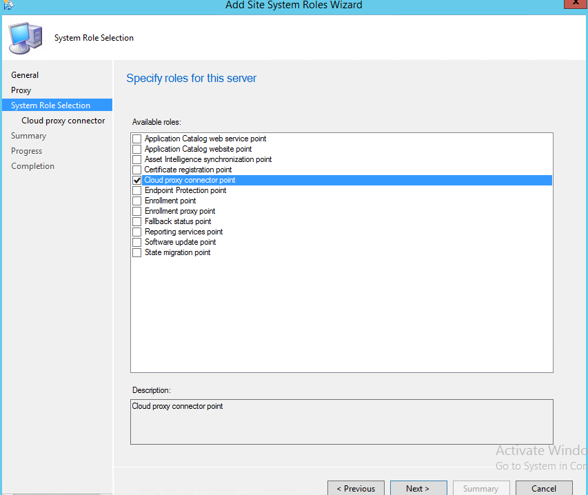

In the next page, choose your Cloud Proxy Service from the drop down box. You can ignore the text about Manually installing the client cert, as we've already done so.

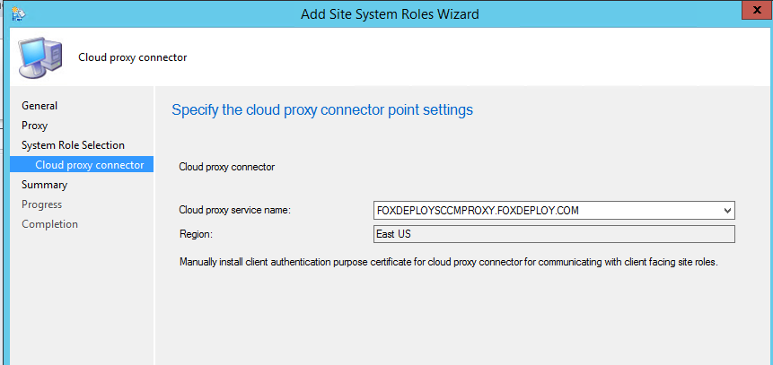

Now, open up SMS\_CLOUD\_PROXYCONNECTOR.log, and chances are you'll see this:

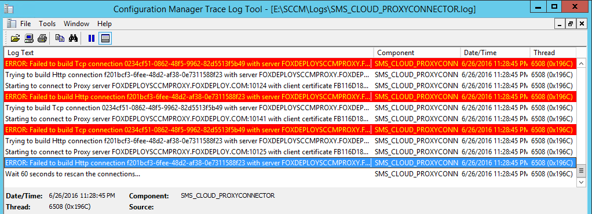

`Text:ERROR: Failed to build Http connection f201bcf3-6fee-48d2-af38-0e7311588f23 with server FOXDEPLOYSCCMPROXY.FOXDEPLOY.COM:10125. Exception: System.Net.WebException: The remote name could not be resolved: 'foxdeploysccmproxy.foxdeploy.com'`

If you see this error, this means that you need to add a CNAME record in DNS.  If you're using Windows DNS, the record should be setup like the following:

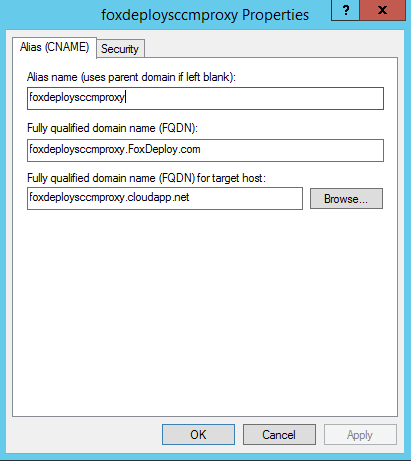

Once this is done, do an ipconfig /flushdns on your SCCM Server and you should see the log files clear up.

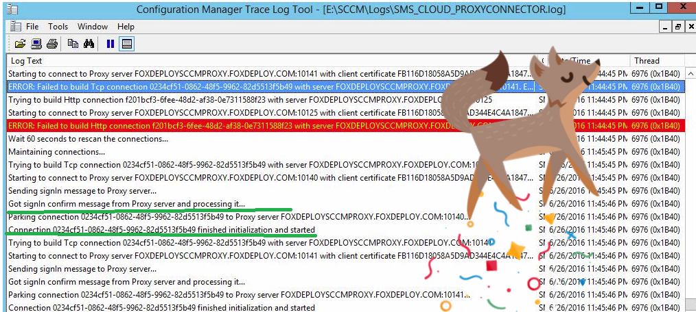

Now that SCCM can talk to Azure, we're in the money.  All that remains is to configure the roles we want to use the Cloud Proxy Service.

**Browse to Administration \\ Site Configuration \\ Servers and Site Systems** and choose the server with the Cloud Proxy Role.  Go to **Management Point \\ General** and make sure that **HTTPS** and **Allow Configuration Manager Cloud Proxy Traffic** are selected.

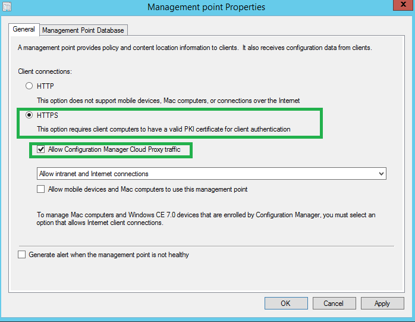

Once you do this, it will trigger a reinstall of the Management Point if needed, to configure HTTPs.  Be sure to monitor the install from MPSetup and MPMsi.log for a healthy install.

#### Begin managing clients wherever they are

And we're finished!  The final step is to refresh policy on some SCCM Clients and take them outside the boundaries of the network.  You'll know that the client is talking to Azure when you by monitoring ClientLocation.log and you should see the new Cloud Proxy Management Point appear as an Internet Management Point.

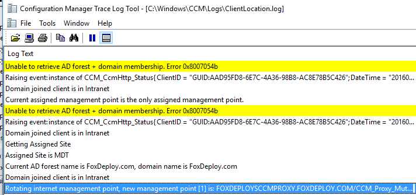

Additionally, from the Configuration Manager Control Panel, you'll see values filled out now under the Network tab for Internet Based Management Points.

](images/client-works.png) You'll also see the site listed as 'Currently Internet' on the General tab as well\[/caption\]

### What's next

Now you're free to manage this client mostly the same as if it were in the office, with Software Updates, Software Installation, new Client Settings and Antivirus Definitions as well!  You'll enjoy up to date Hardware and Software inventory as well!

Be sure to configure each one of these additional roles from the SCCM Console as well.

Did I miss something?  Leave me a comment or shoot me an e-mail / tweet.  stephen \[at\] foxdeploy dot com.  Twitter: [@FoxDeploy](https://twitter.com/FoxDeploy)

#### Source

[New Capabilities in SCCM tp 1606🔗](https://technet.microsoft.com/en-us/library/mt732696.aspx)

[Configuring SCCM 2012 R2 in HTTPS 🔗](https://blogs.technet.microsoft.com/configmgrdogs/2015/01/21/configmgr-2012-r2-certificate-requirements-and-https-configuration/)

[Configuring a cloud DP](https://technet.microsoft.com/en-us/library/mt627852.aspx?f=255&MSPPError=-2147217396#BKMK_clouddp2008_cm2012) [🔗](https://technet.microsoft.com/en-us/library/mt732696.aspx)
