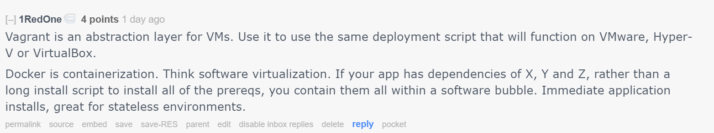

* * *

When I first looked into AWS and Azure, the notion of scaling out an application was COMPLETELY blowing my mind.  I didn't get it, at all.  Like, for real, how would that even work?  A server without a persistent disk?

This short post is not going to tell you precisely how to do devops, or even give you pointers on how to build scaling apps in Azure and AWS.  No, instead, I'll share an interesting conversation I [had on reddi](https://www.reddit.com/r/webdev/comments/4p1lat/docker_for_mac_and_windows_public_beta_is_out_no/d4hfies)t recently, and how I tried to explain the notion of stateless applications to someone with questions.

The initial question

My reply

Their follow-up

> AWS is a great example of how you could setup a stateless application.
> 
> It's easy to configure an application with a load balancer. We can use the load balancer to gauge how many people are trying to hit our site at a given time. If traffic exceeds the capacity of one host, we can tell our web service to add another host to share the load.
> 
> These new workers are just here to help us with traffic and keep our app responsive and fast. They will probably be instructed to pull down the newest source code on first boot, and be configured not to save any files locally. Instead, they'll probably get a shared drive, pooled among all of the other workers.
> 
> #### Since they're not saving files locally, we really don't care about the host machine. As long as users have completed their session, it can die at any point. This is what it means to be stateless.
> 
> The workers make their mark on the world by committing permanent changes to a DB or shared drive.
> 
> So, new worker bees come online as needed. They don't need to be permanently online though, and don't need to preserve their history, so in that sense they are stateless. After the load drops, the unneeded little workers save their changes, and then go to sleep until needed again in the future.
> 
> _Actually they're deleted but I always feel sad thinking about my workers dying or being killed, so I have to think about it in different terms_

Just my take on how I think of designing and deploying a stateless application. What do you think?  Did I get it wrong?
