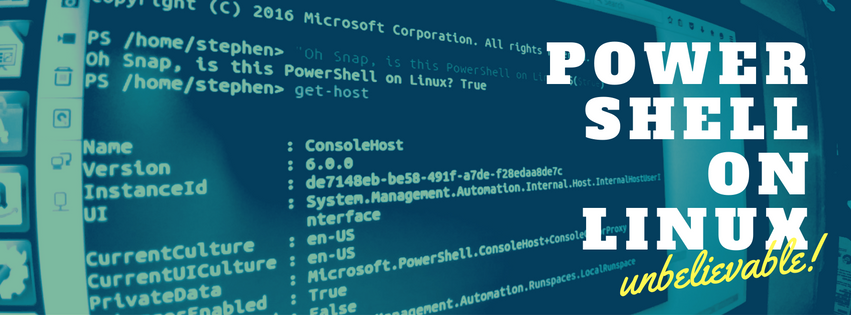
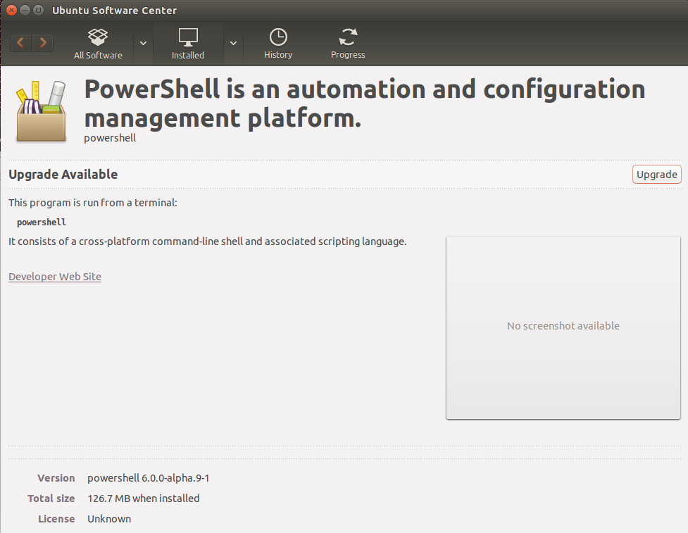
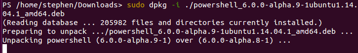
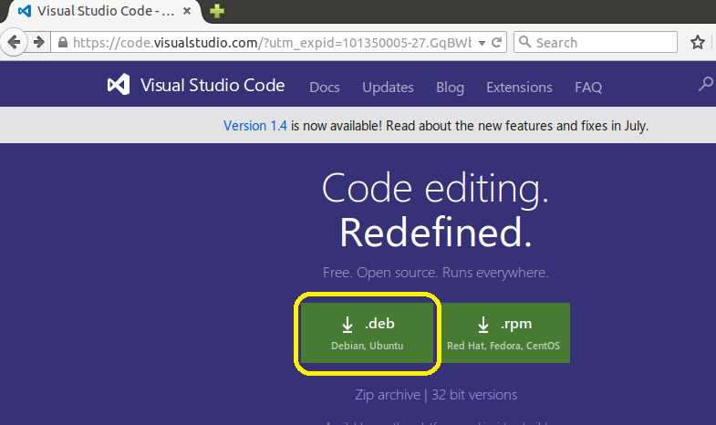
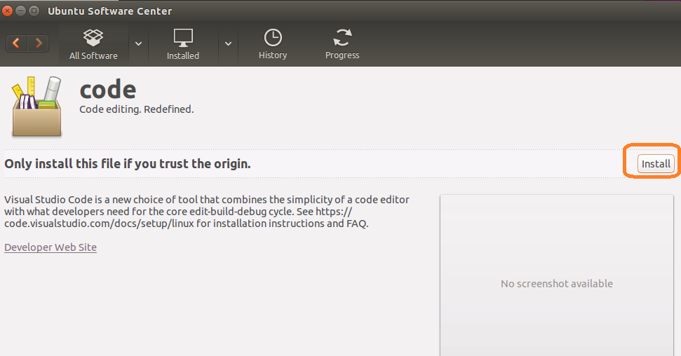
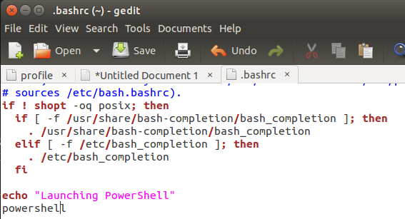
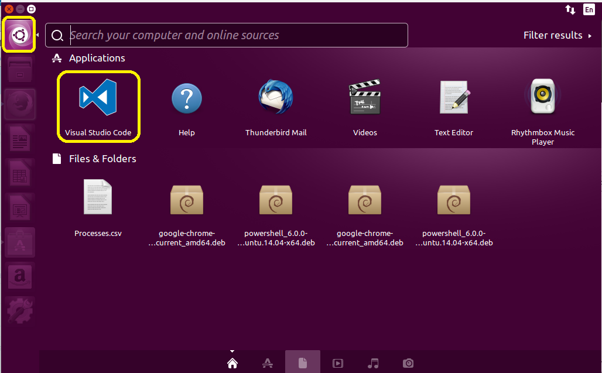

Sounds impossible, huh?

Ever since the beginning of the Monad project, in which Microsoft attempted to bring the same rich toolbox of Piped commands that Linux has enjoyed for ages, Microsoft enthusiasts have been clamoring for confirmation of PowerShell on Linux.  But it forever seemed a pipedream.

Then, in February of 2015, Microsoft announced that the CORE CLR (Common Language Runtime) was made [open source and available on Linux](https://blogs.msdn.microsoft.com/dotnet/2015/02/03/coreclr-is-now-open-source/).  As the Core CLR is the "the .NET execution engine in [.NET Core](http://blogs.msdn.com/b/dotnet/archive/2014/12/04/introducing-net-core.aspx), performing functions such as garbage collection and compilation to machine code", this seemed to imply that PowerShell might be possible on Linux someday.

To further fan the fires of  everyone's excitement, the creator of PowerShell, Jeffrey Snover--a self-proclaimed fan of the Bash shell experience in Linux-- has been dropping hints of a unified management experience ALL OVER THE PLACE in the last year too.

And now [today with this article](https://azure.microsoft.com/en-us/blog/powershell-is-open-sourced-and-is-available-on-linux/), Microsoft released it to the world.  Also, [here's a great YouTube video](https://www.youtube.com/watch?v=2WZwv7TxqZ0) about it too.

\[youtube https://www.youtube.com/watch?v=2WZwv7TxqZ0\]

Available now on OSX, Debian and Ubuntu, PowerShell on Linux is here and it is awesome!

[Get it here](https://github.com/PowerShell/PowerShell) if you can't wait, or read ahead to see why I'm so excited about this!

### Why is this great news for us Windows folks?

For we PowerShell experts, our management capabilities have just greatly expanded. Update those resumes, folks.

This means that the majority of our scripts?  They'll _just work_ in a Linux environment.  Have to hop on Linux machines from time-to-time?  PowerShell already used Linux aliases, which limited the friction of hopping between OSes but now we can write a script once and generally be able to assume that it will work anywhere.

#### I did say GENERALLY

With PowerShell on Linux we will not have WMI or CIM.  Furthermore, we'll be enacting system changes mostly by tweaking files instead of using Windows APIs and methods to do things (which honestly was kind of the harder way to do it anyway).  And there's no Internet Explorer COM object or a bunch of other crutches we might have used.

But a lot of things _just work._

So this is great news for us!  Linux is a vastly different OS than Windows but I encourage you to start trying today.  Since you already know PowerShell, you'll find it that much easier to interact with the OS now.

### What does this mean for the Linux community?

This is good news for Linux fans as well.  We Microsofties and Enthusiasts are not coming to drink anybodies milk shake.  The Bourne Again Shell is NOT dead, and we're not trying to replace it with PowerShell!

If anything this will signal the dawn of a new era, as loads of skilled Windows devs and operators will now be trying their hands at Linux.  Some of these will inevitably be the type to tinker with things, and will likely result in a new wave of energy and excitement around Linux.

The age of collaboration?  It's just getting started.  The Power to write scripts and run them on any platform, and to bring the giant crowd of PowerShellers out into Mac and Linux can only mean good things for everyone.

> Just like Bash on Windows, PowerShell on Linux is a GOOD thing, people.  Those who think it's anything but are completely missing the point.

### Developing on any platform

It also frees us up for all sorts of development scenarios.  You don't NEED a Windows OS anymore, as you can write your code on an Ubuntu or OS X machine.

Similarly, you can use Bash on Windows to write shell code to execute on your Linux Machines.  Or write PowerShell code instead.

No longer are you stuck on the platform you want to execute on.

### How do I get started?

Getting started is very easy.  First, spin up a VM in Azure, AWS or Hyper-V and install Ubuntu or CentOS.  Or do this on your Mac if you're on Capitan.

Now simply follow the instructions for the platform below:

| Platform | Downloads | How to Install |
| --- | --- | --- |
| Windows | [.msi](https://github.com/PowerShell/PowerShell/releases/download/v6.0.0-alpha.8/PowerShell_6.0.0.8.msi) | [Instructions](https://github.com/PowerShell/PowerShell/blob/master/docs/installation/windows.md#msi) |
| Ubuntu 14.04 | [.deb](https://github.com/PowerShell/PowerShell/releases/download/v6.0.0-alpha.8/powershell_6.0.0-alpha.8-1_amd64-ubuntu.14.04-x64.deb) | [Instructions](https://github.com/PowerShell/PowerShell/blob/master/docs/installation/linux.md#ubuntu-1404) |
| Ubuntu 16.04 | [.deb](https://github.com/PowerShell/PowerShell/releases/download/v6.0.0-alpha.8/powershell_6.0.0-alpha.8-1_amd64-ubuntu.16.04-x64.deb) | [Instructions](https://github.com/PowerShell/PowerShell/blob/master/docs/installation/linux.md#ubuntu-1604) |
| CentOS 7 | [.rpm](https://github.com/PowerShell/PowerShell/releases/download/v6.0.0-alpha.8/powershell-6.0.0_alpha.8-1.x86_64-centos.7-x64.rpm) | [Instructions](https://github.com/PowerShell/PowerShell/blob/master/docs/installation/linux.md#centos-7) |
| OS X 10.11 | [.pkg](https://github.com/PowerShell/PowerShell/releases/download/v6.0.0-alpha.8/powershell-6.0.0-alpha.8-osx.10.11-x64.pkg) | [Instructions](https://github.com/PowerShell/PowerShell/blob/master/docs/installation/linux.md#os-x-1011) |

Once the install is completed type 'PowerShell' from the bash shell and away you go.  Right out of the gate you'll have full intellisense and loads of core PowerShell and Linux specific commands.  I've been amazed at how much of my code 'just works'.

### Updating PowerShell

There's no WMF on Linux, so upgrading PowerShell on Linux is a bit different.  As new releases [are posted HERE](https://github.com/PowerShell/PowerShell/releases), download the new .deb file.  You can run this manually, which will launch Ubuntu Software Center.

Or you can always update a deb Debian Package from the command line too.

`sudo dpkg -i ./newFile.deb`

### Where's the PowerShell ISE?

There is NO ISE release...yet.

However you can use Visual Studio Code and its Integrated Console mode to get something that feels very similar.

> **Note:** these steps will cause Terminal to automatically load PowerShell.  If you don't want this to happen, don't do them.

First, download [Visual Studio Code](https://code.visualstudio.com) here.

Choose to install via Ubuntu Software Center

Next, launch Terminal and type `sudo gedit ~/.bashrc` this will launch your Bash Profile, which is pretty much where the idea for PowerShell profiles came from \[[citation needed](https://xkcd.com/285/)\].  We're going to tell Bash to Launch PowerShell by default when it opens.

Now, go to the very bottom line of the file and add this content

`echo "Launching PowerShell"`

`powershell`

It should look like this when completed.

Save the file and reopen bash (the actual name of the Linux Terminal) to see if it worked.

Finally, launch Visual Studio Code by Clicking the Linux Start Button 😜 and typing 'Code'

The last step is to click 'View->Integrated Terminal' and then you should feel right at home.

As time goes on, we should have `F5` and `F8` support added to Visual Studio Code as well, to make it feel even more the ISE.  And this isn't just a substitute for the ISE, but also a very capable and powerful code editor in it's own right.

### One more thing

Do you hate the Linux style autocomplete, where it displays multiple lines with possible suggestions?

If so, then run:

`Set-psreadlineoption -editmode Windows`

Let's dig in and become Linux experts too!
